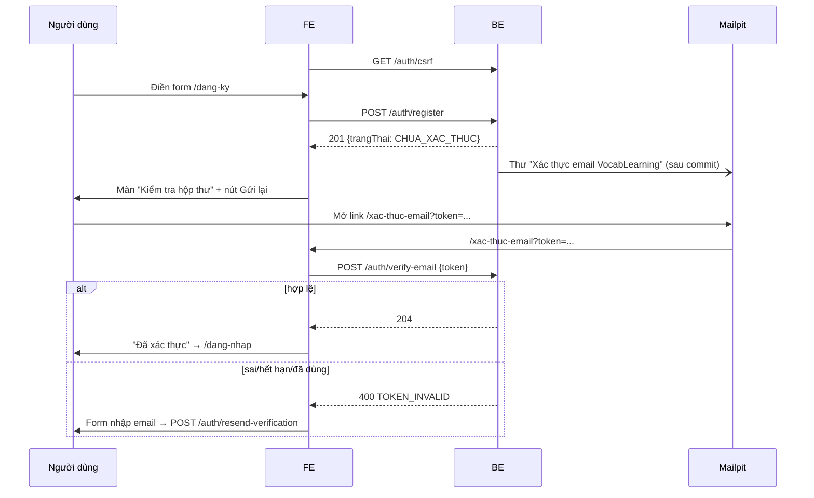
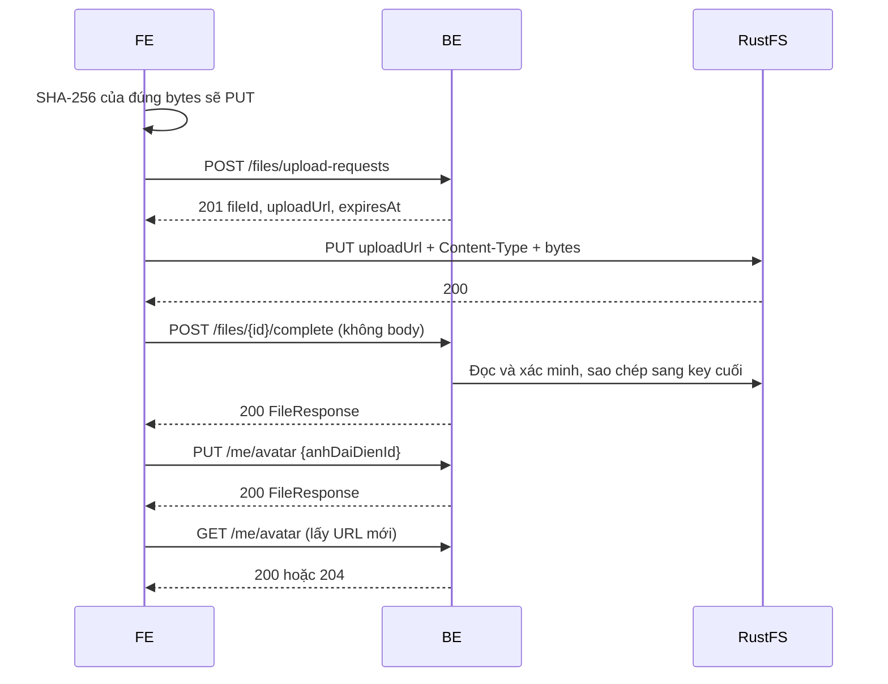

# Báo cáo bàn giao BE → FE — DOT1 Tài khoản & nội dung

> **Cập nhật08/10/2026 — B1.10:** thư viện BE và FE thật đã hoàn tất trong phạm vi mục5.40–5.42/mục10. Các ghi nhận hoàn tác FE05/10 bên dưới là lịch sử. Bộ mẫu chỉ seed dev; sao chép bộ/CSV còn kế hoạch.

> **Đợt khắc phục 05/10/2026 — GĐ0–B1.8:** BE thống nhất IANA, reset CSRF custom login/logout, OpenAPI security theo operation, log requestId và mẫu boot. **Toàn bộ thay đổi trong frontend đã hoàn tác theo yêu cầu mới nhất; các chênh lệch FE còn cần tích hợp riêng.** Giữ BE/Postman/tài liệu và mockup ngoài frontend; mockup là demo có lớp hợp đồng riêng; trạng thái hiện tại theo [báo cáo đối chiếu](DOI_CHIEU_BE_GD0_B1_8_2026_10_05.md).
>
> SESSION tạm được tạo trước xác thực trong Google-start. Mail lỗi nền không đổi response đã trả. DELETE files thêm409 khi còn liên kết the_tep, không đổi avatar/trạng thái xóa/S3 khi bị chặn. Hợp đồng hiện hành JSON camelCase, PageResponse đủ5 trường; PUT thiết lập/danh mục và PATCH bộ dùng version; DELETE bộ dùng query version.

| Mục | Giá trị |
|---|---|
| Giai đoạn | Đợt 1 — Tài khoản & nội dung (12/10 – 25/10/2026) |
| Ngày cập nhật | 08/10/2026 — hoàn tất B1.10; giữ kết quả lịch sử theo ngày |
| Trạng thái BE | B1.1–B1.8 đã triển khai; B1.8 hoàn tất theo bằng chứng05/10 được kế thừa, không chạy lại trong lượt06/10. B1.9 có 4 API thẻ + public tags; HTTP77/77 và assertion19/19 theo evidence06/10. FR03CardTest đã pass theo xác nhận người dùng sau sửa; HTTP ADMIN9/9 đã pass; Postman thêm28 request cho5 API, đã hoàn tất B1.9 trong phạm vi BE và bàn giao. Script Postman/Newman B1.9 mới chưa chạy. B1.10 đã triển khai và kiểm chứng ngày08/10 (mục5.40–5.42 và mục10); B1.11–B1.12 còn kế hoạch; không cộng kết quả khác ngày thành một suite |
| FE làm tương ứng | F1.7 / UI02, UI03 và bộ khởi động UI11 đã tích hợp B1.10; API thẻ B1.9 đã bàn giao. Sao chép bộ/CSV còn dự kiến; các bước khác giữ trạng thái riêng |
| Báo cáo trước | [GĐ0](GD0_BAO_CAO_FE.md) — hợp đồng chung (lỗi, CSRF, phân trang, `api-client.js`) xem ở đó |

> **Đọc nhanh:**
> - Dùng được thật ngay: `POST /auth/register`, `/auth/verify-email`, `/auth/resend-verification`. Thư xác thực xem ở Mailpit http://localhost:8025.
> - **Tên trường JSON = tên field entity** (tiếng Việt không dấu): `tenHienThi`, `trangThai`, `muiGio`, `vaiTro`, `daHoanTatKhoiDau`. FE dùng nguyên tên, không đổi sang tiếng Anh.
> - Đăng nhập thật đã có: `POST /auth/login`, `POST /auth/logout`, `GET /me` (cookie `SESSION`). Tài khoản seed: `an@vocab.local` / `Vocab@12345`.
> - **FE cần áp dụng (mã frontend đã hoàn tác):** chỉ thử lại 403 khi `code === 'FORBIDDEN'` (mục 3).
> - Tệp và avatar thật đã có (B1.6): SHA-256 → xin URL → PUT bytes → complete → `PUT /me/avatar`. `/me` trả `anhDaiDienId`; URL ảnh lấy ở `GET /me/avatar`.
> - Hồ sơ & thiết lập thật đã có (B1.5): `PATCH /me`, thiết lập học (lưu lần đầu = hoàn tất `/bat-dau`), thông báo; PUT phải gửi `version` (409 khi cũ) — mục 5.11–5.13.
> - Google thật đã có (B1.4): nút Google **điều hướng toàn trang** tới `/api/v1/auth/google/start?next=…`; lỗi quay về `/dang-nhap?loi=<MÃ>` (mục 5.10).
> - Mật khẩu thật đã có (B1.3): quên mật khẩu, đặt lại từ thư (Mailpit), đổi mật khẩu ở `/ca-nhan/bao-mat`. Đặt lại → đăng xuất **mọi** phiên; đổi → giữ phiên hiện tại, đăng xuất phiên khác.

---

### Kiểm chứng và bàn giao mới — 05/10/2026

| Nhóm | Kết quả mới | Giới hạn |
|---|---|---|
| BE toàn bộ checkout | Compile đạt;117 test,0 failure/error/skipped | Chạy backend/k28 thực; không tạo bản sao dự án |
| B1.7 | FR03CatalogTest14/14 | Có FK bo_the/the_nhan và race create/update/delete |
| B1.8 | FR03DeckTest11/11; Newman CRUD/version/favorite/delete đạt | Không triển khai API thẻ/library |
| B1.6 | Guard tệp có liên kết409 không thay avatar/trạng thái/S3; kiểm chứng bằng test BE | B1.9 đã có CardController; HTTP guard với thẻ xóa mềm xem mục5.39 |
| CSRF | 6 kiểm tra HTTP login/logout/refresh/old-header mismatch đạt | CookieCsrfTokenRepository không thu hồi server-side mọi cặp cookie/header cũ; token cũ+cookie mới trả403 |
| RequestId | Header/body/log khớp ở lỗi muiGio | Không bảo đảm mọi lỗi nghiệp vụ đều được ghi log trong mọi môi trường |
| Postman | Cloud80 request;2 environment; local export/registry/fixture; smoke31 request chính,49 HTTP,67 assertion đạt | Chưa chạy toàn bộ80 như một suite; Google/mail/file cần chuẩn bị theo README |
| FE | Đã hoàn tác toàn bộ thay đổi trong frontend; build/lint/client trước hoàn tác chỉ là lịch sử | Chưa kiểm thử mã FE sau hoàn tác |
| Mockup ngoài frontend |14 kiểm tra hợp đồng demo đạt | Demo không thay kiểm thử HTTP BE |
| UI trước hoàn tác | Kết quả browser chỉ là lịch sử của phiên bản FE đã hoàn tác; ảnh/JSON không còn trong checkout | Không nghiệm thu frontend hiện tại; OAuth provider thật chưa E2E |

Các file bàn giao: [báo cáo54 mục](DOI_CHIEU_BE_GD0_B1_8_2026_10_05.md), [Postman](../postman/README.md), [hướng dẫn chạy](../huong-dan/CHAY_GD0_B1_8.md). Không dùng bảng lịch sử03–04/10 để kết luận thiếu test hiện tại.


## 1. BE đã giao gì (đối chiếu 2 roadmap)

| BE bước | Kết quả | FE bước / UI | FE cần làm |
|---|---|---|---|
| B1.1 Đăng ký & xác thực email | ✅ `POST /auth/register`, `/auth/verify-email`, `/auth/resend-verification`; token một lần, hết hạn 24 giờ, chỉ lưu SHA-256; mật khẩu BCrypt | F1.1 UI06 `/dang-ky`, UI07 `/xac-thuc-email` | Form đăng ký; trang xác thực tự gọi API từ `?token=`; nút gửi lại thư; khóa nút khi 429 |
| B1.2 Đăng nhập/đăng xuất/phiên | ✅ `POST /auth/login`, `POST /auth/logout`, `GET /me`; phiên Redis, đổi session id khi đăng nhập, logout xóa phiên; lỗi riêng chưa xác thực/bị khóa; 429 khi sai nhiều | F1.2 UI08 `/dang-nhap`, menu người dùng | Form đăng nhập; `useMe()` làm nguồn người dùng; route guard; nút đăng xuất; điều hướng theo `daHoanTatKhoiDau` |
| B1.3 Quên / đặt lại / đổi mật khẩu | ✅ `POST /auth/forgot-password`, `POST /auth/reset-password`, `PUT /me/password`; link một lần, hết hạn 30 phút; đặt lại hủy mọi phiên, đổi giữ phiên hiện tại | F1.3 UI09 `/quen-mat-khau`, UI10 `/dat-lai-mat-khau`, UI42 `/ca-nhan/bao-mat` | Form email → màn "Kiểm tra hộp thư" (luôn giống nhau); trang đặt lại đọc `?token=`; form đổi mật khẩu có ô nhập lại |
| B1.4 Đăng nhập Google | ✅ `GET /auth/google/start` → Google → `/auth/google/callback`; tạo tài khoản mới đã xác thực, không tự liên kết email trùng (liên kết sau khi đăng nhập mật khẩu) | F1.4 UI06, UI08 | Nút "Tiếp tục với Google" điều hướng toàn trang; `/dang-nhap` đọc `?loi=` |
| B1.5 Hồ sơ & thiết lập | ✅ `PATCH /me`, `GET/PUT /me/learning-settings`, `GET/PUT /me/notification-settings`; khóa phiên bản (`version` → 409); lưu thiết lập học lần đầu = hoàn tất khởi đầu | F1.5 UI11 `/bat-dau`, UI40 `/ca-nhan`, UI41 `/ca-nhan/hoc-tap`, UI43 `/ca-nhan/thong-bao` | Form theo mục 5.11–5.13; gửi kèm `version`; 409 → tải lại |
| B1.6 Tệp & ảnh đại diện | ✅ 4 API tệp + 3 API avatar; MIME thực, SHA-256, URL ký, dọn tệp và retry | F1.6 UI40 `/ca-nhan`, UI16 biên tập thẻ | Dùng mục 5.14–5.20; mockup [hồ sơ](../mockups/dot1/ca-nhan.html), [biên tập thẻ](../mockups/dot1/the-tao.html) |
| B1.7 Chủ đề, nhãn, trình độ | ✅ 11 API danh mục; `chuDeIds` trong thiết lập học; version và chặn xóa khi đang dùng | F1.5 UI11/UI41, F1.7 UI02/UI03, F1.12 UI48 | Mục 5.12, 5.21–5.31; GET danh sách đọc `items`; PUT dùng `ten`, `version`; chủ đề tối đa 5 |
| B1.8 Bộ thẻ cá nhân | ✅ 7 API; kế thừa FR03DeckTest11/11 và Newman DELETE204/GET404 ngày05/10; không chạy lại ngày06/10 | F1.8 UI13 `/bo-the`, UI14 `/bo-the/tao` | Mục5.32–5.38; tên trường tiếng Việt, PATCH/DELETE kèm version, xử lý404/409; giới hạn mockup tại mục10 |
| B1.9 | ✅ BE và bàn giao hoàn tất; FR03CardTest pass theo người dùng, HTTP77/77 + assertion19/19 và ADMIN9/9 riêng ngày06/10 | F1.7, F1.9 | Mục5.39; FR03CardTest pass theo người dùng; HTTP ADMIN9/9 pass, Postman28 request đã đồng bộ; FE/mockup chưa sửa |
| B1.10 | Đã triển khai và kiểm chứng08/10 | F1.7 / UI02, UI03, UI11 | FE thật có danh sách/chi tiết/media/link chia sẻ và gợi ý bộ mẫu sau lưu thiết lập; xem mục5.40–5.42 |
| B1.11 – B1.12 | ⏳ chưa làm | F1.10–F1.11 | Sao chép bộ và CSV còn kế hoạch |

**Chưa có API BE:** sao chép và CSV (B1.11–B1.12); tìm kiếm bộ cá nhân và danh sách bộ yêu thích của người khác chưa thuộc GET /decks hiện tại. B1.9 đã có code và kiểm chứng HTTP phạm vi mục5.39. Lịch dự kiến Đợt1: 12/10–25/10. B1.8 hoàn tất theo bằng chứng riêng05/10; không lấy HTTP B1.9 thay thế hoặc cộng vào bằng chứng B1.8. Không chạy lại phần B1.8 người dùng đã bỏ qua.

## 2. Chạy BE

Không đổi so với GĐ0: `docker compose --profile app up -d --build` trong `backend/k28`.

| Mới | Giá trị |
|---|---|
| Link trong thư xác thực | `${APP_FRONTEND_URL}/xac-thuc-email?token=<token>` (mặc định `http://localhost:3000`) → FE phải có route `/xac-thuc-email` đọc `token` |
| Link trong thư đặt lại mật khẩu | `${APP_FRONTEND_URL}/dat-lai-mat-khau?token=<token>` (hiệu lực 30 phút, dùng 1 lần) → FE phải có route `/dat-lai-mat-khau` đọc `token` |
| Mailpit | http://localhost:8025 — mọi thư BE gửi nằm ở đây, không ra ngoài |

### Cấu hình mới B1.6

- RustFS: `http://localhost:9000`; không gửi tệp qua API JSON/multipart.
- Bucket CORS: `backend/k28/docker/s3-cors.json`, mặc định cho `localhost:3000` và `127.0.0.1:3000`. Khi đổi origin FE, cập nhật file rồi chạy `docker compose up -d s3-init`.
- `FILE_MAX_IMAGE_DIMENSION=4096`, `FILE_MAX_AUDIO_SECONDS=300`; cleanup mặc định bật, mỗi 60 giây.
- URL PUT/GET theo `expiresAt`; pending hết hạn 24 giờ. Khi URL PUT hết hạn, xin yêu cầu mới.

### Kiểm chứng B1.7 ngày 03/10/2026

Backend thật tại `http://localhost:8080`, MySQL/Redis/RustFS/Mailpit cục bộ. 62 lượt HTTP đạt kỳ vọng; 11 API danh mục và 2 API thiết lập học được gọi lại. Tài khoản thử mới `handoff-b17-<timestamp>@test.local` được đăng ký, xác thực qua Mailpit và đăng nhập. CRUD dùng danh mục thử, sau kiểm chứng đã bỏ chọn và xóa chính các danh mục thử đó. Không có seed chủ đề/nhãn; khi chưa tạo danh mục, `items` rỗng là hợp lệ.

Postman: thêm 15 request (11 API + 4 lỗi), cập nhật 3 request thiết lập học; bổ sung 6 biến vào cả hai environment. Xem [hướng dẫn chạy](../postman/README.md).

## 3. Thay đổi hợp đồng chung

| Thay đổi | Chi tiết |
|---|---|
| **Tên trường JSON** | = tên field entity, camelCase tiếng Việt không dấu (`tenHienThi`, `trangThai`, `muiGio`, `emailXacThucAt`, `vaiTro`, `daHoanTatKhoiDau`). Trường không có trong entity: tên gần nhất (`password`, `token`, `acceptTerms`). Áp dụng cho mọi API từ Đợt 1 |
| Mã lỗi mới | `TOKEN_INVALID` (400) — token xác thực sai, hết hạn hoặc đã dùng |
| Enum `trangThai` người dùng | `CHUA_XAC_THUC`, `HOAT_DONG`, `BI_KHOA`, `DANG_XOA` |
| Enum `vaiTro` | `USER`, `ADMIN` |
| Hạn mức mới (429 `RATE_LIMITED`) | Đăng ký: 5 lần/giờ/IP. Gửi lại thư: 3 lần/15 phút theo IP **và** 3 lần/15 phút theo email. Đăng nhập: 5 lần/15 phút theo email (lần 6 bị 429 kể cả khi đúng mật khẩu; đăng nhập đúng trước đó thì bộ đếm về 0) |
| Mã lỗi mới (B1.2) | `INVALID_CREDENTIALS` 401 · `EMAIL_NOT_VERIFIED` 403 · `ACCOUNT_LOCKED` 403 |
| **`api-client.js` (GĐ0 §6) phải sửa** | FE còn cần cập nhật client: thử lại tối đa một lần khi `code === 'FORBIDDEN'` (code mẫu ở mục 6) |
| Hạn mức mới (B1.3) | Quên mật khẩu: 3 lần/15 phút theo IP **và** theo email. Đổi mật khẩu: 5 lần/15 phút theo người dùng (đổi thành công thì bộ đếm về 0) |
| Lỗi nghiệp vụ có `fieldErrors` (từ B1.3) | Một số lỗi không phải lỗi định dạng vẫn kèm 1 phần tử `fieldErrors` để FE hiện dưới ô (ví dụ sai mật khẩu hiện tại → `currentPassword`). `applyServerErrors` xử lý được, không cần code riêng |
| Cookie phiên | `SESSION` (HttpOnly, SameSite=Lax) có principal sau **đăng nhập thành công**; Google-start có thể tạo session tạm trước xác thực; request khách bị 401 không tạo phiên. Logout trả `SESSION=; Max-Age=0` |
| Hết phiên | Không hoạt động 7 ngày thì phiên hết hạn. Cookie là cookie phiên trình duyệt (không có `Max-Age`) |

### Thay đổi B1.6

- `UserResponse` thêm `anhDaiDienId: string | null`; không trả `anhDaiDienUrl`.
- `FileResponse`: `id`, `loai`, `mimeType`, `kichThuoc`, `checksum`, `hoanTatAt`, `downloadUrl`, `expiresAt`.
- `complete` không body; `PUT /me/avatar` trả FileResponse; `GET /me/avatar` trả 204 nếu không có avatar.
- Upload-request và complete chia sẻ hạn mức 30 lần/phút/người dùng.
- Ví dụ UserResponse ở mục 5.1–5.13 được thu trước B1.6; từ bản hiện tại có thêm `anhDaiDienId`. Mẫu mới đã gọi thật:

```http
HTTP/1.1 200
```
```json
{
  "id": "17",
  "email": "b16.handoff.1790886576@test.local",
  "tenHienThi": "Kiểm chứng B1.6",
  "anhDaiDienId": "2",
  "trangThai": "HOAT_DONG",
  "muiGio": "Asia/Ho_Chi_Minh",
  "emailXacThucAt": "2026-10-01T20:29:38.660Z",
  "vaiTro": [
    "USER"
  ],
  "daHoanTatKhoiDau": false
}
```

### Thay đổi B1.7

- `GET /public/topics`, `GET /admin/topics`, `GET /admin/tags` trả `{items,page,size,totalElements,totalPages}`. Mặc định `page=0,size=20`, `size` tối đa 100; sắp xếp `ten ASC,id ASC`.
- Topic: `{id,ten,moTa,version}`; tag: `{id,ten,version}`. ID là string; version là number. Không có `name`, `deckCount` hoặc `cardCount`.
- Sửa danh mục dùng **PUT**, không dùng PATCH; version bắt buộc ≥0. PUT topic bỏ `moTa` đặt mô tả về null.
- PUT thiết lập học bắt buộc thêm `chuDeIds: []` hoặc tối đa 5 ID string tồn tại, không trùng. Thiếu trường trả 400. Không đảm bảo thứ tự danh sách; gửi toàn bộ lựa chọn khi lưu.
- Trình độ vẫn là enum ở mục 5.12; không có API CRUD trình độ hoặc `/public/tags`.

## 4. Luồng chính



**Đăng nhập / đăng xuất (B1.2):**

```mermaid
sequenceDiagram
  participant FE
  participant BE
  participant R as Redis
  FE->>BE: GET /auth/csrf
  FE->>BE: POST /auth/login {email, password}
  alt đúng + HOAT_DONG
    BE->>R: tạo phiên (session id mới)
    BE-->>FE: 200 user + Set-Cookie SESSION
    FE->>BE: GET /auth/csrf (lấy token mới cho phiên)
    FE->>BE: GET /me (useMe)
    FE->>FE: daHoanTatKhoiDau ? next ?? /bo-the : /bat-dau
  else sai
    BE-->>FE: 401 INVALID_CREDENTIALS / 403 EMAIL_NOT_VERIFIED / 403 ACCOUNT_LOCKED / 429
  end
  FE->>BE: POST /auth/logout
  BE->>R: xóa phiên
  BE-->>FE: 204 + SESSION=; Max-Age=0
  FE->>BE: GET /me (cookie cũ)
  BE-->>FE: 401 UNAUTHENTICATED
```

### Upload và avatar B1.6



### Danh mục và chủ đề yêu thích B1.7

```mermaid
sequenceDiagram
    participant A as Admin
    participant FE as Frontend
    participant BE as Backend
    participant DB as MySQL
    A->>BE: POST /admin/topics (SESSION + CSRF)
    BE->>DB: Lưu chủ đề, unique ten
    BE-->>A: 201 + Location + version
    FE->>BE: GET /public/topics?page=0&size=20
    BE-->>FE: PageResponse, items có id string
    FE->>BE: GET /me/learning-settings
    BE-->>FE: chuDeIds + version
    FE->>BE: PUT thiết lập + chuDeIds + version
    BE->>DB: Kiểm tra phiên bản, ID tồn tại; lưu profile và collection
    BE-->>FE: 200, version hiện tại
    A->>BE: DELETE chủ đề đang được chọn
    BE-->>A: 409 CONFLICT
```

Chi tiết transaction và nhánh lỗi: [Luồng B1.7](../docs/luong-backend/B1.7-chu-de-nhan-chu-de-yeu-thich.md).

## 5. API chi tiết (đã kiểm chứng trên BE thật)

Mọi request ghi (POST) cần cookie `XSRF-TOKEN` + header `X-XSRF-TOKEN` (GĐ0 §3). Thiếu → 403 `FORBIDDEN`.

### 5.1 `POST /api/v1/auth/register` — đăng ký

| Quyền | FE bước | UI | Trang |
|---|---|---|---|
| G | F1.1 | UI06 | `/dang-ky` |

**Gửi**

| Trường | Kiểu | Bắt buộc | Giới hạn (khớp BE) | Ví dụ |
|---|---|---|---|---|
| `tenHienThi` | string | ✔ | không rỗng, ≤ 100 ký tự | `"Minh Anh"` |
| `email` | string | ✔ | email hợp lệ, ≤ 255; BE tự trim + chữ thường | `"minhanh@vocab.local"` |
| `password` | string | ✔ | 8–72 ký tự, có ít nhất 1 chữ cái và 1 chữ số | `"matkhau123"` |
| `muiGio` | string | – | IANA, ≤ 50; bỏ trống → `Asia/Ho_Chi_Minh` | `Intl.DateTimeFormat().resolvedOptions().timeZone` |
| `acceptTerms` | boolean | ✔ | phải `true` | `true` |

**Nhận** (thật)

```http
HTTP/1.1 201
```
```json
{"id":"6","email":"minhanh.1790618975@vocab.local","tenHienThi":"Minh Anh","trangThai":"CHUA_XAC_THUC","muiGio":"Asia/Ho_Chi_Minh","emailXacThucAt":null,"vaiTro":["USER"],"daHoanTatKhoiDau":false}
```

Chưa tạo phiên: đăng ký xong **không** đăng nhập; phải xác thực email rồi đăng nhập (B1.2).

**Lỗi** (thật)

| HTTP | `code` | Khi nào | FE xử lý |
|---|---|---|---|
| 400 | `VALIDATION_FAILED` + `fieldErrors` | Sai giới hạn trường | `applyServerErrors` → lỗi dưới ô (`field` = tên input) |
| 400 | `VALIDATION_FAILED`, `fieldErrors: []`, message `"Múi giờ không hợp lệ"` | `muiGio` không phải IANA | Hiện lỗi chung của form (hoặc không gửi `muiGio`) |
| 409 | `CONFLICT` "Email đã được sử dụng" | Email đã có (không phân biệt hoa/thường) | `setError('email', …)` + link `/dang-nhap` |
| 429 | `RATE_LIMITED` | > 5 lần/giờ cùng IP | Khóa nút, toast |
| 403 | `FORBIDDEN` | Thiếu CSRF | `api-client` tự lấy token và thử lại 1 lần |

```json
{"code":"VALIDATION_FAILED","message":"Dữ liệu không hợp lệ","fieldErrors":[{"field":"password","message":"Mật khẩu 8–72 ký tự, có chữ cái và chữ số"},{"field":"email","message":"Email không hợp lệ"},{"field":"acceptTerms","message":"Bạn cần đồng ý với điều khoản sử dụng"},{"field":"tenHienThi","message":"Vui lòng nhập tên hiển thị"}],"requestId":"cbf0c5d5-fa82-45a8-ad78-67fa0dbb90e4"}
```
```json
{"code":"CONFLICT","message":"Email đã được sử dụng","fieldErrors":[],"requestId":"73d7fa4a-115f-4477-b9d0-8c36aebdd8e5"}
```

**Tác dụng phụ:** tạo `ho_so_hoc_tap` + `cai_dat_thong_bao` mặc định; gửi thư tiêu đề **"Xác thực email VocabLearning"** chứa link `http://localhost:3000/xac-thuc-email?token=…` (hiệu lực 24 giờ). Thư gửi bất đồng bộ sau commit, thường tới Mailpit trong 1–2 giây.

### 5.2 `POST /api/v1/auth/verify-email` — xác thực email

| Quyền | FE bước | UI | Trang |
|---|---|---|---|
| G | F1.1 | UI07 | `/xac-thuc-email?token=` |

**Gửi**

| Trường | Kiểu | Bắt buộc | Giới hạn | Ví dụ |
|---|---|---|---|---|
| `token` | string | ✔ | không rỗng, ≤ 100 | lấy nguyên từ query `token` |

**Nhận** (thật)

```http
HTTP/1.1 204
```

`trangThai` chuyển `CHUA_XAC_THUC` → `HOAT_DONG`, ghi `emailXacThucAt`. Token bị đánh dấu đã dùng.

**Lỗi** (thật)

| HTTP | `code` | Khi nào | FE xử lý |
|---|---|---|---|
| 400 | `TOKEN_INVALID` | Token sai, hết hạn, **đã dùng** (gọi lần 2), hoặc đã bị thay bằng token mới do gửi lại | Hiện "Liên kết không hợp lệ hoặc đã hết hạn" + form gửi lại thư |
| 400 | `VALIDATION_FAILED` (`field: token`) | Thiếu token | Như trên |

```json
{"code":"TOKEN_INVALID","message":"Liên kết xác thực không hợp lệ hoặc đã hết hạn","fieldErrors":[],"requestId":"2feb89a0-2dd1-4406-bb1d-04fa42bb9a6f"}
```

> React Strict Mode gọi effect 2 lần ở dev → lần 2 nhận `TOKEN_INVALID`. Dùng `useMutation` + cờ `useRef` để chỉ gọi 1 lần.

### 5.3 `POST /api/v1/auth/resend-verification` — gửi lại thư xác thực

| Quyền | FE bước | UI | Trang |
|---|---|---|---|
| G | F1.1 | UI06 (sau đăng ký), UI07 | `/dang-ky`, `/xac-thuc-email` |

**Gửi**

| Trường | Kiểu | Bắt buộc | Giới hạn | Ví dụ |
|---|---|---|---|---|
| `email` | string | ✔ | email hợp lệ, ≤ 255 | `"minhanh@vocab.local"` |

**Nhận** (thật): luôn `204`, kể cả email không tồn tại hoặc đã xác thực (không lộ tài khoản).

```http
HTTP/1.1 204
```

**Lỗi** (thật)

| HTTP | `code` | Khi nào | FE xử lý |
|---|---|---|---|
| 400 | `VALIDATION_FAILED` | Email sai định dạng | Lỗi dưới ô email |
| 429 | `RATE_LIMITED` | > 3 lần/15 phút cùng IP hoặc cùng email | `VL.countdown`/khóa nút ~60 giây, toast message |

**Tác dụng phụ:** chỉ khi tài khoản tồn tại và `CHUA_XAC_THUC`: vô hiệu token cũ, gửi thư mới. Link trong thư cũ sẽ trả `TOKEN_INVALID`.

### 5.4 `POST /api/v1/auth/login` — đăng nhập

| Quyền | FE bước | UI | Trang |
|---|---|---|---|
| G | F1.2 | UI08 | `/dang-nhap?next=` |

**Gửi**

| Trường | Kiểu | Bắt buộc | Giới hạn (khớp BE) | Ví dụ |
|---|---|---|---|---|
| `email` | string | ✔ | email hợp lệ, ≤ 255; BE tự trim + chữ thường | `"an@vocab.local"` |
| `password` | string | ✔ | không rỗng, ≤ 72 | `"Vocab@12345"` |

Trường lạ (ví dụ `remember` của mockup) bị bỏ qua.

**Nhận** (thật)

```http
HTTP/1.1 200
Set-Cookie: SESSION=<id>; Path=/; HttpOnly; SameSite=Lax
```
```json
{"id":"2","email":"an@vocab.local","tenHienThi":"Nguyễn Văn An","trangThai":"HOAT_DONG","muiGio":"Asia/Ho_Chi_Minh","emailXacThucAt":"2026-09-27T14:47:04.939Z","vaiTro":["USER"],"daHoanTatKhoiDau":true}
```

**Lỗi** (thật)

| HTTP | `code` | Khi nào | FE xử lý |
|---|---|---|---|
| 400 | `VALIDATION_FAILED` + `fieldErrors` (`email`, `password`) | Thiếu/sai định dạng | Lỗi dưới ô |
| 401 | `INVALID_CREDENTIALS` "Sai email hoặc mật khẩu" | Sai mật khẩu **hoặc** email không tồn tại (cùng thông điệp) | Notice đầu form; **không** chuyển trang, không gọi `/dang-nhap?next` |
| 403 | `EMAIL_NOT_VERIFIED` "Tài khoản chưa xác thực email" | Mật khẩu đúng nhưng `CHUA_XAC_THUC` | Notice cảnh báo + nút "Gửi lại thư xác thực" → `/xac-thuc-email?email=` |
| 403 | `ACCOUNT_LOCKED` "Tài khoản đã bị khóa. Liên hệ với quản trị viên để được hỗ trợ" | `BI_KHOA` hoặc `DANG_XOA` | Notice lỗi |
| 429 | `RATE_LIMITED` | > 5 lần/15 phút cùng email | Khóa nút, đếm ngược |

```json
{"code":"INVALID_CREDENTIALS","message":"Sai email hoặc mật khẩu","fieldErrors":[],"requestId":"941e54c9-09c4-4360-839b-670aac768583"}
```
```json
{"code":"EMAIL_NOT_VERIFIED","message":"Tài khoản chưa xác thực email","fieldErrors":[],"requestId":"668119c0-0a4b-45d5-8d70-8e949f969159"}
```

**Tác dụng phụ:** đổi session id (chống session fixation), ghi `dang_nhap_cuoi_at`. Sau đăng nhập gọi lại `GET /auth/csrf` (ROADMAP_FE F1.2) rồi `invalidateQueries(['me'])`.

### 5.5 `GET /api/v1/me` — người dùng hiện tại

| Quyền | FE bước | UI | Trang |
|---|---|---|---|
| L | F1.2 | Header, menu người dùng, route guard | mọi trang cần đăng nhập |

**Nhận** (thật): cùng dạng 5.4.

```http
HTTP/1.1 200
```
```json
{"id":"6","email":"minhanh.1790618975@vocab.local","tenHienThi":"Minh Anh","trangThai":"HOAT_DONG","muiGio":"Asia/Ho_Chi_Minh","emailXacThucAt":"2026-09-28T18:09:40.227Z","vaiTro":["USER"],"daHoanTatKhoiDau":false}
```

**Lỗi** (thật)

| HTTP | `code` | Khi nào | FE xử lý |
|---|---|---|---|
| 401 | `UNAUTHENTICATED` | Chưa đăng nhập, phiên hết hạn hoặc đã đăng xuất | `useMe()` trả `null` (không redirect ở trang khách); trang cần đăng nhập → `/dang-nhap?next=` |

```json
{"code":"UNAUTHENTICATED","message":"Bạn cần đăng nhập để tiếp tục","fieldErrors":[],"requestId":"726dfa70-c2da-49ef-b3b2-78da860aa4b4"}
```

### 5.6 `POST /api/v1/auth/logout` — đăng xuất

| Quyền | FE bước | UI | Trang |
|---|---|---|---|
| G/L | F1.2 | Menu người dùng | mọi trang |

**Nhận** (thật)

```http
HTTP/1.1 204
Set-Cookie: SESSION=; Max-Age=0; Expires=Thu, 1 Jan 1970 00:00:00 GMT; Path=/; HttpOnly; SameSite=Lax
```

Gọi khi chưa đăng nhập vẫn 204. Cần CSRF như mọi POST. Sau logout: `queryClient.clear()` rồi chuyển `/dang-nhap?loggedOut=1`. Cookie cũ gọi `/me` → 401 (đã kiểm thật).

### 5.7 `POST /api/v1/auth/forgot-password` — quên mật khẩu

| Quyền | FE bước | UI | Trang |
|---|---|---|---|
| G | F1.3 | UI09 | `/quen-mat-khau` |

**Gửi**

| Trường | Kiểu | Bắt buộc | Giới hạn | Ví dụ |
|---|---|---|---|---|
| `email` | string | ✔ | email hợp lệ, ≤ 255; BE tự trim + chữ thường | `"an@vocab.local"` |

**Nhận** (thật): luôn `200` body rỗng, kể cả email không tồn tại hoặc tài khoản bị khóa (không lộ tài khoản).

```http
HTTP/1.1 200
```

**Lỗi** (thật)

| HTTP | `code` | Khi nào | FE xử lý |
|---|---|---|---|
| 400 | `VALIDATION_FAILED` + `fieldErrors` `email` "Email không hợp lệ" | Sai định dạng | Lỗi dưới ô email |
| 429 | `RATE_LIMITED` | > 3 lần/15 phút cùng IP hoặc cùng email | Khóa nút, đếm ngược |

```json
{"code":"VALIDATION_FAILED","message":"Dữ liệu không hợp lệ","fieldErrors":[{"field":"email","message":"Email không hợp lệ"}],"requestId":"5b724f9c-a26d-4dbc-b77f-03fe66617df0"}
```

**Tác dụng phụ:** chỉ khi tài khoản `HOAT_DONG` hoặc `CHUA_XAC_THUC`: vô hiệu link đặt lại cũ, gửi thư mới (tiêu đề "Đặt lại mật khẩu VocabLearning"). FE luôn hiện cùng một màn "Kiểm tra hộp thư".

### 5.8 `POST /api/v1/auth/reset-password` — đặt lại mật khẩu

| Quyền | FE bước | UI | Trang |
|---|---|---|---|
| G | F1.3 | UI10 | `/dat-lai-mat-khau?token=` |

**Gửi**

| Trường | Kiểu | Bắt buộc | Giới hạn | Ví dụ |
|---|---|---|---|---|
| `token` | string | ✔ | lấy từ `?token=` (43 ký tự), ≤ 100 | `"q3Zk…"` |
| `password` | string | ✔ | 8–72 ký tự, có chữ cái và chữ số | `"matkhaumoi1"` |

Ô "Nhập lại mật khẩu" chỉ kiểm ở FE, không gửi.

**Nhận** (thật)

```http
HTTP/1.1 204
```

**Lỗi** (thật)

| HTTP | `code` | Khi nào | FE xử lý |
|---|---|---|---|
| 400 | `VALIDATION_FAILED` + `fieldErrors` `password` | Mật khẩu yếu. Link **chưa** bị dùng, sửa rồi gửi lại được | Lỗi dưới ô mật khẩu |
| 400 | `TOKEN_INVALID` "Liên kết đặt lại mật khẩu không hợp lệ hoặc đã hết hạn" | Token sai, hết hạn, đã dùng, là token xác thực email, hoặc tài khoản bị khóa | Màn "Liên kết không dùng được" + nút `/quen-mat-khau`, hiện `requestId` |

```json
{"code":"TOKEN_INVALID","message":"Liên kết đặt lại mật khẩu không hợp lệ hoặc đã hết hạn","fieldErrors":[],"requestId":"12432091-14cd-47eb-8ad8-e20729a86c4b"}
```

**Tác dụng phụ:** đổi mật khẩu; **đăng xuất mọi phiên** của tài khoản; xóa bộ đếm 429 đăng nhập; tài khoản `CHUA_XAC_THUC` được xác thực luôn (đã chứng minh sở hữu email). Sau 204 FE đặt cache `['me']` = `null` và mời đăng nhập lại.

### 5.9 `PUT /api/v1/me/password` — đổi mật khẩu

| Quyền | FE bước | UI | Trang |
|---|---|---|---|
| L | F1.3 | UI42 | `/ca-nhan/bao-mat` |

**Gửi**

| Trường | Kiểu | Bắt buộc | Giới hạn | Ví dụ |
|---|---|---|---|---|
| `currentPassword` | string | ✔ | ≤ 72 | `"Vocab@12345"` |
| `newPassword` | string | ✔ | 8–72 ký tự, có chữ cái và chữ số, khác mật khẩu hiện tại | `"matkhau456"` |

**Nhận** (thật)

```http
HTTP/1.1 204
```

**Lỗi** (thật)

| HTTP | `code` | Khi nào | FE xử lý |
|---|---|---|---|
| 400 | `VALIDATION_FAILED` + `fieldErrors` `newPassword` "Mật khẩu 8–72 ký tự, có chữ cái và chữ số" | Mật khẩu mới yếu | Lỗi dưới ô |
| 400 | `VALIDATION_FAILED` + `fieldErrors` `currentPassword` "Mật khẩu hiện tại không đúng" | Sai mật khẩu hiện tại | Lỗi dưới ô mật khẩu hiện tại |
| 400 | `VALIDATION_FAILED` + `fieldErrors` `newPassword` "Mật khẩu mới phải khác mật khẩu hiện tại" | Trùng mật khẩu cũ | Lỗi dưới ô mật khẩu mới |
| 401 | `UNAUTHENTICATED` | Chưa đăng nhập hoặc phiên đã bị hủy | `/dang-nhap?next=/ca-nhan/bao-mat` |
| 429 | `RATE_LIMITED` | > 5 lần/15 phút | Khóa nút, đếm ngược |

```json
{"code":"VALIDATION_FAILED","message":"Mật khẩu hiện tại không đúng","fieldErrors":[{"field":"currentPassword","message":"Mật khẩu hiện tại không đúng"}],"requestId":"1439d887-8fa9-4ed1-892b-d54054f21902"}
```

**Tác dụng phụ:** phiên hiện tại **vẫn đăng nhập**; các phiên khác bị đăng xuất (đã kiểm thật: phiên A `/me` 200, phiên B `/me` 401). Thành công → reset form + toast "Đã đổi mật khẩu".

### 5.10 `GET /api/v1/auth/google/start` — đăng nhập bằng Google

| Quyền | FE bước | UI | Trang |
|---|---|---|---|
| G | F1.4 | UI06, UI08 | Nút "Tiếp tục với Google" trên `/dang-ky` và `/dang-nhap` |

**Không phải API JSON.** FE **điều hướng toàn trang**, không dùng `fetch`/`api-client` (Google không cho nhúng, cookie phiên phải do trình duyệt nhận qua chuyển hướng):

```js
window.location.href = `/api/v1/auth/google/start?next=${encodeURIComponent(next ?? '/bo-the')}`;
```

| Tham số | Kiểu | Bắt buộc | Giới hạn |
|---|---|---|---|
| `next` | string | không | bắt đầu `/`, không `//`, không `\`, ≤ 200 ký tự; sai thì BE bỏ qua (về `/bo-the`) |

**Luồng** (thật):

| Bước | URL | Kết quả |
|---|---|---|
| 1 | `GET /api/v1/auth/google/start?next=/bo-the` | `302 Location: /api/v1/auth/oauth2/google` |
| 2 | `GET /api/v1/auth/oauth2/google` | `302` tới `accounts.google.com` (`scope=openid profile email`, `redirect_uri=http://localhost:8080/api/v1/auth/google/callback`) |
| 3 | Người dùng chọn tài khoản Google | Google gọi `GET /api/v1/auth/google/callback?code=…&state=…` |
| 4a | Thành công | Đặt cookie `SESSION` → `302 {frontend}/bat-dau` nếu `daHoanTatKhoiDau = false`, ngược lại `next` hoặc `/bo-the` |
| 4b | Lỗi | `302 {frontend}/dang-nhap?loi=<MÃ>` — không tạo phiên |

Sau 4a, FE ở trang đích gọi `GET /me` như bình thường (mục 5.5) và lấy lại CSRF.

**Quy tắc tài khoản** (TK §6.1):

| Trường hợp | Kết quả |
|---|---|
| Google mới, email chưa có trong hệ thống | Tạo tài khoản `HOAT_DONG`, `emailXacThucAt` = lúc đăng nhập, **không có mật khẩu**, `tenHienThi` = tên Google, `muiGio = Asia/Ho_Chi_Minh` → vào `/bat-dau` |
| Đã từng đăng nhập bằng Google này | Vào thẳng tài khoản cũ |
| Email Google **trùng** tài khoản mật khẩu có sẵn | **Không tự liên kết** → `?loi=OAUTH_LINK_REQUIRED`. BE giữ hồ sơ Google trong phiên 10 phút; người dùng đăng nhập bằng mật khẩu (`POST /auth/login`, cùng trình duyệt) → BE tự liên kết. Lần sau bấm Google vào thẳng |

**Giá trị `?loi=` trên `/dang-nhap` và thông điệp FE nên hiện** (`.notice`, đặt trên form):

| `loi` | Khi nào | Thông điệp | Hành động kèm |
|---|---|---|---|
| `OAUTH_LINK_REQUIRED` | Email Google đã có tài khoản đăng ký bằng mật khẩu | "Email này đã có tài khoản. Đăng nhập bằng mật khẩu để liên kết Google, lần sau bạn có thể dùng Google." | Focus ô mật khẩu. Nếu đăng nhập tiếp bị `EMAIL_NOT_VERIFIED` → hiện thêm "Hãy xác thực email trước, rồi đăng nhập để liên kết Google" + nút gửi lại thư |
| `EMAIL_NOT_VERIFIED` | Google báo email chưa xác minh | "Email Google này chưa được xác minh. Hãy dùng tài khoản Google khác hoặc đăng ký bằng email." | Link `/dang-ky` |
| `ACCOUNT_LOCKED` | Tài khoản bị khóa hoặc đang xóa | "Tài khoản đã bị khóa. Liên hệ quản trị viên để được hỗ trợ." | — |
| `GOOGLE_THAT_BAI` | Bấm Hủy trên Google, hết hạn, `state` sai | "Không đăng nhập được bằng Google. Vui lòng thử lại." | Nút Google bấm lại được |
| giá trị khác | — | Dùng thông điệp của `GOOGLE_THAT_BAI` | — |

Sau khi hiện, xóa `loi` khỏi URL (`router.replace('/dang-nhap')`) để tải lại trang không hiện lại.

### 5.11 `PATCH /api/v1/me` — sửa hồ sơ

| Quyền | FE bước | UI | Trang |
|---|---|---|---|
| L | F1.5 | UI40 | `/ca-nhan` |

**Gửi** — chỉ trường có gửi mới đổi; bỏ trường hoặc `null` = giữ nguyên.

| Trường | Kiểu | Bắt buộc | Giới hạn | Ví dụ |
|---|---|---|---|---|
| `tenHienThi` | string | không | 1–100 ký tự sau khi cắt khoảng trắng | `"Nguyễn Minh Anh"` |
| `muiGio` | string | không | ID IANA trong danh sách của Java (`Asia/Ho_Chi_Minh`, `Asia/Tokyo`, `UTC`); **không** nhận `+07:00` | `"Asia/Tokyo"` |

**Nhận** (thật) — `UserResponse` như `GET /me`:

```json
{"id":"14","email":"b15-631@test.local","tenHienThi":"Minh Anh mới","trangThai":"HOAT_DONG","muiGio":"Asia/Tokyo","emailXacThucAt":"2026-10-01T04:06:33.031Z","vaiTro":["USER"],"daHoanTatKhoiDau":true}
```

**Lỗi** (thật)

| HTTP | `code` | Khi nào | FE xử lý |
|---|---|---|---|
| 400 | `VALIDATION_FAILED` + `fieldErrors` `tenHienThi` "Tên hiển thị 1–100 ký tự" | Rỗng/toàn khoảng trắng hoặc > 100 | Lỗi dưới ô |
| 400 | `VALIDATION_FAILED` + `fieldErrors` `muiGio` "Múi giờ không hợp lệ" | Không phải ID IANA | Lỗi dưới ô (FE nên dùng select, mặc định `Intl.DateTimeFormat().resolvedOptions().timeZone`) |
| 401 | `UNAUTHENTICATED` | Chưa đăng nhập | `/dang-nhap?next=/ca-nhan` |

Thành công → `queryClient.setQueryData(['me'], data)` + toast "Đã lưu hồ sơ". Ảnh đại diện dùng API riêng ở mục 5.18–5.20; không gửi `anhDaiDienId` vào `PATCH /me`.

### 5.12 `GET/PUT /api/v1/me/learning-settings` — thiết lập học

| Quyền | FE bước | UI | Trang |
|---|---|---|---|
| L | F1.5 | UI11, UI41 | `/bat-dau`, `/ca-nhan/hoc-tap` |

**GET → 200** (thật, tài khoản mới):

```json
{"trinhDo":null,"mucTieu":null,"phutMoiNgay":10,"tuMoiMoiNgay":10,"daHoanTatKhoiDau":false,"chuDeIds":[],"version":0}
```

**PUT — gửi** (thay toàn bộ, mọi trường bắt buộc):

| Trường | Kiểu | Giới hạn | Nhãn FE |
|---|---|---|---|
| `trinhDo` | enum | `MOI_BAT_DAU`, `CO_BAN`, `TRUNG_CAP`, `NANG_CAO` | "Trình độ tự đánh giá" (FR-02: chỉ là tự đánh giá, không phải điểm) |
| `mucTieu` | enum | `GIAO_TIEP`, `TOEIC` | "Mục tiêu" |
| `phutMoiNgay` | int | 1–240 | "Phút học mỗi ngày" |
| `tuMoiMoiNgay` | int | 0–100 | "Từ mới mỗi ngày" |
| `chuDeIds` | array<string> | Bắt buộc, tối đa 5, không trùng, ID dương tồn tại; `[]` bỏ chọn | "Chủ đề yêu thích" |
| `version` | number | = `version` của lần GET gần nhất | ẩn |

**PUT → 200** (thật, chọn chủ đề thử): `{"trinhDo":"CO_BAN","mucTieu":"TOEIC","phutMoiNgay":15,"tuMoiMoiNgay":20,"daHoanTatKhoiDau":true,"chuDeIds":["1"],"version":1}`

**Body đã gọi:** `{"trinhDo":"CO_BAN","mucTieu":"TOEIC","phutMoiNgay":15,"tuMoiMoiNgay":20,"chuDeIds":["1"],"version":0}`. ID `1` là bản ghi thử đã xóa sau kiểm chứng; FE chọn ID từ public topics.

**Chỉ đổi chủ đề:** giữ nguyên bốn thiết lập, gửi `chuDeIds: []`, `version: 1` → 200, version tăng lên 2. Đã gọi thật. Nếu không có thay đổi dữ liệu, không yêu cầu version luôn tăng.

**Tác dụng phụ:** lần lưu đầu đặt `daHoanTatKhoiDau = true` → đây là nút "Hoàn tất" của `/bat-dau`. Sau 200 FE cập nhật `['me']` (`daHoanTatKhoiDau: true`) rồi chuyển `/bo-the`.

**Lỗi** (thật)

| HTTP | `code` | Khi nào | FE xử lý |
|---|---|---|---|
| 400 | `VALIDATION_FAILED` + `fieldErrors` `phutMoiNgay` "Thời gian học từ 1 đến 240 phút mỗi ngày", `tuMoiMoiNgay` "Số từ mới từ 0 đến 100 mỗi ngày", `trinhDo` "Chọn trình độ tự đánh giá", `mucTieu` "Chọn mục tiêu học" | Thiếu/sai giới hạn | Lỗi dưới ô |
| 400 | `VALIDATION_FAILED` không có `fieldErrors` | Enum sai chính tả (`"ABC"`) | Lỗi chung; dùng select để không gặp |
| 409 | `VERSION_CONFLICT` "Thiết lập đã được thay đổi ở nơi khác, vui lòng tải lại" | `version` cũ (đã lưu ở tab khác) | Notice + nút "Tải lại" (refetch GET) |
| 401 | `UNAUTHENTICATED` | | `/dang-nhap?next=` |

**B1.7 đã có chủ đề yêu thích:** GET danh mục public, đọc `items`; hiển thị `ten`; đối chiếu `chuDeIds` với ID string. ID đúng mẫu `[1-9][0-9]{0,18}` và trong phạm vi Long. PUT thay thế toàn bộ tập lựa chọn, không gửi `topicIds`. Không chọn vẫn phải gửi `chuDeIds: []`.

| HTTP | `code` | Khi nào | FE xử lý |
|---|---|---|---|
| 400 | `VALIDATION_FAILED` | Thiếu/null, >5, ID sai/null/quá Long hoặc trùng; `fieldErrors` thuộc `chuDeIds` hoặc phần tử | Lỗi dưới vùng chọn chủ đề |
| 422 | `BUSINESS_RULE` | Chủ đề không tồn tại; field `chuDeIds` | Tải lại danh mục, giữ lựa chọn còn hợp lệ |
| 409 | `CONFLICT` | FK bị thay đổi trong lúc lưu; nhánh race đọc từ code, chưa thử đồng thời | Tải lại danh mục và thiết lập |

Gọi thật đã kiểm tra thiếu trường, >5, trùng, ID không tồn tại và version cũ; không ghi thay đổi khi bị từ chối.

### 5.13 `GET/PUT /api/v1/me/notification-settings` — thông báo & giờ nhắc

| Quyền | FE bước | UI | Trang |
|---|---|---|---|
| L | F1.5 | UI43 | `/ca-nhan/thong-bao` |

**GET → 200** (thật, mặc định): `{"nhanTrongUngDung":true,"nhanEmail":true,"nhacHoc":true,"gioNhac":null,"version":0}`

**PUT — gửi:**

| Trường | Kiểu | Bắt buộc | Giới hạn |
|---|---|---|---|
| `nhanTrongUngDung` | boolean | ✔ | |
| `nhanEmail` | boolean | ✔ | |
| `nhacHoc` | boolean | ✔ | |
| `gioNhac` | string `"HH:mm"` | khi `nhacHoc = true` | giờ địa phương theo `muiGio`; được `null` khi tắt nhắc học |
| `version` | number | ✔ | = `version` của lần GET gần nhất |

**PUT → 200** (thật): `{"nhanTrongUngDung":true,"nhanEmail":false,"nhacHoc":true,"gioNhac":"20:30","version":1}`

**Lỗi** (thật)

| HTTP | `code` | Khi nào | FE xử lý |
|---|---|---|---|
| 400 | `VALIDATION_FAILED` + `fieldErrors` `gioNhac` "Chọn giờ nhắc học" | Bật nhắc học mà không có giờ | Lỗi dưới ô giờ (FE nên mặc định `20:00` khi bật) |
| 409 | `VERSION_CONFLICT` | `version` cũ | Như 5.12 |
| 401 | `UNAUTHENTICATED` | | `/dang-nhap?next=` |

Lưu ý: mặc định `nhacHoc = true` nhưng `gioNhac = null` → FE hiện công tắc bật và ô giờ trống; khi lưu phải có giờ. Gửi nhắc thật làm ở module thông báo (Đợt 3).

### Hợp đồng chung cho API tệp B1.6

Các phản hồi dưới đây đã gọi trên backend thật ngày 02/10/2026 bằng tài khoản `*@test.local`, có cookie SESSION và CSRF. URL đã lược bỏ query chữ ký, không dùng URL mẫu để tải tệp.

| Loại | MIME nhận | Giới hạn |
|---|---|---|
| ANH | image/jpeg, image/png, image/webp | ≤2 MiB (2097152 byte), mỗi chiều ≤4096 px |
| AM_THANH | audio/mpeg, audio/wav, audio/vnd.wave, audio/flac, audio/x-flac | ≤5 MiB (5242880 byte), ≤300 giây |

BE cũng chuẩn hóa alias `image/jpg` → `image/jpeg`, `audio/wave`/`audio/x-wav` → `audio/vnd.wave`. `FileResponse.mimeType` trả MIME chuẩn hóa.

MIME, checksum và kích thước được BE xác minh trên bytes thực. Không nhận M4A/MP4, WEBM, OGG. FE chỉ đổi preview sau khi server xác nhận.

### 5.14 `POST /api/v1/files/upload-requests` — Xin URL tải tệp

| Quyền | FE bước | UI | Trang |
|---|---|---|---|
| L | F1.6 | UI40; tệp dùng thêm UI16 | `/ca-nhan`, biên tập thẻ |

**Gửi**

| Trường | Kiểu | Bắt buộc | Giới hạn | Ví dụ |
|---|---|---|---|---|
|loai|enum|có|ANH hoặc AM_THANH|ANH|
|mimeType|string|có|không rỗng, ≤50 ký tự, MIME ở bảng trên|image/png|
|kichThuoc|number|có|>0, byte size đúng giới hạn loại|69|
|checksum|string|có|64 ký tự hex SHA-256|xem JSON bên dưới|

```json
{
  "loai": "ANH",
  "mimeType": "image/png",
  "kichThuoc": 69,
  "checksum": "b1ff9c8ea3a780bad09b346c423d2d0e46815926879b18e841d928376a946640"
}
```

Sau201, PUT trực tiếp uploadUrl với binary bytes; đã kiểm chứng PUT200. Không gắn SESSION hay X-XSRF-TOKEN khi PUT sang S3.

**Nhận** (thật)

```http
HTTP/1.1 201
```
```json
{
  "fileId": "2",
  "uploadUrl": "http://localhost:9000/vocab-files/pending/17/257f336f-e33e-4a36-806f-22bfd2054fc8?[chu-ky-da-luoc-bo]",
  "expiresAt": "2026-10-01T20:39:38.888277500Z"
}
```

**Lỗi**

| HTTP | code | Khi nào | FE xử lý |
|---|---|---|---|
|401|UNAUTHENTICATED|thiếu/hết phiên, đã kiểm với CSRF hợp lệ|đăng nhập lại|
|403|FORBIDDEN|request ghi thiếu/sai CSRF|nạp CSRF; chỉ thử lại lỗi CSRF|
|400|VALIDATION_FAILED|body sai, đã kiểm trên BE thật|hiện fieldErrors|
|422|BUSINESS_RULE|vượt giới hạn, bytes không khớp, pending hết hạn/chưa complete, loại avatar sai tùy API|sửa/chọn lại tệp và tạo yêu cầu mới|
|429|RATE_LIMITED|30 lần/phút chung request+complete|khóa nút, thử lại sau|

**Tác dụng phụ:** Tạo pending; chưa có tệp dùng được. URL PUT phải giữ nguyên và dùng đúng Content-Type.

### 5.15 `POST /api/v1/files/{id}/complete` — Hoàn tất tải tệp

| Quyền | FE bước | UI | Trang |
|---|---|---|---|
| O | F1.6 | UI40; tệp dùng thêm UI16 | `/ca-nhan`, biên tập thẻ |

**Gửi**

| Trường | Kiểu | Bắt buộc | Giới hạn | Ví dụ |
|---|---|---|---|---|
|id|path ID|có|ID số của chính người dùng|2|

**Nhận** (thật)

```http
HTTP/1.1 200
```
```json
{
  "id": "2",
  "loai": "ANH",
  "mimeType": "image/png",
  "kichThuoc": 69,
  "checksum": "b1ff9c8ea3a780bad09b346c423d2d0e46815926879b18e841d928376a946640",
  "hoanTatAt": "2026-10-01T20:29:39.019019600Z",
  "downloadUrl": "http://localhost:9000/vocab-files/files/17/f8165697-050c-4f08-ad7f-6dc2789fdc8a?[chu-ky-da-luoc-bo]",
  "expiresAt": "2026-10-01T20:39:39.069360900Z"
}
```

**Lỗi**

| HTTP | code | Khi nào | FE xử lý |
|---|---|---|---|
|401|UNAUTHENTICATED|thiếu/hết phiên, đã kiểm với CSRF hợp lệ|đăng nhập lại|
|403|FORBIDDEN|request ghi thiếu/sai CSRF|nạp CSRF; chỉ thử lại lỗi CSRF|
|404|NOT_FOUND|không có, khác chủ hoặc đã xóa (GET/complete)|bỏ preview và tải lại dữ liệu|
|422|BUSINESS_RULE|vượt giới hạn, bytes không khớp, pending hết hạn/chưa complete, loại avatar sai tùy API|sửa/chọn lại tệp và tạo yêu cầu mới|
|429|RATE_LIMITED|30 lần/phút chung request+complete|khóa nút, thử lại sau|
|409|CONFLICT|trạng thái tệp thay đổi|đọc lại tệp|

**Tác dụng phụ:** Không có body. BE kiểm bytes thực và chuyển sang key cuối; gọi lại trả cùng tệp, URL ký có thể khác.

### 5.16 `GET /api/v1/files/{id}` — Đọc tệp / làm mới URL

| Quyền | FE bước | UI | Trang |
|---|---|---|---|
| O | F1.6 | UI40; tệp dùng thêm UI16 | `/ca-nhan`, biên tập thẻ |

**Gửi**

| Trường | Kiểu | Bắt buộc | Giới hạn | Ví dụ |
|---|---|---|---|---|
|id|path ID|có|ID tệp đã complete|2|

**Nhận** (thật)

```http
HTTP/1.1 200
```
```json
{
  "id": "2",
  "loai": "ANH",
  "mimeType": "image/png",
  "kichThuoc": 69,
  "checksum": "b1ff9c8ea3a780bad09b346c423d2d0e46815926879b18e841d928376a946640",
  "hoanTatAt": "2026-10-01T20:29:39.019Z",
  "downloadUrl": "http://localhost:9000/vocab-files/files/17/f8165697-050c-4f08-ad7f-6dc2789fdc8a?[chu-ky-da-luoc-bo]",
  "expiresAt": "2026-10-01T20:39:39.102771600Z"
}
```

**Lỗi**

| HTTP | code | Khi nào | FE xử lý |
|---|---|---|---|
|401|UNAUTHENTICATED|thiếu/hết phiên, đã kiểm với CSRF hợp lệ|đăng nhập lại|
|403|FORBIDDEN|request ghi thiếu/sai CSRF|nạp CSRF; chỉ thử lại lỗi CSRF|
|404|NOT_FOUND|không có, khác chủ hoặc đã xóa (GET/complete)|bỏ preview và tải lại dữ liệu|
|422|BUSINESS_RULE|vượt giới hạn, bytes không khớp, pending hết hạn/chưa complete, loại avatar sai tùy API|sửa/chọn lại tệp và tạo yêu cầu mới|

**Tác dụng phụ:** Tạo downloadUrl mới; không lưu URL ký như dữ liệu lâu dài.

### 5.17 `DELETE /api/v1/files/{id}` — Xóa tệp

| Quyền | FE bước | UI | Trang |
|---|---|---|---|
| O | F1.6 | UI40; tệp dùng thêm UI16 | `/ca-nhan`, biên tập thẻ |

**Gửi**

| Trường | Kiểu | Bắt buộc | Giới hạn | Ví dụ |
|---|---|---|---|---|
|id|path ID|có|ID tệp của chính người dùng|2|

**Nhận** (thật)

```http
HTTP/1.1 204
```
Không có body.

**Lỗi**

| HTTP | code | Khi nào | FE xử lý |
|---|---|---|---|
|401|UNAUTHENTICATED|thiếu/hết phiên, đã kiểm với CSRF hợp lệ|đăng nhập lại|
|403|FORBIDDEN|request ghi thiếu/sai CSRF|nạp CSRF; chỉ thử lại lỗi CSRF|
|404|NOT_FOUND|không có, khác chủ hoặc đã xóa (GET/complete)|bỏ preview và tải lại dữ liệu|

**Tác dụng phụ:** Ghi tombstone, gỡ avatar nếu đang dùng, xóa object. Nếu S3 lỗi503, tệp vẫn bị ẩn trong DB và worker retry. Gọi lại DELETE cùng tệp vẫn204 khi S3 hoạt động.

### 5.18 `PUT /api/v1/me/avatar` — Gắn ảnh đại diện

| Quyền | FE bước | UI | Trang |
|---|---|---|---|
| O | F1.6 | UI40; tệp dùng thêm UI16 | `/ca-nhan`, biên tập thẻ |

**Gửi**

| Trường | Kiểu | Bắt buộc | Giới hạn | Ví dụ |
|---|---|---|---|---|
|anhDaiDienId|string|có|không rỗng, ≤18 ký tự, regex [1-9][0-9]*; ảnh đã complete của chính mình|"2"|

```json
{"anhDaiDienId":"2"}
```

**Nhận** (thật)

```http
HTTP/1.1 200
```
```json
{
  "id": "2",
  "loai": "ANH",
  "mimeType": "image/png",
  "kichThuoc": 69,
  "checksum": "b1ff9c8ea3a780bad09b346c423d2d0e46815926879b18e841d928376a946640",
  "hoanTatAt": "2026-10-01T20:29:39.019Z",
  "downloadUrl": "http://localhost:9000/vocab-files/files/17/f8165697-050c-4f08-ad7f-6dc2789fdc8a?[chu-ky-da-luoc-bo]",
  "expiresAt": "2026-10-01T20:39:39.202707700Z"
}
```

**Lỗi**

| HTTP | code | Khi nào | FE xử lý |
|---|---|---|---|
|401|UNAUTHENTICATED|thiếu/hết phiên, đã kiểm với CSRF hợp lệ|đăng nhập lại|
|403|FORBIDDEN|request ghi thiếu/sai CSRF|nạp CSRF; chỉ thử lại lỗi CSRF|
|404|NOT_FOUND|không có, khác chủ hoặc đã xóa (GET/complete)|bỏ preview và tải lại dữ liệu|
|400|VALIDATION_FAILED|body sai, đã kiểm trên BE thật|hiện fieldErrors|
|422|BUSINESS_RULE|vượt giới hạn, bytes không khớp, pending hết hạn/chưa complete, loại avatar sai tùy API|sửa/chọn lại tệp và tạo yêu cầu mới|

**Tác dụng phụ:** Gắn liên kết avatar; không xóa ảnh cũ khi thay ảnh.

### 5.19 `GET /api/v1/me/avatar` — Đọc ảnh đại diện

| Quyền | FE bước | UI | Trang |
|---|---|---|---|
| L | F1.6 | UI40; tệp dùng thêm UI16 | `/ca-nhan`, biên tập thẻ |

**Gửi**

Không có body/query.

**Nhận** (thật)

```http
HTTP/1.1 200
```
```json
{
  "id": "2",
  "loai": "ANH",
  "mimeType": "image/png",
  "kichThuoc": 69,
  "checksum": "b1ff9c8ea3a780bad09b346c423d2d0e46815926879b18e841d928376a946640",
  "hoanTatAt": "2026-10-01T20:29:39.019Z",
  "downloadUrl": "http://localhost:9000/vocab-files/files/17/f8165697-050c-4f08-ad7f-6dc2789fdc8a?[chu-ky-da-luoc-bo]",
  "expiresAt": "2026-10-01T20:39:39.232876700Z"
}
```

**Lỗi**

| HTTP | code | Khi nào | FE xử lý |
|---|---|---|---|
|401|UNAUTHENTICATED|thiếu/hết phiên, đã kiểm với CSRF hợp lệ|đăng nhập lại|
|403|FORBIDDEN|request ghi thiếu/sai CSRF|nạp CSRF; chỉ thử lại lỗi CSRF|

**Tác dụng phụ:** 200 khi có avatar;204 không có body khi chưa gắn/gỡ ảnh. URL tải được ký lại mỗi lần GET.

### 5.20 `DELETE /api/v1/me/avatar` — Gỡ ảnh đại diện

| Quyền | FE bước | UI | Trang |
|---|---|---|---|
| L | F1.6 | UI40; tệp dùng thêm UI16 | `/ca-nhan`, biên tập thẻ |

**Gửi**

Không có body/query.

**Nhận** (thật)

```http
HTTP/1.1 204
```
Không có body.

**Lỗi**

| HTTP | code | Khi nào | FE xử lý |
|---|---|---|---|
|401|UNAUTHENTICATED|thiếu/hết phiên, đã kiểm với CSRF hợp lệ|đăng nhập lại|
|403|FORBIDDEN|request ghi thiếu/sai CSRF|nạp CSRF; chỉ thử lại lỗi CSRF|

**Tác dụng phụ:** Chỉ bỏ liên kết avatar, giữ tệp; sau gỡ GET /files/{id} vẫn200. Nếu muốn xóa bytes, gọi DELETE /files/{id} riêng.

### B1.6 — mẫu lỗi đã gọi thật

**Body upload sai:**

```http
HTTP/1.1 400
```
```json
{
  "code": "VALIDATION_FAILED",
  "message": "Yêu cầu không đúng định dạng",
  "fieldErrors": [],
  "requestId": "b56f65a3-7587-4a44-a91a-a4beb4f433fb"
}
```

**ID avatar sai:**

```http
HTTP/1.1 400
```
```json
{
  "code": "VALIDATION_FAILED",
  "message": "Dữ liệu không hợp lệ",
  "fieldErrors": [
    {
      "field": "anhDaiDienId",
      "message": "must match \"[1-9][0-9]*\""
    }
  ],
  "requestId": "654ba80b-bd7d-4be5-8ea6-82e0b64d7cf2"
}
```

**GET tệp pending:**

```http
HTTP/1.1 422
```
```json
{
  "code": "BUSINESS_RULE",
  "message": "Tệp chưa hoàn tất tải lên",
  "fieldErrors": [],
  "requestId": "cf93c8fe-0b56-4679-90f4-153b7b2c84a6"
}
```

**GET tệp đã xóa:**

```http
HTTP/1.1 404
```
```json
{
  "code": "NOT_FOUND",
  "message": "Không tìm thấy tệp",
  "fieldErrors": [],
  "requestId": "a461e68c-b7d8-4566-ac5a-7f7ab7550438"
}
```

**Không có avatar:**

```http
HTTP/1.1 204
```
Không có body.

### Hợp đồng chung danh mục B1.7

11 endpoint dưới đây đã gọi thật trên backend, gồm happy path. Tất cả 10 route admin đã thử khách →401 và USER →403; request ghi có CSRF hợp lệ để kiểm tra đúng quyền. Không có `deckCount`/`cardCount`. ID/version trong ví dụ lấy từ danh mục thử, đã xóa sau kiểm chứng.

### 5.21 `GET /api/v1/public/topics` — Danh sách chủ đề công khai

| Quyền | FE bước | UI | Trang |
|---|---|---|---|
| G | F1.5/F1.7 | UI11/UI41/UI02/UI03 | `/bat-dau`, `/ca-nhan/hoc-tap`, `/thu-vien` |

**Gửi**

| Trường | Kiểu | Bắt buộc | Giới hạn | Ví dụ |
|---|---|---|---|---|
| `page` (query) | int | Không | ≥0, mặc định 0 | 0 |
| `size` (query) | int | Không | 1–100, mặc định 20 | 20 |

Sắp xếp `ten ASC,id ASC`; FE dùng `items`, xử lý danh sách rỗng và chuyển trang bằng `totalPages`.

**Nhận thật ngày 03/10/2026:**
```http
HTTP/1.1 200
```
```json
{
  "items": [
    {
      "id": "1",
      "ten": "Giao tiếp 1790999821418",
      "moTa": "Từ vựng giao tiếp hằng ngày",
      "version": 0
    }
  ],
  "page": 0,
  "size": 20,
  "totalElements": 1,
  "totalPages": 1
}
```

**Lỗi**

| HTTP | `code` | Khi nào | FE xử lý |
|---|---|---|---|
| 400 | `VALIDATION_FAILED` | page/size sai | Dùng tham số hợp lệ |

**Tác dụng phụ:** Không ghi danh mục hoặc gửi email.


### 5.22 `GET /api/v1/admin/topics` — Danh sách chủ đề

| Quyền | FE bước | UI | Trang |
|---|---|---|---|
| A | F1.12 | UI48 | `/quan-tri/chu-de` |

**Gửi**

| Trường | Kiểu | Bắt buộc | Giới hạn | Ví dụ |
|---|---|---|---|---|
| `page` (query) | int | Không | ≥0, mặc định 0 | 0 |
| `size` (query) | int | Không | 1–100, mặc định 20 | 20 |

Sắp xếp `ten ASC,id ASC`; FE dùng `items`, xử lý danh sách rỗng và chuyển trang bằng `totalPages`.

**Nhận thật ngày 03/10/2026:**
```http
HTTP/1.1 200
```
```json
{
  "items": [
    {
      "id": "1",
      "ten": "Giao tiếp 1790999821418",
      "moTa": "Từ vựng giao tiếp hằng ngày",
      "version": 0
    }
  ],
  "page": 0,
  "size": 20,
  "totalElements": 1,
  "totalPages": 1
}
```

**Lỗi**

| HTTP | `code` | Khi nào | FE xử lý |
|---|---|---|---|
| 400 | `VALIDATION_FAILED` | page/size sai | Dùng tham số hợp lệ |
| 401 | `UNAUTHENTICATED` | Chưa có phiên | Đăng nhập |
| 403 | `FORBIDDEN` | USER không có ADMIN; request ghi thiếu CSRF | Kiểm tra quyền và CSRF |

**Tác dụng phụ:** Không ghi danh mục hoặc gửi email.


### 5.23 `GET /api/v1/admin/topics/{id}` — Chi tiết chủ đề

| Quyền | FE bước | UI | Trang |
|---|---|---|---|
| A | F1.12 | UI48 | `/quan-tri/chu-de` |

**Gửi**

| Trường | Kiểu | Bắt buộc | Giới hạn | Ví dụ |
|---|---|---|---|---|
| `id` (path) | string số | Có | ID bản ghi trong phạm vi Long | "1" |

**Nhận thật ngày 03/10/2026:**
```http
HTTP/1.1 200
```
```json
{
  "id": "1",
  "ten": "Giao tiếp 1790999821418",
  "moTa": "Từ vựng giao tiếp hằng ngày",
  "version": 0
}
```

**Lỗi**

| HTTP | `code` | Khi nào | FE xử lý |
|---|---|---|---|
| 400 | `VALIDATION_FAILED` | Path sai kiểu hoặc DTO sai | Hiển thị lỗi trường/form |
| 401 | `UNAUTHENTICATED` | Chưa có phiên | Đăng nhập |
| 403 | `FORBIDDEN` | USER không có ADMIN; request ghi thiếu CSRF | Kiểm tra quyền và CSRF |
| 404 | `NOT_FOUND` | Không có bản ghi | Tải lại danh sách |

**Tác dụng phụ:** Không ghi danh mục hoặc gửi email.


### 5.24 `POST /api/v1/admin/topics` — Tạo chủ đề

| Quyền | FE bước | UI | Trang |
|---|---|---|---|
| A | F1.12 | UI48 | `/quan-tri/chu-de` |

**Gửi**

| Trường | Kiểu | Bắt buộc | Giới hạn | Ví dụ |
|---|---|---|---|---|
| `ten` | string | Có | Không trắng, strip; ≤100 | "Giao tiếp" |
| `moTa` | string/null | Không | Strip, ≤500; PUT bỏ trường đặt về null | "Từ vựng giao tiếp" |

**Body đã gửi:**
```json
{
  "ten": "Giao tiếp 1790999821418",
  "moTa": "Từ vựng giao tiếp hằng ngày"
}
```

**Nhận thật ngày 03/10/2026:**
```http
HTTP/1.1 201
Location: /api/v1/admin/topics/1
```
```json
{
  "id": "1",
  "ten": "Giao tiếp 1790999821418",
  "moTa": "Từ vựng giao tiếp hằng ngày",
  "version": 0
}
```

**Lỗi**

| HTTP | `code` | Khi nào | FE xử lý |
|---|---|---|---|
| 400 | `VALIDATION_FAILED` | Path sai kiểu hoặc DTO sai | Hiển thị lỗi trường/form |
| 401 | `UNAUTHENTICATED` | Chưa có phiên | Đăng nhập |
| 403 | `FORBIDDEN` | USER không có ADMIN; request ghi thiếu CSRF | Kiểm tra quyền và CSRF |
| 409 | `CONFLICT` | Tên đã có; field `ten` | Giữ form, báo tên trùng |

**Tác dụng phụ:** Ghi MySQL; không gửi email, không tạo tác vụ nền. Sau thành công invalidate danh sách/chi tiết liên quan.


### 5.25 `PUT /api/v1/admin/topics/{id}` — Cập nhật chủ đề

| Quyền | FE bước | UI | Trang |
|---|---|---|---|
| A | F1.12 | UI48 | `/quan-tri/chu-de` |

**Gửi**

| Trường | Kiểu | Bắt buộc | Giới hạn | Ví dụ |
|---|---|---|---|---|
| `id` (path) | string số | Có | ID bản ghi trong phạm vi Long | "1" |
| `ten` | string | Có | Không trắng, strip; ≤100 | "Giao tiếp" |
| `moTa` | string/null | Không | Strip, ≤500; PUT bỏ trường đặt về null | "Từ vựng giao tiếp" |
| `version` | number | Có | ≥0; bản GET/POST/PUT mới nhất | 0 |

**Body đã gửi:**
```json
{
  "ten": "Giao tiếp 1790999821418 cập nhật",
  "version": 0
}
```

**Nhận thật ngày 03/10/2026:**
```http
HTTP/1.1 200
```
```json
{
  "id": "1",
  "ten": "Giao tiếp 1790999821418 cập nhật",
  "moTa": null,
  "version": 1
}
```

**Lỗi**

| HTTP | `code` | Khi nào | FE xử lý |
|---|---|---|---|
| 400 | `VALIDATION_FAILED` | Path sai kiểu hoặc DTO sai | Hiển thị lỗi trường/form |
| 401 | `UNAUTHENTICATED` | Chưa có phiên | Đăng nhập |
| 403 | `FORBIDDEN` | USER không có ADMIN; request ghi thiếu CSRF | Kiểm tra quyền và CSRF |
| 404 | `NOT_FOUND` | Không có bản ghi | Tải lại danh sách |
| 409 | `CONFLICT` | Tên đã có; field `ten` | Giữ form, báo tên trùng |
| 409 | `VERSION_CONFLICT` | Bản ghi đã thay đổi | GET lại rồi cho người dùng sửa |

**Tác dụng phụ:** Ghi MySQL; không gửi email, không tạo tác vụ nền. Sau thành công invalidate danh sách/chi tiết liên quan.


### 5.26 `DELETE /api/v1/admin/topics/{id}` — Xóa chủ đề

| Quyền | FE bước | UI | Trang |
|---|---|---|---|
| A | F1.12 | UI48 | `/quan-tri/chu-de` |

**Gửi**

| Trường | Kiểu | Bắt buộc | Giới hạn | Ví dụ |
|---|---|---|---|---|
| `id` (path) | string số | Có | ID bản ghi trong phạm vi Long | "1" |

Không gửi body hoặc version. Backend chặn xóa chủ đề được bộ thẻ/chủ đề yêu thích tham chiếu; nhãn được `the_nhan` tham chiếu. Không gỡ tham chiếu tự động.

**Nhận thật ngày 03/10/2026:**
```http
HTTP/1.1 204
```
Không có body.

**Lỗi**

| HTTP | `code` | Khi nào | FE xử lý |
|---|---|---|---|
| 401 | `UNAUTHENTICATED` | Chưa có phiên | Đăng nhập |
| 403 | `FORBIDDEN` | USER không có ADMIN; request ghi thiếu CSRF | Kiểm tra quyền và CSRF |
| 404 | `NOT_FOUND` | Không có bản ghi | Tải lại danh sách |
| 409 | `CONFLICT` | Danh mục đang được sử dụng | Giữ dòng, hiện thông báo |

**Tác dụng phụ:** Ghi MySQL; không gửi email, không tạo tác vụ nền. Sau thành công invalidate danh sách/chi tiết liên quan.


### 5.27 `GET /api/v1/admin/tags` — Danh sách nhãn

| Quyền | FE bước | UI | Trang |
|---|---|---|---|
| A | F1.12 | UI48 | `/quan-tri/chu-de` |

**Gửi**

| Trường | Kiểu | Bắt buộc | Giới hạn | Ví dụ |
|---|---|---|---|---|
| `page` (query) | int | Không | ≥0, mặc định 0 | 0 |
| `size` (query) | int | Không | 1–100, mặc định 20 | 20 |

Sắp xếp `ten ASC,id ASC`; FE dùng `items`, xử lý danh sách rỗng và chuyển trang bằng `totalPages`.

**Nhận thật ngày 03/10/2026:**
```http
HTTP/1.1 200
```
```json
{
  "items": [
    {
      "id": "1",
      "ten": "TOEIC 1790999821418",
      "version": 0
    }
  ],
  "page": 0,
  "size": 20,
  "totalElements": 1,
  "totalPages": 1
}
```

**Lỗi**

| HTTP | `code` | Khi nào | FE xử lý |
|---|---|---|---|
| 400 | `VALIDATION_FAILED` | page/size sai | Dùng tham số hợp lệ |
| 401 | `UNAUTHENTICATED` | Chưa có phiên | Đăng nhập |
| 403 | `FORBIDDEN` | USER không có ADMIN; request ghi thiếu CSRF | Kiểm tra quyền và CSRF |

**Tác dụng phụ:** Không ghi danh mục hoặc gửi email.


### 5.28 `GET /api/v1/admin/tags/{id}` — Chi tiết nhãn

| Quyền | FE bước | UI | Trang |
|---|---|---|---|
| A | F1.12 | UI48 | `/quan-tri/chu-de` |

**Gửi**

| Trường | Kiểu | Bắt buộc | Giới hạn | Ví dụ |
|---|---|---|---|---|
| `id` (path) | string số | Có | ID bản ghi trong phạm vi Long | "1" |

**Nhận thật ngày 03/10/2026:**
```http
HTTP/1.1 200
```
```json
{
  "id": "1",
  "ten": "TOEIC 1790999821418",
  "version": 0
}
```

**Lỗi**

| HTTP | `code` | Khi nào | FE xử lý |
|---|---|---|---|
| 400 | `VALIDATION_FAILED` | Path sai kiểu hoặc DTO sai | Hiển thị lỗi trường/form |
| 401 | `UNAUTHENTICATED` | Chưa có phiên | Đăng nhập |
| 403 | `FORBIDDEN` | USER không có ADMIN; request ghi thiếu CSRF | Kiểm tra quyền và CSRF |
| 404 | `NOT_FOUND` | Không có bản ghi | Tải lại danh sách |

**Tác dụng phụ:** Không ghi danh mục hoặc gửi email.


### 5.29 `POST /api/v1/admin/tags` — Tạo nhãn

| Quyền | FE bước | UI | Trang |
|---|---|---|---|
| A | F1.12 | UI48 | `/quan-tri/chu-de` |

**Gửi**

| Trường | Kiểu | Bắt buộc | Giới hạn | Ví dụ |
|---|---|---|---|---|
| `ten` | string | Có | Không trắng, strip; ≤50 | "Giao tiếp" |

**Body đã gửi:**
```json
{
  "ten": "TOEIC 1790999821418"
}
```

**Nhận thật ngày 03/10/2026:**
```http
HTTP/1.1 201
Location: /api/v1/admin/tags/1
```
```json
{
  "id": "1",
  "ten": "TOEIC 1790999821418",
  "version": 0
}
```

**Lỗi**

| HTTP | `code` | Khi nào | FE xử lý |
|---|---|---|---|
| 400 | `VALIDATION_FAILED` | Path sai kiểu hoặc DTO sai | Hiển thị lỗi trường/form |
| 401 | `UNAUTHENTICATED` | Chưa có phiên | Đăng nhập |
| 403 | `FORBIDDEN` | USER không có ADMIN; request ghi thiếu CSRF | Kiểm tra quyền và CSRF |
| 409 | `CONFLICT` | Tên đã có; field `ten` | Giữ form, báo tên trùng |

**Tác dụng phụ:** Ghi MySQL; không gửi email, không tạo tác vụ nền. Sau thành công invalidate danh sách/chi tiết liên quan.


### 5.30 `PUT /api/v1/admin/tags/{id}` — Cập nhật nhãn

| Quyền | FE bước | UI | Trang |
|---|---|---|---|
| A | F1.12 | UI48 | `/quan-tri/chu-de` |

**Gửi**

| Trường | Kiểu | Bắt buộc | Giới hạn | Ví dụ |
|---|---|---|---|---|
| `id` (path) | string số | Có | ID bản ghi trong phạm vi Long | "1" |
| `ten` | string | Có | Không trắng, strip; ≤50 | "Giao tiếp" |
| `version` | number | Có | ≥0; bản GET/POST/PUT mới nhất | 0 |

**Body đã gửi:**
```json
{
  "ten": "TOEIC 1790999821418 cập nhật",
  "version": 0
}
```

**Nhận thật ngày 03/10/2026:**
```http
HTTP/1.1 200
```
```json
{
  "id": "1",
  "ten": "TOEIC 1790999821418 cập nhật",
  "version": 1
}
```

**Lỗi**

| HTTP | `code` | Khi nào | FE xử lý |
|---|---|---|---|
| 400 | `VALIDATION_FAILED` | Path sai kiểu hoặc DTO sai | Hiển thị lỗi trường/form |
| 401 | `UNAUTHENTICATED` | Chưa có phiên | Đăng nhập |
| 403 | `FORBIDDEN` | USER không có ADMIN; request ghi thiếu CSRF | Kiểm tra quyền và CSRF |
| 404 | `NOT_FOUND` | Không có bản ghi | Tải lại danh sách |
| 409 | `CONFLICT` | Tên đã có; field `ten` | Giữ form, báo tên trùng |
| 409 | `VERSION_CONFLICT` | Bản ghi đã thay đổi | GET lại rồi cho người dùng sửa |

**Tác dụng phụ:** Ghi MySQL; không gửi email, không tạo tác vụ nền. Sau thành công invalidate danh sách/chi tiết liên quan.


### 5.31 `DELETE /api/v1/admin/tags/{id}` — Xóa nhãn

| Quyền | FE bước | UI | Trang |
|---|---|---|---|
| A | F1.12 | UI48 | `/quan-tri/chu-de` |

**Gửi**

| Trường | Kiểu | Bắt buộc | Giới hạn | Ví dụ |
|---|---|---|---|---|
| `id` (path) | string số | Có | ID bản ghi trong phạm vi Long | "1" |

Không gửi body hoặc version. Backend chặn xóa chủ đề được bộ thẻ/chủ đề yêu thích tham chiếu; nhãn được `the_nhan` tham chiếu. Không gỡ tham chiếu tự động.

**Nhận thật ngày 03/10/2026:**
```http
HTTP/1.1 204
```
Không có body.

**Lỗi**

| HTTP | `code` | Khi nào | FE xử lý |
|---|---|---|---|
| 401 | `UNAUTHENTICATED` | Chưa có phiên | Đăng nhập |
| 403 | `FORBIDDEN` | USER không có ADMIN; request ghi thiếu CSRF | Kiểm tra quyền và CSRF |
| 404 | `NOT_FOUND` | Không có bản ghi | Tải lại danh sách |
| 409 | `CONFLICT` | Danh mục đang được sử dụng | Giữ dòng, hiện thông báo |

**Tác dụng phụ:** Ghi MySQL; không gửi email, không tạo tác vụ nền. Sau thành công invalidate danh sách/chi tiết liên quan.

### B1.7 — lỗi đã gọi thật

**Tên chủ đề trống**
```http
HTTP/1.1 400
```
```json
{
  "code": "VALIDATION_FAILED",
  "message": "Dữ liệu không hợp lệ",
  "fieldErrors": [
    {
      "field": "ten",
      "message": "Nhập tên chủ đề"
    }
  ],
  "requestId": "d5c85e56-6ed2-42ad-bb57-4fa94d3de9c9"
}
```

**Xóa chủ đề đang được chọn**
```http
HTTP/1.1 409
```
```json
{
  "code": "CONFLICT",
  "message": "Chủ đề đang được sử dụng, chưa thể xóa",
  "fieldErrors": [],
  "requestId": "7d485c39-1815-45d8-b9cb-5ae8d9598fd0"
}
```

**Chọn quá 5 chủ đề**
```http
HTTP/1.1 400
```
```json
{
  "code": "VALIDATION_FAILED",
  "message": "Dữ liệu không hợp lệ",
  "fieldErrors": [
    {
      "field": "chuDeIds",
      "message": "Chọn tối đa 5 chủ đề"
    }
  ],
  "requestId": "b2493e69-fa79-4242-8aa3-0c754722148e"
}
```

**Chủ đề không tồn tại**
```http
HTTP/1.1 422
```
```json
{
  "code": "BUSINESS_RULE",
  "message": "Có chủ đề không còn tồn tại, vui lòng chọn lại",
  "fieldErrors": [
    {
      "field": "chuDeIds",
      "message": "Có chủ đề không còn tồn tại, vui lòng chọn lại"
    }
  ],
  "requestId": "f09d6d0e-e8a4-4701-9b24-8258f4a6242d"
}
```


### Hợp đồng chung bộ cá nhân B1.8

Ngày04/10/2026: HTTP6a đạt8/8, 6b đạt26/26; tổng34/34 lượt API bộ thẻ, không tính chuẩn bị phiên. Sáu API có happy path đã gọi thật; DELETE bộ mới kiểm tra nhánh404/409. Các JSON bên dưới rút gọn từ dữ liệu đã kiểm chứng, không phải response đầy đủ. Quyền/validation chưa gọi thật được ghi là hợp đồng theo source.

Mọi endpoint cần SESSION; request ghi cần CSRF theo hợp đồng chung GĐ0. Đọc/lưu JSON đúng tên field; ID là string, version là number.

| Field DeckResponse | Kiểu / ý nghĩa |
|---|---|
| id, chuSoHuuId | string ID |
| chuDeId, boNguonId | string ID hoặc null |
| ten, moTa | string; moTa có thể null |
| trinhDo | MOI_BAT_DAU / CO_BAN / TRUNG_CAP / NANG_CAO |
| quyenTruyCap | RIENG_TU / CONG_KHAI |
| trangThaiKiemDuyet | BINH_THUONG / DA_AN |
| yeuThich | boolean riêng cho người đang đăng nhập |
| createdAt, updatedAt | chuỗi Instant |
| version | number; dùng response mới nhất khi sửa/xóa |

Không có goal, cardCount, ownerName, visibility, favorite trong DTO. GET /decks chỉ trả bộ của mình chưa xóa; yêu thích bộ người khác không làm bộ đó xuất hiện trong danh sách này.

| HTTP / code | Tình huống | Kiểm chứng B1.8 | FE xử lý |
|---|---|---|---|
| 400 VALIDATION_FAILED | PATCH thiếu version | Có | fieldErrors vào đúng ô |
| 400 VALIDATION_FAILED | tên/mô tả/ID/chọn chủ đề/size/version xóa sai | Theo source, chưa gọi hết | Giữ form và hiển thị lỗi |
| 401 UNAUTHENTICATED | Chưa đăng nhập | Theo security, chưa gọi riêng B1.8 | Về đăng nhập |
| 403 FORBIDDEN | CSRF không hợp lệ | Theo security | Làm mới CSRF theo hợp đồng chung |
| 404 NOT_FOUND | Quản lý bộ người khác, kể cả công khai | Có | Màn không tìm thấy; không suy luận bộ có tồn tại |
| 404 NOT_FOUND | Yêu thích bộ riêng tư người khác | Có | Gỡ hành động không còn khả dụng |
| 404 NOT_FOUND | Bộ đã xóa; người khác yêu thích bộ DA_AN | Theo source, chưa gọi | Tải lại danh sách |
| 409 VERSION_CONFLICT | PATCH/DELETE version cũ | Có | Giữ nội dung đang nhập; yêu cầu tải lại, không tự gửi đè |
| 422 BUSINESS_RULE | chuDeId không tồn tại | Theo source, chưa gọi | Chọn lại chủ đề |

### 5.32 `GET /api/v1/decks` — Bộ của tôi

Quyền L, dữ liệu chỉ chủ sở hữu; F1.8 UI13 `/bo-the`, [mockup](../mockups/dot1/bo-the.html).

| Query | Kiểu | Bắt buộc | Giới hạn / mặc định |
|---|---|---|---|
| page | integer | Không | ≥0, mặc định0 |
| size | integer | Không | 1–100, mặc định20 |

200 PageResponse `{items,page,size,totalElements,totalPages}`, sắp xếp createdAt DESC rồi id DESC. HTTP đã xác nhận danh sách chủ bộ có bộ vừa tạo, tài khoản khác có totalElements=0. Không hỗ trợ q/tab/favorites; FE không gửi các tham số này để suy ra lọc trên BE. Lỗi theo bảng chung; không có tác dụng ghi.

### 5.33 `POST /api/v1/decks` — Tạo bộ

Quyền L; F1.8 UI14 `/bo-the/tao`, [mockup](../mockups/dot1/bo-the-tao.html).

| Field | Kiểu | Bắt buộc | Giới hạn / mặc định |
|---|---|---|---|
| ten | string | Có | strip, không trống, ≤150 |
| moTa | string | Không | strip, ≤1000; rỗng →null |
| chuDeId | string | Không | [1-9][0-9]{0,18}, ≤9223372036854775807, tồn tại |
| trinhDo | enum | Có | 4 giá trị ở bảng DTO |
| quyenTruyCap | enum | Không | RIENG_TU mặc định; hoặc CONG_KHAI |

Body đã gọi thật: `{"ten":"  Bo kiem chung B1.8  ","moTa":"  Tu vung cong viec  ","trinhDo":"CO_BAN"}`.

```http
HTTP/1.1 201 Created
Location: /api/v1/decks/1
```

JSON rút gọn: `{"id":"1","ten":"Bo kiem chung B1.8","moTa":"Tu vung cong viec","trinhDo":"CO_BAN","quyenTruyCap":"RIENG_TU","yeuThich":false,"version":0}`.

Tác dụng phụ: thêm dòng bo_the của CurrentUser, BINH_THUONG, chưa xóa; không tạo thẻ. Lỗi theo bảng chung; validation POST và chủ đề không tồn tại chưa gọi riêng.

### 5.34 `GET /api/v1/decks/{id}` — Chi tiết bộ của mình

Quyền O; F1.8 UI13/UI14 `/bo-the/{id}` và `/bo-the/tao?id={id}`. ID path là số nguyên dương. 200 DeckResponse như bảng chung.

HTTP đã gọi thật bộ1 sau sửa: `{"id":"1","ten":"Bo cong viec da sua","moTa":"Tu vung cong viec","quyenTruyCap":"RIENG_TU","version":1}` (rút gọn). GET của người khác trả404 cho cả riêng tư/công khai; không dùng endpoint này làm link chia sẻ. Link công khai dùng GET /library/decks/{id} ở mục5.41. Không có tác dụng ghi; lỗi theo bảng chung.

### 5.35 `PATCH /api/v1/decks/{id}` — Sửa một phần

Quyền O; F1.8 UI14. Field tùy chọn có giới hạn như POST; ten nếu gửi phải dài1–150 sau strip; thêm version bắt buộc≥0 và boChuDe boolean tùy chọn.

| Cách gửi | Kết quả theo source |
|---|---|
| Field thiếu/null | Giữ giá trị cũ |
| moTa="" | Xóa mô tả |
| boChuDe=true | Bỏ chủ đề; không gửi cùng chuDeId |
| Chỉ chuDeId | Kiểm chủ đề tồn tại rồi thay chủ đề |

Body thật: `{"ten":"Bo cong viec da sua","version":0}` →200, JSON rút gọn ở5.34, version1; các trường khác giữ nguyên. Gửi tiếp version0 trả409 VERSION_CONFLICT; thiếu version trả400 với fieldErrors của version. Các nhánh xóa mô tả/bỏ chủ đề chưa gọi HTTP.

Tác dụng phụ: cập nhật entity trong transaction; @Version chặn thay đổi cùng phiên bản khi flush. PATCH không làm thay đổi thực sự có thể giữ version; FE dùng version response, không tự cộng1. Không đổi trangThaiKiemDuyet/boNguonId qua endpoint này. Lỗi theo bảng chung.

### 5.36 `DELETE /api/v1/decks/{id}` — Xóa mềm bộ

Quyền O; F1.8 UI13/UI14. Query version bắt buộc, integer≥0, ví dụ `/decks/1?version=1`.

**Hợp đồng theo code, chưa kiểm chứng happy path:** 204, body rỗng; đặt xoa_at, tăng version khi ghi; giữ dòng bộ, thẻ, liên kết yêu thích và boNguonId của bộ tham chiếu. GET/list/PATCH quản lý không còn thấy bộ đã xóa. Không hứa bảo toàn lịch sử học bằng bằng chứng hiện tại vì lịch sử chưa triển khai.

HTTP đã gọi thật: version cũ→409 VERSION_CONFLICT; chủ sở hữu khác→404 NOT_FOUND. Lỗi thiếu/âm version theo code→400. FE xác nhận trước xóa, gửi version hiện tại và invalidate danh sách khi204.

### 5.37 `PUT /api/v1/decks/{id}/favorite` — Thêm yêu thích

Quyền L: chủ sở hữu hoặc CONG_KHAI + BINH_THUONG; F1.8 UI13/UI14, sau này F1.7 thư viện. Không body/version. 204, body rỗng đã gọi thật, gửi2 lần đều204.

GET/list của chủ sở hữu phản ánh yeuThich=true khi chính chủ thêm; người khác thêm không làm yeuThich của chủ thành true. Không tăng version bộ. Bộ riêng tư của người khác→404; đổi công khai về riêng tư rồi thêm lại→404. Nhánh DA_AN và bộ đã xóa theo code, chưa kiểm chứng HTTP. Composite PK và INSERT ON DUPLICATE KEY bảo đảm một liên kết theo source/schema; chưa đếm dòng trực tiếp trong HTTP6b.

### 5.38 `DELETE /api/v1/decks/{id}/favorite` — Gỡ yêu thích

Quyền L; F1.8 UI13/UI14. Không body/version. 204, body rỗng; HTTP gửi2 lần đều204. Chỉ xóa liên kết của CurrentUser; người khác gỡ không ảnh hưởng yêu thích chủ bộ. Đã gọi thật sau bộ chuyển riêng tư; gỡ bộ đã xóa theo code, chưa gọi HTTP.

Tác dụng phụ: xóa liên kết bo_yeu_thich, không thay version của bộ. Lỗi auth/CSRF/ID theo bảng chung; thiếu liên kết vẫn204.

### 5.39 B1.9 — Thẻ và đọc nhãn, kiểm chứng ngày 06/10/2026

Người dùng xác nhận build/test hiện có đã pass trước khi bổ sung FR03CardTest, chưa cung cấp log hoặc số lượng. Agent không chạy lại build/JUnit. HTTP B1.9 tại localhost:8080 đạt77/77 lượt kiểm tra status/code và19/19 assertion dữ liệu/kết quả, không cộng thành96 test JUnit. FR03CardTest đã pass theo xác nhận người dùng sau sửa, chưa có log/số lượt thực chạy. HTTP ADMIN9/9 đã pass với evidence riêng. B1.9 đã hoàn tất BE/kiểm chứng/bàn giao theo phạm vi bước; script Postman/Newman mới chưa chạy. Chưa sửa FE/mockup/Postman. Chi tiết luồng: [B1.9 — Thẻ từ vựng](../docs/luong-backend/B1.9-the-tu-vung.md).

Suite mới ngày06/10: `FR03CardTest` gồm16 phương thức,22 lượt dự kiến sau tham số hóa. Người dùng đã chạy từ IDE; ảnh cho thấy các nhánh ownership, validation và rollback thất bại, không có log chi tiết hoặc tổng số. Đã sửa baseline của bốn test so sánh JSON từ response POST sang snapshot GET sau lưu, giữ nguyên assertion đầy đủ để kiểm tra trạng thái trước/sau. Mismatch timestamp Java/DB là nguyên nhân suy ra từ code, chưa xác nhận bằng stack trace. Sau sửa baseline, người dùng xác nhận FR03CardTest đã pass toàn bộ; agent không chạy JUnit và chưa có log để xác nhận số lượt thực chạy. Source có16 phương thức/22 lượt dự kiến, không ghi thành22/22 quan sát được. Bao phủ CRUD, USER/ADMIN/guest/CSRF, quyền bộ cha và bộ xóa mềm, Unicode/trùng/phân trang, PATCH null/empty/version/no-op, nhãn/tệp, validation, rollback JPA+JDBC và hai PATCH đồng thời. Test soft-delete upload/complete ảnh/âm thanh thật rồi kiểm tra liên kết/avatar/byte object S3 còn nguyên khi xóa tệp bị409. Các fixture lựa chọn/validation tệp khác dùng entity metadata, không giả làm bằng chứng upload thành công. Chưa kiểm tra tham chiếu tiến độ/lịch sử học vì schema hiện tại chưa có các bảng đó. Chỉ chạy riêng FR03CardTest, giữ phần B1.8 đã bỏ qua.

Bằng chứng thực chạy: [lượt hoàn chỉnh](evidence/B1.9-http-603099a05ed3.json); [lượt đầu dừng do lỗi runner DB](evidence/B1.9-http-f8e55599a941.json); [fixture ADMIN bị chặn429](evidence/B1.9-http-eb7dde1c4aeb.json). Lượt đầu có86 assertion pass và một fail do docker exec thiếu -i; backend không được sửa để xử lý lỗi runner này. Script backend/k28/scripts/verify-b1-9-http.py dùng tài khoản b19-*@test.local và dữ liệu thử riêng; giữ fixture để đối chiếu.

Phạm vi đã chạy: CRUD thẻ, ownership USER/guest/bộ công khai người khác, phân trang/validation/Unicode/NFC/trùng, PATCH null/empty/no-op, nhãn, ảnh/âm từ/âm câu, rollback khi tệp sai, version cũ409, soft-delete và DB giữ thẻ/nhãn/ba liên kết tệp, guard xóa tệp409 sau soft-delete, hai PATCH cùng version đồng thời cho một200/một409. Bộ cha xóa mềm được chuẩn bị bằng SQL trên bộ thử mới rồi kiểm tra bốn API thẻ404; không chạy lại DELETE bộ hoặc các nhánh B1.8 đã bỏ qua. HTTP ADMIN ngày06/10/2026 tại localhost:8080 đạt9/9 kiểm tra: POST201, GET200, PATCH200, DELETE204 trong bộ của ADMIN; GET/POST/PATCH/DELETE trên bộ công khai người khác đều404 NOT_FOUND; GET /admin/tags200 xác nhận role. Quyền ADMIN fixture đã thu hồi và phiên đã logout (evidence xác nhận cả hai). [Bằng chứng ADMIN](evidence/B1.9-http-ec263badc3c9.json). Các lượt dừng [thiếu endpoint](evidence/B1.9-http-5cac40a79ecd.json) và đăng ký429 ([lượt trước](evidence/B1.9-http-a404862c3bda.json), [lượt thử lại](evidence/B1.9-http-04ac42a64033.json)) là lịch sử, không cộng vào9/9. Đã chờ TTL localhost hết tự nhiên; không xóa khóa Redis hay thay rate limit. Không chạy lại B1.8 đã bỏ qua.

#### Đồng bộ Postman và đóng bước B1.9

Postman B1.9 đã đồng bộ ngày06/10/2026: thêm28 request cho5 API vào 02 Nội dung / B1.9 Thẻ từ vựng; collection108 request, giữ nguyên80 request cũ và collection events. Cả hai environment thêm12 biến, bảo toàn mọi biến cũ. Đọc lại cloud xác nhận IDs/folder/scripts; [evidence đồng bộ](evidence/B1.9-postman-sync-20261006.json). Khôi phục registry/export collection và hai environment local đã loại credentials/token, kèm [hướng dẫn fixture](../postman/README.md). HTTP ví dụ đạt5/5 ([evidence](evidence/B1.9-http-edc71d632f85.json)); chưa chạy script Postman/Newman28 request, không coi đồng bộ là28/28 pass. Không chạy lại B1.8 đã bỏ qua, không sửa FE. postman/ bị .gitignore bỏ qua; đã lưu trên máy, chưa commit/push.

| API | Status theo code | Đầu vào / response |
|---|---|---|
| GET /api/v1/decks/{id}/cards | 200 | page=0, size=20, tối đa 100; PageResponse<CardResponse>, id giảm dần |
| POST /api/v1/decks/{id}/cards | 201 | CreateCardRequest; CardResponse, Location /api/v1/cards/{id} |
| PATCH /api/v1/cards/{id} | 200 | UpdateCardRequest có version; CardResponse với version mới |
| DELETE /api/v1/cards/{id} | 204 | Query version không âm; không body |
| GET /api/v1/public/tags | 200 | Khách/USER/ADMIN; page=0, size=20, tối đa 100; PageResponse<TagResponse>, ten rồi id |

CardResponse: id, boTheId, tu, tuLoai, nghiaVi, phienAm, viDuEn, dichVi, doKho, nguon, nhanIds, anhId, amTuId, amCauId, trung, theTrungIds, createdAt, updatedAt, version. ID dạng string; version dạng số; danh sách không null. TagResponse gồm id/ten/version. FE đọc public tags.items và ten; URL media lấy qua B1.6, không lưu URL ký lâu dài. Chưa có GET riêng /cards/{id}.

Tu/nghiaVi bắt buộc, độ dài 100/500; tuLoai 30, phienAm 100, viDuEn/dichVi 300, nguon 500. DoKho 1–5, POST mặc định 1. Chuẩn hóa NFC và khoảng trắng Unicode; so trùng từ + từ loại sau gom khoảng trắng/chữ thường, không chặn lưu.

PATCH null/omitted giữ nguyên; chuỗi rỗng xóa trường tùy chọn. NhanIds null giữ, [] bỏ hết; tối đa 100 và không lặp. ID tệp thay theo vai trò; boAnh/boAmTu/boAmCau bỏ liên kết; ID và cờ bỏ cùng vai trò trả 400. Các vai trò không gửi giữ nguyên. Mỗi PATCH thành công tăng version một lần, kể cả chỉ đổi liên kết hoặc gửi lại dữ liệu cũ.

Chỉ chủ bộ quản lý thẻ; bộ người khác hoặc bộ/thẻ đã xóa mềm trả 404. Version cũ409, nhãn không tồn tại422, tệp người khác/đã xóa404, chưa hoàn tất/sai loại422. DELETE xóa mềm giữ liên kết và tham chiếu; xóa tệp còn được thẻ tham chiếu trả409, kể cả thẻ đã xóa mềm. Các thao tác ghi yêu cầu CSRF.


#### Giới hạn DTO B1.9 đã đối chiếu với V4

| Trường JSON | POST | PATCH | Giới hạn / cách dùng |
|---|---|---|---|
| tu | Bắt buộc | Thiếu/null giữ nguyên; gửi mới phải không trắng |100 ký tự; NFC, gom khoảng trắng Unicode |
| nghiaVi | Bắt buộc | Thiếu/null giữ nguyên; gửi mới phải không trắng |500 ký tự; NFC, cắt khoảng trắng Unicode ở hai đầu |
| tuLoai | Tùy chọn | Thiếu/null giữ; rỗng bỏ |30 ký tự; không phải enum |
| phienAm | Tùy chọn | Thiếu/null giữ; rỗng bỏ |100 ký tự |
| viDuEn, dichVi | Tùy chọn | Thiếu/null giữ; rỗng bỏ |300 ký tự mỗi trường |
| nguon | Tùy chọn | Thiếu/null giữ; rỗng bỏ |500 ký tự |
| doKho | Thiếu/null mặc định1 | Thiếu/null giữ |Số nguyên1–5 |
| nhanIds | Thiếu/null thành[] | Thiếu/null giữ;[] bỏ toàn bộ |Tối đa100 ID string dương thuộc Long, không null/trùng; nhãn phải tồn tại |
| anhId, amTuId, amCauId | Tùy chọn | ID mới thay vai trò tương ứng |ID string dương thuộc Long; tệp sở hữu/hoạt động/hoàn tất/đúng loại |
| boAnh, boAmTu, boAmCau | Không thuộc POST |true bỏ liên kết; không gửi ID cùng vai trò |Thiếu/null/false không yêu cầu bỏ |
| version | Không thuộc POST |Bắt buộc |Số nguyên không âm; DELETE truyền query version |

Giới hạn @Size áp dụng trên String Java sau chuẩn hóa; consumer cần lưu ý ký tự ngoài BMP khi đếm độ dài. POST không nhận version và PATCH không nhận boTheId; không dùng DTO demo tiếng Anh làm body BE.

**Ví dụ response thực đã lưu trong evidence, không phải HTTP mới của lượt đối chiếu:** case `create minimal card` trả201:

```json
{"id":"10","boTheId":"12","tu":"book","tuLoai":null,"nghiaVi":"sách","phienAm":null,"viDuEn":null,"dichVi":null,"doKho":1,"nguon":null,"nhanIds":[],"anhId":null,"amTuId":null,"amCauId":null,"trung":false,"theTrungIds":[],"createdAt":"2026-10-06T06:09:02.164706700Z","updatedAt":"2026-10-06T06:09:02.164706700Z","version":0}
```

ID10/bộ12 là fixture của lần chạy; chọn ID hiện tại khi tích hợp. Case `create rejects word too long` trả400 VALIDATION_FAILED với `fieldErrors:[{field:"tu",message:"Từ tối đa 100 ký tự"}]`; case `patch rejects missing version` trả400 với lỗi trường version. API public tags trả PageResponse, không phải mảng.

### 5.40 `GET /api/v1/library/decks` — Thư viện công khai (B1.10)

Quyền **G** (guest), F1.7 / UI02 `/thu-vien`. Hợp đồng suy từ code đã đối chiếu với HTTP/Newman08/10. Chỉ `CONG_KHAI + BINH_THUONG + xoa_at IS NULL`; đây là quyết định A, không phải mô hình duyệt trước. Chủ sở hữu/ADMIN cũng không thấy bộ riêng tư/ẩn/xóa qua API thư viện.

| Query | Quy tắc |
|---|---|
| q | Không bắt buộc; trim + NFC; tối đa150 ký tự; tìm tên/mô tả, LIKE escape ký tự ! % _ |
| chuDeId | ID số nguyên dương dạng chuỗi |
| trinhDo | MOI_BAT_DAU, CO_BAN, TRUNG_CAP, NANG_CAO |
| mucTieu | GIAO_TIEP, TOEIC; metadata của bộ, không suy từ hồ sơ tác giả |
| nguon | MAU hoặc CHIA_SE; ánh xạ bo_mau, không suy từ vai trò ADMIN |
| sort | updated mặc định: updatedAt DESC/id DESC; name: ten ASC/id ASC; size: số thẻ chưa xóa DESC/id DESC |
| page / size | page≥0, mặc định0; size1–100, mặc định20; offset không vượt Integer.MAX_VALUE |

Các lọc kết hợp AND. Số thẻ chỉ tính thẻ chưa xóa. Bộ mẫu và bộ chia sẻ dùng cùng điều kiện công khai. Dữ liệu seed tự biên soạn chỉ ở dev: 8 bộ/24 thẻ đủ2 mục tiêu ×4 trình độ, tác giả hệ thống bị khóa, không mật khẩu, không ADMIN. Chưa cung cấp bộ mẫu production hoặc CRUD quản trị bộ mẫu.

HTTP200 thật: `GET /api/v1/library/decks?nguon=MAU&mucTieu=TOEIC&trinhDo=CO_BAN&q=Khởi động`:

```json
{
  "items": [
    {
      "id": "28",
      "ten": "Khởi động — TOEIC cơ bản",
      "moTa": "Bộ khởi động môi trường dev; nội dung tự biên soạn để kiểm thử và demo.",
      "chuDeId": null,
      "tenChuDe": null,
      "trinhDo": "CO_BAN",
      "mucTieu": "TOEIC",
      "nguon": "MAU",
      "chuSoHuuId": "43",
      "tenTacGia": "VocabLearning",
      "soThe": 3,
      "createdAt": "2026-10-08T14:39:44.056Z",
      "updatedAt": "2026-10-08T14:39:44.056Z"
    }
  ],
  "page": 0,
  "size": 20,
  "totalElements": 1,
  "totalPages": 1
}
```

ID trả chuỗi; mucTieu/chuDeId/tenChuDe có thể null. Không có version/quyền ghi trong DTO công khai.400 VALIDATION_FAILED có fieldErrors/requestId; kết quả không khớp lọc trả200 items rỗng.

### 5.41 `GET /api/v1/library/decks/{id}` — Chi tiết/link chia sẻ

Quyền **G**, F1.7 / UI03 `/thu-vien/[id]`. page/size phân trang **thẻ** theo id DESC, cùng giới hạn mục5.40. Bộ rỗng vẫn200. Bộ không tồn tại/riêng tư/ẩn/xóa trả404 NOT_FOUND, không tiết lộ cho cả chủ bộ/ADMIN. ID≤0 trả400 VALIDATION_FAILED.

HTTP200 thật: `GET /api/v1/library/decks/28?page=0&size=2` (rút gọn còn1 thẻ; metadata trang giữ nguyên):

```json
{
  "boThe": {
    "id": "28",
    "ten": "Khởi động — TOEIC cơ bản",
    "moTa": "Bộ khởi động môi trường dev; nội dung tự biên soạn để kiểm thử và demo.",
    "chuDeId": null,
    "tenChuDe": null,
    "trinhDo": "CO_BAN",
    "mucTieu": "TOEIC",
    "nguon": "MAU",
    "chuSoHuuId": "43",
    "tenTacGia": "VocabLearning",
    "soThe": 3,
    "createdAt": "2026-10-08T14:39:44.056Z",
    "updatedAt": "2026-10-08T14:39:44.056Z"
  },
  "the": {
    "items": [
      {
        "id": "39",
        "boTheId": "28",
        "tu": "reservation",
        "tuLoai": "noun",
        "nghiaVi": "việc đặt chỗ",
        "phienAm": null,
        "viDuEn": "I would like to confirm my reservation.",
        "dichVi": "Tôi muốn xác nhận việc đặt chỗ của mình.",
        "doKho": 2,
        "nguon": "VocabLearning — nội dung mẫu dev tự biên soạn",
        "nhanIds": [],
        "anhId": null,
        "amTuId": null,
        "amCauId": null
      }
    ],
    "page": 0,
    "size": 2,
    "totalElements": 3,
    "totalPages": 2
  }
}
```

LibraryCardResponse trả id/boTheId, tu/tuLoai/nghiaVi/phienAm/viDuEn/dichVi/doKho/nguon, nhanIds, anhId/amTuId/amCauId. Không trả version/trung/theTrungIds. Thẻ xóa mềm không xuất hiện. ID media lấy từ liên kết the_tep còn lưu; có ID không bảo đảm tải được: API media kiểm tra lại hoàn tất/trạng thái xóa/loại tệp tại thời điểm GET. Mục tiêu/nguồn bộ độc lập nguồn tham khảo trên từng thẻ. Nhãn không bị tự xóa khi thẻ/bộ xóa mềm.

### 5.42 `GET /api/v1/library/decks/{id}/cards/{cardId}/files/{role}` — Media guest

Quyền **G**, role ANH/AM_TU/AM_CAU. Kiểm tra bộ công khai + trạng thái + chưa xóa, thẻ chưa xóa và thuộc đúng bộ, liên kết đúng role, tệp hoàn tất/chưa xóa và đúng loại. Không khớp trả404 NOT_FOUND; role hoặcID không hợp lệ trả400 VALIDATION_FAILED. GET `/files/{id}` chung vẫn cần đăng nhập/ownership; guest401 UNAUTHENTICATED.

HTTP200 thật roleANH (downloadUrl đã che URL ký):

```json
{
  "id": "18",
  "loai": "ANH",
  "mimeType": "image/png",
  "kichThuoc": 75,
  "checksum": "c484dd27c3f237228f0e2ba4a0976b6df8c0e5773cc22a0201d34008eb7d12b2",
  "hoanTatAt": "2026-10-08T14:49:24.534Z",
  "downloadUrl": "[signed URL omitted]",
  "expiresAt": "2026-10-08T14:59:26.420125800Z"
}
```

FE xin URL khi bấm mở ảnh/nghe âm thanh, tải trực tiếp S3; lỗi thì thử lại để xin URL mới. TTL theo expiresAt; URL đã cấp có thể còn hiệu lực đến hết TTL nếu bộ chuyển riêng tư/xóa sau đó. API GET không tăng version/không ghi bộ/thẻ. Ba role tải thật và so khớp SHA-256 đã đạt; audio fixture là âm thử1giây, không phải phát âm thật.

## 6. Mã FE mẫu

**Zod** (giới hạn = BE):

```js
import { z } from 'zod';

export const registerSchema = z.object({
  tenHienThi: z.string().trim().min(1, 'Vui lòng nhập tên hiển thị').max(100, 'Tên hiển thị tối đa 100 ký tự'),
  email: z.string().trim().email('Email không hợp lệ').max(255),
  password: z.string().regex(/^(?=.*[A-Za-z])(?=.*\d).{8,72}$/, 'Mật khẩu 8–72 ký tự, có chữ cái và chữ số'),
  acceptTerms: z.literal(true, { errorMap: () => ({ message: 'Bạn cần đồng ý với điều khoản sử dụng' }) }),
});

export const resendSchema = z.object({ email: z.string().trim().email('Email không hợp lệ').max(255) });
```

**Hook**:

```js
import { useMutation } from '@tanstack/react-query';
import { api } from '@/lib/api-client';

const tz = () => Intl.DateTimeFormat().resolvedOptions().timeZone;

export const useRegister = () =>
  useMutation({ mutationFn: (v) => api('/auth/register', { method: 'POST', body: { ...v, muiGio: tz() } }) });

export const useVerifyEmail = () =>
  useMutation({ mutationFn: (token) => api('/auth/verify-email', { method: 'POST', body: { token } }) });

export const useResendVerification = () =>
  useMutation({ mutationFn: (email) => api('/auth/resend-verification', { method: 'POST', body: { email } }) });
```

**Xử lý lỗi đăng ký**:

```js
onError: (e) => {
  if (applyServerErrors(e, setError)) return;
  if (e.code === 'CONFLICT') return setError('email', { message: e.message });
  if (e.code === 'RATE_LIMITED') return lockSubmit(60);
  setError('root', { message: e.message });
}
```

**MSW** (dữ liệu thật mục 5):

```js
import { http, HttpResponse } from 'msw';
const API = 'http://localhost:8080/api/v1';
const err = (status, code, message, fieldErrors = []) =>
  HttpResponse.json({ code, message, fieldErrors, requestId: 'mock' }, { status });

export const authHandlers = [
  http.post(`${API}/auth/register`, async ({ request }) => {
    const b = await request.json();
    if (b.email?.trim().toLowerCase() === 'an@vocab.local') return err(409, 'CONFLICT', 'Email đã được sử dụng');
    return HttpResponse.json({
      id: '6', email: b.email.trim().toLowerCase(), tenHienThi: b.tenHienThi.trim(), trangThai: 'CHUA_XAC_THUC',
      muiGio: b.muiGio ?? 'Asia/Ho_Chi_Minh', emailXacThucAt: null, vaiTro: ['USER'], daHoanTatKhoiDau: false,
    }, { status: 201 });
  }),
  http.post(`${API}/auth/verify-email`, async ({ request }) => {
    const { token } = await request.json();
    return token === 'mock-ok' ? new HttpResponse(null, { status: 204 })
      : err(400, 'TOKEN_INVALID', 'Liên kết xác thực không hợp lệ hoặc đã hết hạn');
  }),
  http.post(`${API}/auth/resend-verification`, () => new HttpResponse(null, { status: 204 })),
];
```

**Đăng nhập / phiên (B1.2)**

Sửa `api-client.js` (GĐ0 §6), chỉ thử lại khi lỗi CSRF:

```js
if (res.status === 403 && data?.code === 'FORBIDDEN' && WRITE.has(method) && !retried) {
  document.cookie = 'XSRF-TOKEN=; Max-Age=0; path=/';
  return api(path, { method, body, headers, retried: true });
}
```

```js
export const loginSchema = z.object({
  email: z.string().trim().min(1, 'Vui lòng nhập email').email('Email không hợp lệ').max(255),
  password: z.string().min(1, 'Vui lòng nhập mật khẩu').max(72, 'Mật khẩu tối đa 72 ký tự'),
});

export const useMe = () =>
  useQuery({
    queryKey: ['me'],
    queryFn: () => api('/me').catch((e) => (e instanceof ApiError && e.status === 401 ? null : Promise.reject(e))),
    staleTime: 60_000,
  });

export const useLogin = () => {
  const qc = useQueryClient();
  return useMutation({
    mutationFn: (v) => api('/auth/login', { method: 'POST', body: v }),
    onSuccess: async (user) => {
      document.cookie = 'XSRF-TOKEN=; Max-Age=0; path=/';
      await ensureCsrf();
      qc.setQueryData(['me'], user);
    },
  });
};

export const useLogout = () => {
  const qc = useQueryClient();
  return useMutation({
    mutationFn: () => api('/auth/logout', { method: 'POST' }),
    onSettled: () => { qc.clear(); window.location.href = '/dang-nhap?loggedOut=1'; },
  });
};

export const afterLogin = (user, next) => (user.daHoanTatKhoiDau ? next ?? '/bo-the' : '/bat-dau');
```

Xử lý lỗi form đăng nhập:

```js
onError: (e) => {
  if (applyServerErrors(e, setError)) return;
  if (e.code === 'EMAIL_NOT_VERIFIED') return setNotice({ kind: 'warning', text: e.message, resendFor: getValues('email') });
  if (e.code === 'RATE_LIMITED') return lockSubmit(60);
  setNotice({ kind: 'danger', text: e.message, requestId: e.requestId });
}
```

MSW:

```js
let loggedIn = null;
const an = { id: '2', email: 'an@vocab.local', tenHienThi: 'Nguyễn Văn An', trangThai: 'HOAT_DONG', muiGio: 'Asia/Ho_Chi_Minh',
  emailXacThucAt: '2026-09-27T14:47:04.939Z', vaiTro: ['USER'], daHoanTatKhoiDau: true };

export const sessionHandlers = [
  http.post(`${API}/auth/login`, async ({ request }) => {
    const b = await request.json();
    if (b.email?.trim().toLowerCase() !== an.email || b.password !== 'Vocab@12345')
      return err(401, 'INVALID_CREDENTIALS', 'Sai email hoặc mật khẩu');
    loggedIn = an;
    return HttpResponse.json(an);
  }),
  http.get(`${API}/me`, () => (loggedIn ? HttpResponse.json(loggedIn) : err(401, 'UNAUTHENTICATED', 'Bạn cần đăng nhập để tiếp tục'))),
  http.post(`${API}/auth/logout`, () => { loggedIn = null; return new HttpResponse(null, { status: 204 }); }),
];
```

**Mật khẩu (B1.3)**

```js
const password = z.string().regex(/^(?=.*[A-Za-z])(?=.*\d).{8,72}$/, 'Mật khẩu 8–72 ký tự, có chữ cái và chữ số');

export const forgotSchema = z.object({ email: z.string().trim().min(1, 'Vui lòng nhập email').email('Email không hợp lệ').max(255) });

export const resetSchema = z.object({ password, confirm: z.string() })
  .refine((v) => v.password === v.confirm, { path: ['confirm'], message: 'Hai mật khẩu chưa khớp' });

export const changePasswordSchema = z.object({
  currentPassword: z.string().min(1, 'Vui lòng nhập mật khẩu hiện tại').max(72, 'Mật khẩu tối đa 72 ký tự'),
  newPassword: password,
  confirm: z.string(),
}).refine((v) => v.newPassword === v.confirm, { path: ['confirm'], message: 'Hai mật khẩu chưa khớp' });

export const useForgotPassword = () =>
  useMutation({ mutationFn: (email) => api('/auth/forgot-password', { method: 'POST', body: { email } }) });

export const useResetPassword = () => {
  const qc = useQueryClient();
  return useMutation({
    mutationFn: ({ token, password }) => api('/auth/reset-password', { method: 'POST', body: { token, password } }),
    onSuccess: () => qc.setQueryData(['me'], null),
  });
};

export const useChangePassword = () =>
  useMutation({
    mutationFn: ({ currentPassword, newPassword }) => api('/me/password', { method: 'PUT', body: { currentPassword, newPassword } }),
  });
```

Trang đặt lại: `TOKEN_INVALID` → màn "Liên kết không dùng được"; lỗi khác → `applyServerErrors`. Không gửi `confirm` lên BE.

MSW:

```js
export const passwordHandlers = [
  http.post(`${API}/auth/forgot-password`, () => new HttpResponse(null, { status: 200 })),
  http.post(`${API}/auth/reset-password`, async ({ request }) => {
    const { token } = await request.json();
    return token === 'mock-ok' ? new HttpResponse(null, { status: 204 })
      : err(400, 'TOKEN_INVALID', 'Liên kết đặt lại mật khẩu không hợp lệ hoặc đã hết hạn');
  }),
  http.put(`${API}/me/password`, async ({ request }) => {
    const b = await request.json();
    if (b.currentPassword !== 'Vocab@12345')
      return err(400, 'VALIDATION_FAILED', 'Mật khẩu hiện tại không đúng', [{ field: 'currentPassword', message: 'Mật khẩu hiện tại không đúng' }]);
    return new HttpResponse(null, { status: 204 });
  }),
];
```

### B1.6 — upload đúng bytes và gắn avatar

`api(method, path, data)` bên dưới là wrapper api-client ở GĐ0, giữ SESSION và nạp CSRF cho API ghi.

```javascript
async function uploadAvatar(file) {
  if (!['image/jpeg', 'image/png', 'image/webp'].includes(file.type)
      || file.size <= 0 || file.size > 2097152) throw new Error('Ảnh JPG/PNG/WEBP tối đa 2 MB');
  const bytes = await file.arrayBuffer();
  const hash = await crypto.subtle.digest('SHA-256', bytes);
  const checksum = [...new Uint8Array(hash)].map(b => b.toString(16).padStart(2, '0')).join('');
  const intent = await api('POST', '/files/upload-requests', {
    loai: 'ANH', mimeType: file.type, kichThuoc: file.size, checksum
  });
  const put = await fetch(intent.uploadUrl, {
    method: 'PUT', headers: { 'Content-Type': file.type }, body: bytes, credentials: 'omit'
  });
  if (!put.ok) throw new Error('Không tải được tệp. Hãy thử lại.');
  const done = await api('POST', `/files/${intent.fileId}/complete`);
  const avatar = await api('PUT', '/me/avatar', { anhDaiDienId: done.id });
  return avatar;
}
```

Nếu crop/nén ảnh: làm trước khi tính checksum, MIME, kích thước; PUT chính bytes đã tính hash. Sau mutation invalidate `['me']` và `['me','avatar']`. Khi `expiresAt` đến, GET avatar để lấy URL mới;204 → chữ cái tên người dùng. Zod avatar: `z.string().max(18).regex(/^[1-9][0-9]*$/)`.

### B1.7 — dữ liệu form và danh mục

Mọi body thiết lập học ở các ví dụ B1.5 phải bổ sung `chuDeIds`. Với form hiện tại không chọn chủ đề, dùng `[]`; nếu sửa một trường khác, gửi lại tập lựa chọn đang có để tránh vô tình bỏ chọn.

```javascript
const selectedTopicsSchema = z.array(z.string()
  .regex(/^[1-9][0-9]{0,18}$/)
  .refine(id => BigInt(id) <= 9223372036854775807n))
  .max(5)
  .refine(ids => new Set(ids).size === ids.length);

const learningSchemaB17 = z.object({
  trinhDo: z.enum(['MOI_BAT_DAU', 'CO_BAN', 'TRUNG_CAP', 'NANG_CAO']),
  mucTieu: z.enum(['GIAO_TIEP', 'TOEIC']),
  phutMoiNgay: z.number().int().min(1).max(240),
  tuMoiMoiNgay: z.number().int().min(0).max(100),
  chuDeIds: selectedTopicsSchema,
  version: z.number().int()
});
```

Version thiết lập học chỉ bắt buộc khác null trong DTO; stale version trả 409. Version PUT danh mục phải ≥0.

```javascript
const topicsQuery = useQuery({
  queryKey: ['topics', page, size],
  queryFn: () => api(`/public/topics?page=${page}&size=${size}`)
});
const topics = topicsQuery.data?.items ?? [];
```

Sau CRUD topic invalidate `['topics']`, `['admin-topics']` và chi tiết topic; sau CRUD tag invalidate `['admin-tags']` và chi tiết tag. Sau lưu thiết lập cập nhật `['learning-settings']` bằng response và invalidate `['me']`. Không bỏ `version` khỏi dữ liệu mỗi dòng quản trị.

## 7. Dữ liệu mẫu / tài khoản demo

| Việc | Cách làm |
|---|---|
| Tài khoản seed (profile `dev`) | `admin@vocab.local` (ADMIN, USER), `an@vocab.local`, `binh@vocab.local`, `chi@vocab.local` — mật khẩu chung `Vocab@12345` (README). `an@` có `daHoanTatKhoiDau = true` |
| Thử 403 `EMAIL_NOT_VERIFIED` | Đăng ký tài khoản mới, **không** bấm link trong Mailpit, rồi đăng nhập |
| Thử 403 `ACCOUNT_LOCKED` | Chưa có API khóa (phần quản trị); nhờ BE đổi `trang_thai = 'BI_KHOA'` trong DB dev |
| Tạo tài khoản test mới | Đăng ký với email bất kỳ `*@vocab.local` → mở http://localhost:8025 → bấm link trong thư |
| Email trùng để thử 409 | `an@vocab.local` |
| Thử quên / đặt lại mật khẩu | `/quen-mat-khau` nhập email → http://localhost:8025, thư "Đặt lại mật khẩu VocabLearning" → bấm link. Nên dùng tài khoản tự đăng ký, tránh đổi mật khẩu seed dùng chung |
| Thử "đăng xuất phiên khác" | Đăng nhập cùng tài khoản ở 2 trình duyệt (hoặc 1 cửa sổ ẩn danh), đổi mật khẩu ở cửa sổ 1 → cửa sổ 2 tải lại bị đưa về `/dang-nhap` |
| Bị 429 khi dev | Chờ hết cửa sổ (1 giờ / 15 phút) hoặc nhờ BE xóa khóa Redis `rl:*` |

## 8. Checklist FE cho phần đã bàn giao B1.1 → B1.8

- [ ] `/dang-ky`: 4 trường + checkbox điều khoản; Zod khớp mục 6; gửi `muiGio` từ trình duyệt
- [ ] Lỗi server hiện dưới đúng ô theo `fieldErrors[].field` (`tenHienThi`, `email`, `password`, `acceptTerms`)
- [ ] 409 → lỗi dưới ô email + link đăng nhập; 429 → khóa nút có đếm ngược
- [ ] Đăng ký xong → màn "Kiểm tra hộp thư" hiện email vừa nhập + nút "Gửi lại thư"
- [ ] `/xac-thuc-email?token=` tự gọi xác thực **đúng 1 lần**; 204 → thông báo thành công + nút `/dang-nhap`
- [ ] `TOKEN_INVALID` → thông báo + form email gửi lại thư; gửi lại luôn hiện cùng một thông báo thành công
- [ ] Không có `token` trên URL → hiện form gửi lại thư
- [ ] Kiểm thử thật: đăng ký → mở link trong Mailpit → xác thực OK; mở lại link lần 2 → `TOKEN_INVALID`
- [ ] F1.2 `api-client.js` chỉ thử lại 403 khi `code === 'FORBIDDEN'`
- [ ] F1.2 `/dang-nhap`: Zod khớp mục 6; 401 → notice chung (không chỉ ra sai email hay mật khẩu); 403 `EMAIL_NOT_VERIFIED` → notice + nút gửi lại thư; 403 `ACCOUNT_LOCKED` → notice lỗi; 429 → khóa nút đếm ngược
- [ ] F1.2 Đăng nhập xong: lấy lại CSRF, đặt cache `['me']`, chuyển `/bat-dau` nếu `daHoanTatKhoiDau = false`, ngược lại `next` hoặc `/bo-the`
- [ ] F1.2 `useMe()` là nguồn duy nhất cho header/menu; route guard trang cần đăng nhập → `/dang-nhap?next=`
- [ ] F1.2 Đăng xuất: `POST /auth/logout` → xóa cache → `/dang-nhap?loggedOut=1`; bấm Back không xem lại được dữ liệu cũ
- [ ] F1.2 Kiểm thử thật: đăng nhập `an@vocab.local` → header có tên; đăng xuất → mở `/ca-nhan` bị đẩy về `/dang-nhap`
- [ ] F1.3 `/quen-mat-khau`: 200 → màn "Kiểm tra hộp thư" giống hệt cho mọi email; 400 → lỗi dưới ô; 429 → khóa nút đếm ngược
- [ ] F1.3 `/dat-lai-mat-khau?token=`: không có `token` → màn lỗi + link `/quen-mat-khau`; ô nhập lại kiểm ở FE; 400 `password` → lỗi dưới ô; `TOKEN_INVALID` → màn lỗi có `requestId`; 204 → màn thành công + nút `/dang-nhap`
- [ ] F1.3 `/ca-nhan/bao-mat`: 3 ô (hiện tại, mới, nhập lại) + gợi ý 8–72/chữ/số; `fieldErrors` `currentPassword`/`newPassword` hiện đúng ô; 204 → reset form + toast "Đã đổi mật khẩu"; 429 → khóa nút
- [ ] F1.4 Nút "Tiếp tục với Google" trên `/dang-ky` và `/dang-nhap`: `window.location.href = '/api/v1/auth/google/start?next=…'` (không `fetch`); khóa nút sau khi bấm
- [ ] F1.4 `/dang-nhap?loi=`: hiện đúng thông điệp 4 mã ở mục 5.10, mã lạ dùng thông điệp chung; xóa `loi` khỏi URL sau khi hiện
- [ ] F1.4 `OAUTH_LINK_REQUIRED` → đăng nhập mật khẩu ngay trên trang đó → lần sau bấm Google vào thẳng
- [ ] F1.4 Kiểm thử thật: Gmail mới → `/bat-dau`, `/me` có email Gmail; bấm Hủy trên Google → `?loi=GOOGLE_THAT_BAI`
- [ ] F1.5 `/bat-dau`: GET thiết lập học → form mục tiêu, trình độ, phút/ngày, từ mới/ngày; "Hoàn tất" = PUT kèm `version` → cập nhật `['me']` → `/bo-the`
- [ ] F1.5 `/ca-nhan`: sửa `tenHienThi`, chọn `muiGio` (mặc định múi giờ trình duyệt); 200 → cập nhật `['me']` + toast "Đã lưu hồ sơ"
- [ ] F1.5 `/ca-nhan/hoc-tap` và `/ca-nhan/thong-bao`: luôn gửi `version` vừa đọc; 409 `VERSION_CONFLICT` → notice + "Tải lại"; `fieldErrors` hiện dưới đúng ô
- [ ] F1.5 Bật nhắc học → ô `gioNhac` bắt buộc (`HH:mm`), mặc định `20:00`
- [ ] F1.5 Kiểm thử thật: tài khoản mới → `/bat-dau` → hoàn tất → đăng nhập lại vào thẳng `/bo-the`; mở 2 tab cùng sửa thiết lập học → tab lưu sau bị 409
- [ ] F1.3 Kiểm thử thật: quên → Mailpit → đặt lại → đăng nhập bằng mật khẩu mới; mở lại link lần 2 → màn lỗi; đổi mật khẩu khi đăng nhập ở 2 trình duyệt → trình duyệt kia bị đăng xuất

- [ ] F1.6 Tính SHA-256 sau mọi biến đổi ảnh; PUT đúng MIME và bytes, complete không body.
- [ ] F1.6 Dùng `PUT/GET/DELETE /me/avatar`; 204 → chữ cái; GET lấy lại URL khi hết hạn.
- [ ] F1.6 Hiện lỗi 400/401/404/422/429/503; khóa upload/gỡ/lưu trong khi pending; giữ preview cũ khi upload lỗi.
- [ ] F1.6 Gỡ avatar giữ tệp; xóa tệp đang dùng tự gỡ avatar.

### B1.7

- [ ] UI11/UI41: tải toàn bộ trang chủ đề cần hiển thị; dùng `items`/`ten`, ID string, chọn tối đa 5; giữ và gửi lại `chuDeIds`.
- [ ] PUT thiết lập gửi đủ các trường và version vừa đọc; 400/422 hiển thị ở vùng chọn, 409 cho tải lại.
- [ ] UI48: ADMIN guard; GET danh sách phân trang; POST/PUT `ten`, `moTa` theo giới hạn; PUT kèm version; nhãn có thể chỉnh sửa.
- [ ] UI48: 409 khi xóa giữ dòng và thông báo; không hứa tự gỡ nhãn khỏi thẻ.
- [x] F1.7: FE thật /thu-vien và /thu-vien/[id] tích hợp B1.10; bộ lọc/paging lưu URL, media và link chia sẻ; dùng topics.items/ten. Bằng chứng08/10 bên dưới.

### B1.8

- [ ] F1.8 dùng ten/moTa/chuDeId/trinhDo/quyenTruyCap/yeuThich; không gửi ownerId/goal/cardCount.
- [ ] GET /decks phân trang page/size; không mô phỏng q/tab thành tính năng BE đã có.
- [ ] Sửa giữ version response; DELETE gửi query version;409 giữ form và hiện tải lại,404 không tiết lộ chủ sở hữu khác.
- [ ] PUT/DELETE favorite không body; làm mới cache danh sách và chi tiết, không tự tăng version.
- [ ] Bỏ chủ đề dùng boChuDe=true; xóa mô tả dùng chuỗi rỗng; chủ đề đọc items/ten từ public topics.
- [x] Bằng chứng BE B1.8: kế thừa kiểm chứng05/10 về xóa mềm/bảo toàn tham chiếu. Dấu này không xác nhận frontend đã tích hợp, không phải lần chạy mới06/10.

## 9. Sắp có ở Đợt 1 — hợp đồng dự kiến

| BE bước | Dự kiến có | API | FE bước | UI |
|---|---|---|---|---|
| B1.9 | Code và HTTP phạm vi mục5.39 đã kiểm chứng ngày06/10 | CRUD thẻ và đọc nhãn: mục5.39 | F1.7, F1.9 | FR03CardTest pass theo người dùng; HTTP ADMIN9/9 pass; Postman28 request đã đồng bộ; FE/mockup chưa sửa |
| B1.11 – B1.12 | Đợt 1 (12/10–25/10 theo roadmap) | **Dự kiến:** sao chép bộ, CSV (TK §13.2) | F1.10–F1.11 | B1.10 đã bàn giao ở mục5.40–5.42 |

## 10. Lưu ý / giới hạn / chưa kiểm chứng

### Tổng hợp bằng chứng triển khai BE Đợt1

Báo cáo này là nơi ghi chung trạng thái triển khai BE, bằng chứng kiểm chứng và hợp đồng bàn giao FE. Không ghi tiếp báo cáo tiến độ BE cũ hoặc tạo báo cáo BAO_CAO_BE song song. Trạng thái từng bước đối chiếu mục1 và [roadmap BE](../roadmap/ROADMAP_BE.md); đường đi trong code xem [mục lục luồng backend](../docs/luong-backend/README.md).

| Phạm vi | Bằng chứng đã ghi nhận | Giới hạn |
|---|---|---|
| B1.1 | FR01RegisterTest:8 test xanh theo roadmap | Kết quả lần trước, không chạy lại khi cập nhật báo cáo |
| B1.2 | FR01LoginTest:9 test xanh theo roadmap | Kết quả lần trước |
| B1.3 | FR01PasswordTest:8 test xanh theo roadmap | Kết quả lần trước |
| B1.4 | FR01GoogleLoginTest:9 test xanh; thử thật đến màn chọn tài khoản và OAUTH_LINK_REQUIRED | Liên kết bằng mật khẩu mới ghi nhận bằng test, chưa xác nhận toàn luồng Google thật |
| B1.5 | FR02SettingsTest:7 test xanh, các nhánh HTTP theo ghi nhận trước | Chủ đề yêu thích bổ sung ở B1.7 |
| B1.6,02/10/2026 | 22 test FR-03 và13 hồi quy,35 pass ở lần đó | Không xem là toàn suite tại mã nguồn hiện tại |
| B1.7,03/10/2026 | FR03CatalogTest10/10;62 lượt HTTP đạt kỳ vọng | Race đồng thời và một số tham chiếu nội dung chưa kiểm chứng |
| B1.8,04/10/2026 (lịch sử) | 6a8/8 và6b26/26 HTTP, tổng34/34 | Các nhánh còn thiếu ở lần này đã được bổ sung bằng kiểm thử05/10 |
| B1.9,06/10/2026 | HTTP77/77 + assertion19/19 theo evidence603099a05ed3; HTTP ADMIN9/9 theo evidenceec263badc3c9 | FR03CardTest đã pass theo người dùng sau sửa, chưa có log/số lượt thực chạy (source16 phương thức/22 lượt dự kiến). Không cộng HTTP/assertion/JUnit thành một suite. ADMIN fixture đã thu hồi role/logout; không chạy lại build/JUnit hoặc B1.8 đã bỏ qua |
| B1.10 | Đã triển khai và kiểm chứng08/10 | 3 GET guest, Specification, media, FE và bộ mẫu dev; bằng chứng riêng bên dưới |
| B1.11–B1.12 | Chưa triển khai | Sao chép bộ và CSV còn theo kế hoạch |

Không cộng số test/HTTP giữa các ngày. Các dòng lịch sử ở bảng trên giữ mốc cũ; ngày05/10 đã chạy toàn suite117/117, trong đó FR03DeckTest11/11. Nhánh xóa mềm/bảo toàn tham chiếu, bộ ẩn và cập nhật đồng thời đã kiểm chứng tự động; Newman xác nhận DELETE204 và GET sau xóa404. B1.8 được đánh dấu hoàn tất.

Postman B1.8 đã được đồng bộ và kiểm tra12 request cùng3 biến môi trường trong hai environment ở bước trước; đây là bằng chứng đồng bộ, không phải bằng chứng các script đã chạy. Ngày05/10 đã khôi phục registry từ ID thật trên cloud: `postman/postman.json`. Ghi nhận lịch sử05/10: collection80 request, giữ các ID/test script cũ; có export local, fixture ảnh và collection smoke31 request. Hiện trạng sau đồng bộ B1.9:108 request, registry/export mới theo mục5.39; không suy smoke31/fixture ảnh cũ đã được khôi phục.

| Mục | Chi tiết |
|---|---|
| `api-client` retry 403 | Đã có 403 nghiệp vụ (`EMAIL_NOT_VERIFIED`, `ACCOUNT_LOCKED`) → FE cần chỉ retry tối đa1 lần với FORBIDDEN; không retry lỗi nghiệp vụ |
| "Ghi nhớ đăng nhập (7 ngày)" | Mockup có ô này nhưng BE **chưa hỗ trợ**: `remember` bị bỏ qua, cookie `SESSION` luôn là cookie phiên trình duyệt. FE ẩn ô này hoặc để nguyên nhưng không hứa 7 ngày; cần thì báo BE bổ sung |
| Tên seed mockup ≠ BE | Mockup: `an@` tên "Nguyễn An", `chi@` chưa xác thực. BE seed: "Nguyễn Văn An", `chi@` đã xác thực. Dữ liệu thật lấy theo BE |
| Hạn mức theo IP | Gửi lại thư đếm chung theo IP (3/15 phút) cho mọi email → nhiều người cùng mạng/NAT có thể bị 429 sớm. Dev trên localhost cũng chung 1 IP |
| `muiGio` sai | Đăng ký và PATCH hồ sơ cùng kiểm tra IANA; sai múi giờ trả400 với fieldErrors cho muiGio (05/10) |
| Mockup | `mockups/dot1/dang-ky.html`, `xac-thuc-email.html`, `dang-nhap.html`, `quen-mat-khau.html`, `dat-lai-mat-khau.html`, `ca-nhan-bao-mat.html` đã khớp BE (tên trường, thông điệp lỗi, mật khẩu demo `Vocab@12345`) (`tenHienThi`, `muiGio`…). Mockup dùng API giả `shared/demo.js`, trả thêm `demoToken` chỉ để demo — **BE thật không trả trường này** |
| Chưa kiểm chứng | Token hết hạn 24 giờ: kiểm bằng test tự động (`tc01_expiredTokenRejected`), không chờ thật. Hạn mức đăng ký 5/giờ: kiểm bằng code, không bấm thật 6 lần. `ACCOUNT_LOCKED`: kiểm bằng test (`tc01_lockedReturns403`), chưa có API khóa để gọi thật |
| Phiên tạo trước B1.3 | Phiên đăng nhập tạo trước bản BE này chưa có chỉ mục theo người dùng nên không bị hủy khi đặt lại/đổi mật khẩu. Đăng nhập lại một lần là hết |
| Chưa kiểm chứng (B1.3) | Link hết hạn 30 phút: kiểm bằng test (`tc01_invalidExpiredOrWrongTypeTokenRejected`), không chờ thật. Hạn mức đổi mật khẩu 5/15 phút: kiểm bằng code, không bấm thật 6 lần |
| Google chỉ cho tài khoản test (B1.4) | OAuth client ở chế độ *Testing*: chỉ Gmail có trong *Test users* của project Google Cloud đăng nhập được, người khác gặp `access_denied` → `?loi=GOOGLE_THAT_BAI`. Cần thêm Gmail của bạn: báo BE |
| Google cần key thật (B1.4) | BE chạy với `GOOGLE_CLIENT_ID`/`GOOGLE_CLIENT_SECRET` trong `backend/k28/.env` (không commit). Thiếu key → Google báo `invalid_client`; MSW không giả được bước Google |
| Tài khoản Google không có mật khẩu (B1.4) | Tài khoản tạo bằng Google chưa đặt được mật khẩu ở `/ca-nhan/bao-mat` (`PUT /me/password` cần mật khẩu hiện tại); muốn có mật khẩu thì dùng "Quên mật khẩu" |
| Mockup B1.5/B1.7/B1.8 (05/10) | Các trang trong phạm vi gửi/nhận DTO BE; shared/contract-demo.js ánh xạ bộ dữ liệu demo cũ ở nội bộ. Không gửi cờ hoàn tất onboarding. Có kiểm tra version, tham chiếu409 và tên trường thật. Demo không thay kiểm thử HTTP. |
| Chủ đề yêu thích (B1.7) | Đã lưu được bằng `chuDeIds`, không dùng `topicIds`; bắt buộc gửi cả khi rỗng |
| Chưa kiểm chứng (B1.5) | Hai tab lưu đúng cùng một khoảnh khắc: kiểm bằng `@Version` của Hibernate (trả 409), không bấm thật đồng thời |

### Kiểm tra mockups và giới hạn B1.6

| Mục | Kết quả |
|---|---|
| Hồ sơ | [ca-nhan.html](../mockups/dot1/ca-nhan.html): body upload đúng; PUT bytes → complete không body; GET/PUT/DELETE avatar; tên hiển thị maxlength100; nút tải ảnh dùng bàn phím |
| Biên tập thẻ | [the-tao.html](../mockups/dot1/the-tao.html): dùng chung upload B1.6; âm thanh chỉ MP3/WAV/FLAC. BE đã có API lưu thẻ B1.9; mockup chưa chuyển sang DTO B1.9 |
| Demo | `shared/demo.js` mô phỏng hợp đồng mới và quyền sở hữu; `downloadUrl` là data URL chỉ cho demo. BE thật dùng URL ký RustFS; demo không thay kiểm chứng MIME/duration trên server |
| Chưa kiểm chứng thủ công B1.6 | Concurrent complete, URL PUT cũ, WebP, giới hạn duration/dimensions, TTL24h và retry outage kiểm bằng 22 test FR-03; không đợi24h/bấm đồng thời trên backend đang chạy |
| Thiết kế | UI brief thêm trong frontend đã xóa khi hoàn tác; tham chiếu DESIGN.md và mockups/shared/tokens.css ngoài frontend. Ảnh FE trước hoàn tác chỉ là lịch sử |
| Postman | 7 API B1.6 + PUT S3 + 3 request lỗi; fixture [avatar.png](../postman/avatar.png) 32×32 PNG; fileChecksum/fileSize đã đồng bộ ở cả hai environment; thứ tự chạy ở [postman/README.md](../postman/README.md) |
| Kiểm chứng mockup | Hồ sơ: upload ảnh fixture → hiển thị ảnh → gỡ ảnh → chữ cái; không có console error. Đã xem desktop1280 và mobile390; mobile không tràn ngang. Inline JS của hai trang và shared JS qua `node --check` |

### Kiểm tra mockup B1.7 ngày 03/10/2026

Đã đối chiếu mã HTML/JS của ba trang, `shared/app.js` và `shared/demo.js` với controller/DTO/backend thật. Trình duyệt đã kiểm tra chuyển tới đăng nhập khi mở trang quản trị chưa có phiên và hiển thị trang quản trị bằng tài khoản demo. Đây là kiểm tra mockup dùng VLDemo, chưa xác nhận ba trang nối backend thật hoặc kiểm thử toàn bộ kích thước màn hình.

| Trang / mã | Hiện trạng | Hợp đồng BE / việc FE cần sửa |
|---|---|---|
| [bat-dau.html](../mockups/dot1/bat-dau.html) UI11 | `list.map`, `t.name`; PUT `goal`,`level`,`topicIds`,`minutesPerDay`,`newCardsPerDay`, thiếu version | GET public dùng `items`,`ten`; ánh xạ `mucTieu`,`trinhDo`,`chuDeIds`,`phutMoiNgay`,`tuMoiMoiNgay`; giữ version từ GET. Không gửi `onboardingDone` |
| [ca-nhan-hoc-tap.html](../mockups/dot1/ca-nhan-hoc-tap.html) UI41 | Có version/notice409, giới hạn phút1–240/từ0–100 và tối đa5 đúng; còn `topics.map`, tên JSON cũ | Giữ UX này, dùng PageResponse và tên DTO thật; GET đọc `chuDeIds`, PUT gửi cả `[]` |
| [quan-tri-chu-de.html](../mockups/dot1/quan-tri-chu-de.html) UI48 | POST `name`; PATCH topic; không version; maxlength90 cho cả loại; danh sách mảng với số bộ/thẻ | Dùng `ten`, PUT+version, maxlength100 topic/50 tag; `items`; bỏ cột đếm chưa có hoặc ghi chưa cung cấp; bổ sung sửa nhãn |
| UI48 xóa | Thông báo nhãn sẽ gỡ khỏi mọi thẻ | Backend trả409 nếu nhãn đang dùng; chủ đề bị chặn khi có bộ thẻ **hoặc người học đang chọn**. Sửa lời xác nhận khi triển khai FE |
| `shared/demo.js` | Mô phỏng mảng, `name`, PATCH và gỡ nhãn; có `/public/tags` | Demo thành công không chứng minh hợp đồng BE đúng. Backend không có `/public/tags` |
| `shared/app.js` | `VL.api` gọi `VLDemo.handle`, không fetch backend | Kiểm tra hiện tại là mockup; FE dùng API client thật theo GĐ0 |
| [thu-vien.html](../mockups/dot1/thu-vien.html) UI02 | Chủ đề lấy bằng `topics.map`, `t.name`, `t.deckCount` | Dùng `items`, `ten`; BE không trả số bộ theo chủ đề. API thư viện vẫn chờ B1.10 |
| [bo-the-tao.html](../mockups/dot1/bo-the-tao.html) UI14 | GET chủ đề dùng mảng và `t.name` | Chuyển sang PageResponse/ten khi nối bộ thẻ B1.8 |
| [the-tao.html](../mockups/dot1/the-tao.html) UI16 | Gọi GET `/public/tags` trong lúc tải form | BE đã thêm route ngày06/10, chưa kiểm chứng; đọc items và ten. Không dùng admin tags cho USER; chưa sửa mockup |
| Các trang bộ/thẻ/thư viện/CSV | Bộ cá nhân đã có hợp đồng B1.8 ở mục5.32–5.38; mockup còn lệch | Thẻ đã có API B1.9 mục5.39; thư viện/sao chép/CSV chờ B1.10–B1.12. Mockup thẻ còn cần tích hợp |

### Giới hạn kiểm chứng B1.7

| Mục | Chi tiết |
|---|---|
| Kiểm thử | FR03CatalogTest10/10 pass ở lượt sửa; 62 lượt HTTP bổ sung13 route happy path và nhánh lỗi. Không chạy toàn bộ suite ở lượt bàn giao này |
| Race / FK | Đã thử chủ đề được người học chọn → DELETE409. Chưa tạo bộ/thẻ để thử FK `bo_the`/`the_nhan`, chưa thử concurrent unique/update/delete; có kiểm tra tham chiếu + FK + @Version trong code |
| FR-13 nhật ký | Quyền ADMIN đã kiểm chứng; chưa có audit log quản trị hoặc lý do sửa/xóa trong contract B1.7 |
| Runtime | API cục bộ8080 healthy, đã gọi được B1.7. Compose build image thành công nhưng container api không chiếm được8080 do tiến trình BE cục bộ đang dùng; không dừng tiến trình đó |
| Dữ liệu | Không seed topic/tag. Danh mục ID1 trong ví dụ chỉ tồn tại trong lúc kiểm chứng và đã được xóa; dùng POST hoặc chọn ID thật từ GET |

### B1.8 — kiểm chứng và lệch mockup ngày 04/10/2026 (lịch sử)

Đây là ảnh chụp trạng thái04/10. Bằng chứng05/10 đã bổ sung xóa mềm/test tự động và cập nhật mockup bộ; không đọc các dòng “chưa” dưới đây như trạng thái06/10. Kết quả đối chiếu mới ở mục10 tiếp theo.

- Đã triển khai7 API;34/34 lượt HTTP6a–6b đạt kỳ vọng (bộ thử ID1,2). Chưa xác nhận kết quả FR03DeckTest (source có11 lượt dự kiến); không chạy build/test trong phiên này.
- 6c chưa tạo fixture/xóa bộ: đăng ký bị429; người dùng yêu cầu bỏ qua phần6 còn lại. DELETE thành công, bảo toàn thẻ/yêu thích/bộ nguồn, DA_AN và hai transaction đồng thời chưa có bằng chứng pass.
- Hợp đồng JSON lấy từ code; không gọi lại các ca6 đã bỏ qua để bổ sung báo cáo. Postman đã thêm12 request; DELETE thành công và một số ca lỗi là request chuẩn bị theo source, không phải kết quả chạy.
- [bo-the.html](../mockups/dot1/bo-the.html): còn tab/q, name/visibility/favorite/ownerName/goal/cardCount. BE hiện chỉ có danh sách bộ sở hữu; trường đúng xem5.32–5.38. Không có truy vấn danh sách yêu thích ngoài bộ sở hữu.
- [bo-the-tao.html](../mockups/dot1/bo-the-tao.html): còn name/description/topicId/level/visibility/goal, tên maxlength160; cần giới hạn150, đổi JSON đúng DTO, chủ đề là tùy chọn, đọc public topics.items và ten. DELETE cần query version. Chưa sửa mockup trong lần bàn giao này.
- [bo-the-chi-tiet.html](../mockups/dot1/bo-the-chi-tiet.html): phần bộ cá nhân dùng hợp đồng B1.8; nội dung thẻ vẫn chờ B1.9. Thư viện/link chia sẻ chờ B1.10.
- Các ghi chú B1.7 phía trên là kết quả ngày03/10; B1.8 bổ sung ở mục này, không còn xem toàn bộ API bộ cá nhân là dự kiến.
- Tại mốc04/10 roadmap chưa đánh dấu B1.8; từ05/10 B1.8 đã đánh dấu hoàn tất. Không sửa migration V4 đã áp dụng.

### Đối chiếu B1.8–B1.9 ngày06/10/2026

**Lịch sử đối chiếu trước triển khai bổ sung:** Lượt này chỉ đọc code/schema/test/evidence và collection Postman cloud, rồi cập nhật tài liệu. Không sửa BE, frontend, mockup hoặc cloud Postman; không chạy build/JUnit/HTTP mới và không gọi lại các bước B1.8 đã bỏ qua. Code B1.9 chưa commit đang được giữ nguyên. Những mục “cần sửa” dưới đây là công việc còn lại, không phải thay đổi đã áp dụng. **Cập nhật cuối:** FR03CardTest pass theo người dùng, HTTP ADMIN9/9, Postman B1.9 đã đồng bộ; trạng thái hiện tại theo mục5.39.

**Kết quả khớp:** B1.8 có đủ7 API đúng ownership/version/favorite/xóa mềm. B1.9 có4 API thẻ + GET public tags; DTO/entity khớp V4; NFC/Unicode và cảnh báo trùng không chặn; PATCH thẻ tăng version cả khi no-op/liên kết, khác PATCH bộ có thể giữ version; khóa bộ cha/thẻ/tệp; xóa mềm giữ liên kết; không gọi S3 trong transaction thẻ. ADMIN dùng API thẻ cá nhân vẫn phải sở hữu bộ, không được vượt quyền; CRUD admin nội dung riêng thuộc giai đoạn sau.

**Bằng chứng kế thừa:** B1.8 FR03DeckTest11/11 và toàn suite117/117 là kết quả05/10, không phải suite06/10. JSON B1.9 đầy đủ có96 case đạt/0 lỗi, phân loại77 HTTP +19 assertion. Các lượt dừng do runner DB hoặc fixture429 không cộng vào kết quả đầy đủ. Source có CardTextTest (4 giá trị Unicode +2 test thuần) và2 test public tags bổ sung trong FR03CatalogTest; FR03CardTest đã được bổ sung và pass theo người dùng sau sửa baseline; chưa có log/số lượt thực chạy, không suy từ117 lịch sử.

| ID | Ưu tiên | Điểm chưa khớp / còn thiếu | Hướng sửa tối ưu | Trạng thái |
|---|---|---|---|---|
| DC18-01 |P2| Bảng trạng thái/DELETE/checklist trong report và flow vẫn ghi B1.8 chưa kiểm chứng, khác roadmap[x] và evidence05/10 |Sửa đúng đoạn tài liệu; giữ lịch sử04/10 với nhãn ngày |Đã sửa tài liệu trong lượt này |
| DC18-02 |P3| Script Postman “Sửa bộ thẻ” luôn assert version+1; riêng PATCH bộ no-op có thể giữ version |Giữ BE. Mẫu hiện tại chạy từ bước tạo có đổi tên nên phù hợp; khi chạy lại request riêng cần bảo đảm tên thực sự đổi hoặc assert theo thay đổi thực |Còn yêu cầu cải thiện Postman; chưa cập nhật cloud |
| DC18-03 |P2| DTO bộ chỉ dùng String.strip; chưa có ca NBSP/U+2007/U+202F trong FR03DeckTest, khác bộ chuẩn hóa Unicode thẻ |Thêm ca xác nhận tên chỉ có khoảng trắng Unicode; nếu được chấp nhận như tên thì sửa chuẩn hóa BE, không nới tài liệu để che lỗi |Rủi ro biên từ đọc code, chưa tái hiện HTTP; chưa sửa BE |
| DC19-01 |P1| Suite CRUD và HTTP ADMIN cần kiểm chứng |FR03CardTest pass theo người dùng; HTTP ADMIN own CRUD/foreign404/role đạt9/9, evidenceec263badc3c9 |Đã xử lý phần kiểm chứng; B1.9 đã đóng sau đồng bộ Postman |
| DC19-02 |P2| Collection trước đồng bộ có80 request, thiếu5 API B1.9 |Thêm28 request,12 biến ở cả hai environment; giữ IDs/script/biến cũ |Đã đọc lại cloud108 request; script mới chưa chạy |
| DC19-03 |P2| Registry/export local thiếu trước lượt B1.9 |Khôi phục registry từ ID cloud, export collection và2 environment không chứa credentials/token, README fixture |Đã khôi phục phần B1.9; fixture ảnh/smoke B1.8 lịch sử không khôi phục |
| DC19-04 |P2| the-tao.html gửi word/pos/ipa/meaningVi/exampleEn/exampleVi/difficulty/tagIds |Consumer dùng tu/tuLoai/phienAm/nghiaVi/viDuEn/dichVi/doKho/nhanIds; giữ DTO BE, không thêm alias theo demo |Chỉ ghi yêu cầu bàn giao; không sửa UI |
| DC19-05 |P2| Mockup gọi GET /cards/{id} nhưng BE/TK/roadmap chỉ có4 API thẻ, không có GET riêng |Lấy thẻ từ danh sách có phân trang để sửa; nếu cần GET riêng thì chốt mở rộng API trong lượt triển khai. Location POST không chứng minh GET tồn tại |Còn lệch consumer; không tự thêm endpoint |
| DC19-06 |P2| Mockup gọi cards?size=500; tags.map/t.name nhưng public tags trả PageResponse.items/ten |Dùng size≤100, duyệt trang và đọc items/ten; không bỏ phân trang BE |Chỉ ghi yêu cầu bàn giao |
| DC19-07 |P2| Mockup cho từ110/nghĩa520, chỉ chọn độ khó1–3 và mặc định2; không có đầy đủ nguồn/âm câu |Giới hạn100/500; bổ sung100IPA/30từ loại/300ví dụ/500nguồn, độ khó1–5 với mặc định1 hoặc lựa chọn người dùng rõ ràng |DTO/report đã khớp; UI chưa sửa |
| DC19-08 |P2| Mockup lưu imageUrl/audioUrl; upload đã giữ media.*Id nhưng submit không gửi ID; gỡ không gửi cờ bo* |Gửi anhId/amTuId/amCauId và cờ bỏ cho từng vai trò; URL ký chỉ preview, không lưu làm liên kết. Thiếu/null PATCH giữ nguyên |Chỉ ghi yêu cầu bàn giao |
| DC19-09 |P2| Mockup checkDup bỏ dấu NFD, so từ loại thô và chỉ xét danh sách đang tải |Dùng trung/theTrungIds từ BE; BE giữ dấu, NFC, gom khoảng trắng và lowercase cả từ/từ loại; không chặn lưu trùng |Giữ BE; consumer còn lệch |
| DC19-10 |P2| Trang chi tiết Next/mockup vẫn nói chưa có thẻ; report/flow có đoạn coi B1.9 chưa triển khai |Đính chính tài liệu theo code/evidence06/10; triển khai màn hình thẻ trong lượt UI riêng |Đã sửa đoạn tài liệu hiện hành; UI giữ nguyên |
| DC19-11 |P2| ApiError hiện tại trong frontend đọc traceId, BE trả requestId |Consumer cần đọc requestId và code; không rename ErrorResponse hoặc thêm alias BE để bù consumer |Chỉ ghi yêu cầu; không sửa frontend |
| DC19-12 |P3| Mỗi GET trang/POST/PATCH đọc toàn bộ ứng viên trùng của bộ; nhóm nhiều thẻ trùng có thể làm response lớn dù size≤100 |Đo trên bộ lớn rồi tối ưu truy vấn/key chuẩn hóa và giới hạn cảnh báo phù hợp hợp đồng; migration mới nếu cần, không sửa V4 |Giới hạn hiệu năng đã biết; chưa có benchmark, không kết luận lỗi nghiệp vụ |

**Ưu tiên tiếp theo:** B1.10 — Thư viện công khai; đối chiếu thiết kế/schema/code trước triển khai. B1.9 đã đóng với FR03CardTest pass theo người dùng, HTTP và đồng bộ Postman có evidence riêng. Script Postman/Newman mới chưa chạy; UI/benchmark thuộc lượt riêng. Không chạy lại B1.8 đã bỏ qua.


### Quét toàn bộ nguồn B1.8–B1.9 ngày 06/10/2026 — checkout hiện tại

<a id="doi-chieu-toan-bo-b18-b19-20261006"></a>

**Kết luận:** CRUD gốc của B1.8–B1.9 phần lớn khớp thiết kế, nhưng checkout hiện tại có lỗi BE nhận mục tiêu bộ rồi không lưu, và thiếu constraint kiểm tra chọn/xóa mục tiêu. Không nên kết luận “không còn gì cần sửa BE” từ kết quả lịch sử. Các điểm lệch giao diện được ghi vào hợp đồng bàn giao; không chỉnh sửa frontend để thực hiện lượt audit này.

**Phạm vi và phương pháp:** quét danh mục toàn bộ72 tài liệu nguồn (34 Markdown,36 HTML mockup,1 PDF7 trang,1 drawio gồm2 sơ đồ), tìm các mục liên quan B1.8/B1.9, FR-03, TC-02, bộ/thẻ/tệp/nhãn/quyền và đọc các đoạn khớp. Đọc/extract35 SVG luồng phụ thuộc; không có sơ đồ riêng B1.8/B1.9 trong nhóm này. Đọc controller/DTO/entity/service/repository/migration/test, các trang/hook/API client/mock UI và collection Postman cloud. Không dùng chỉ dẫn nằm trong tài liệu làm yêu cầu mới; AGENTS là chỉ dẫn thao tác, roadmap/spec là nguồn để đối chiếu. Không lấy build output, node_modules hay graph sinh tự động làm tài liệu yêu cầu.

**Mức kiểm chứng:** lượt này chỉ đối chiếu nguồn, đọc cloud và cập nhật báo cáo. Không sửa BE, frontend, mockup, Postman; không chạy build/JUnit/HTTP/Newman mới và không chạy lại B1.8 đã bỏ qua. Các nguyên nhân xác định từ code không được ghi thành lỗi HTTP đã tái hiện. Mục BE-03 là rủi ro cần ca xác minh; BE-04 là tối ưu cần đo. Những kết quả HTTP và JUnit ghi ở các phần trước là lịch sử hoặc xác nhận của người dùng, không phải kết quả lượt quét này.

**Mốc hiện tại ưu tiên hơn bảng DC lịch sử phía trên:** cloud collection `37353260-50ce8fcf-6215-4f76-a4bc-5cfd2975f796` đã đọc lại, có108 request/28 request B1.9 cho5 API; FR03CardTest đã có. Không còn ghi “chưa có suite/chưa đồng bộ5 API” như công việc chưa thực hiện. Tuy nhiên `report/`, `postman/`, `huong-dan/` không còn trong checkout; các tuyên bố artifact local đã khôi phục và link evidence phải được cập nhật. Bảng bên dưới chưa được khắc phục trong lượt quét; đây là danh sách đề xuất.

#### A. Danh sách điểm lệch và quyết định sửa

Có **29 nhóm điểm lệch/rủi ro**: 4 BE (2 lỗi rõ từ code,1 rủi ro validation,1 tối ưu), 8 tài liệu, 3 Postman/kiểm chứng, 14 hợp đồng giao diện. P1: xử lý trước; P2: cần khép kín hợp đồng/khả năng kiểm chứng; P3: hoàn thiện hoặc tối ưu sau. Mức P của nhóm UI chỉ xếp ưu tiên bàn giao, không cấp phép sửa frontend.

| ID | Ưu tiên | Điểm lệch và căn cứ | Cách sửa tối ưu / nơi sửa |
|---|---|---|---|
| BE-01 | P1 | POST/PATCH nhận `mucTieu`; PATCH nhận `boMucTieu`, nhưng [DeckService](<C:/doantotnghiep/khoa_luan_tot_nghiep/backend/k28/src/main/java/com/do_an_tot_nghiep/k28/content/service/DeckService.java:63>) không đọc hai trường. Entity và V5 đã có cột mục tiêu; [DeckResponse](<C:/doantotnghiep/khoa_luan_tot_nghiep/backend/k28/src/main/java/com/do_an_tot_nghiep/k28/content/dto/DeckResponse.java:8>) cũng không trả mục tiêu. Hợp đồng nhận dữ liệu nhưng không lưu/trả lại; không có ca `mucTieu` trong FR03DeckTest hiện tại. | **Sửa BE trước**: giữ V5 hiện có, nối create/update với `updateGoal`, bổ sung trường mục tiêu trong response/mapping và chốt PATCH: thiếu/null giữ, `boMucTieu=true` xóa. Thêm ca kiểm chứng lưu/đọc/sửa/xóa mục tiêu và version; sau đó cập nhật hợp đồng. Không cần triển khai thư viện để sửa lỗi nhận rồi bỏ dữ liệu này. Nếu quyết định hoãn metadata sang B1.10, phải gỡ phần nhận mục tiêu khỏi hợp đồng đang công bố và ghi rõ hoãn, không chỉ sửa văn bản để hợp thức hóa việc bỏ dữ liệu. |
| BE-02 | P2 | [UpdateDeckRequest](<C:/doantotnghiep/khoa_luan_tot_nghiep/backend/k28/src/main/java/com/do_an_tot_nghiep/k28/content/dto/UpdateDeckRequest.java:51>) có `isGoalSelectionValid()` nhưng thiếu `@AssertTrue`, khác kiểm tra chủ đề ngay phía trên. `mucTieu=TOEIC` đồng thời `boMucTieu=true` không được constraint này kiểm tra. | **Sửa BE cùng BE-01**: gắn validation cho xung đột chọn/xóa mục tiêu, trả400 và lỗi có thể ánh xạ vào form; kiểm tra cả trường hợp hợp lệ. Không sửa luật tài liệu thành cho phép payload mâu thuẫn. |
| BE-03 | P2 · cần xác minh | [CreateDeckRequest](<C:/doantotnghiep/khoa_luan_tot_nghiep/backend/k28/src/main/java/com/do_an_tot_nghiep/k28/content/dto/CreateDeckRequest.java:34>) và [UpdateDeckRequest](<C:/doantotnghiep/khoa_luan_tot_nghiep/backend/k28/src/main/java/com/do_an_tot_nghiep/k28/content/dto/UpdateDeckRequest.java:40>) chỉ dùng `String.strip()`. Các khoảng trắng NBSP/U+2007/U+202F không thuộc nhóm Java whitespace được strip; PATCH chỉ kiểm tra độ dài. Có nguy cơ tên nhìn như trống vẫn hợp lệ. Chưa tái hiện bằng HTTP lượt này. | **Xác minh BE rồi sửa nếu tái hiện**: thêm ca tên chỉ chứa các khoảng trắng Unicode này; thống nhất chuẩn hóa mép chuỗi và từ chối tên trắng sau chuẩn hóa. Giữ giới hạn150; không tự đổi toàn bộ quy tắc chuẩn hóa tên bộ theo quy tắc thẻ. |
| BE-04 | P3 · tối ưu | [CardService.list](<C:/doantotnghiep/khoa_luan_tot_nghiep/backend/k28/src/main/java/com/do_an_tot_nghiep/k28/content/service/CardService.java:96>) và [duplicateIds](<C:/doantotnghiep/khoa_luan_tot_nghiep/backend/k28/src/main/java/com/do_an_tot_nghiep/k28/content/service/CardService.java:517>) đọc ứng viên trùng của toàn bộ bộ thẻ. Phân trang100 không giới hạn lượng ứng viên hoặc độ dài `theTrungIds`. Chưa có benchmark chứng minh lỗi hiệu năng. | **Đo BE trước khi tối ưu** với bộ lớn và nhiều thẻ trùng. Nếu cần, truy vấn khóa chuẩn hóa/index theo nhóm trùng; thay đổi schema bằng migration tiếp theo. Giữ cảnh báo trùng không chặn lưu, không thêm unique constraint và không cắt âm thầm danh sách cảnh báo. |
| TL-01 | P2 | [TK đầu tài liệu](<C:/doantotnghiep/khoa_luan_tot_nghiep/docs/PHAN_TICH_THIET_KE_HE_THONG_HOC_TU_VUNG_K28.md:3>) vẫn ghi API từ B1.9 là kế hoạch; hiện đã có CardController và public tags. | **Sửa tài liệu**: đánh dấu4 API thẻ + public tags đã triển khai, tách B1.10–B1.12 dự kiến; ghi ngày và mức bằng chứng. Nội dung FR-03/TC-02 và bảng API không đòi thêm GET thẻ đơn. |
| TL-02 | P2 | [Luồng B1.8](<C:/doantotnghiep/khoa_luan_tot_nghiep/docs/luong-backend/B1.8-bo-the-ca-nhan.md:107>) ghi7 request chính +5 lỗi và B1.9 còn ADMIN/JUnit/Postman. Cloud hiện có13 request B1.8 (thêm GET sau xóa) và28 B1.9; cuối tài liệu B1.9 đã ghi đóng. | **Sửa tài liệu hiện hành**, giữ ghi nhận cũ trong phần lịch sử. ADMIN/JUnit/Postman không còn là ba việc chưa được bổ sung; phân biệt suite người dùng xác nhận pass với script28 request chưa chạy. |
| TL-03 | P2 | [V5](<C:/doantotnghiep/khoa_luan_tot_nghiep/backend/k28/src/main/resources/db/migration/V5__library_metadata.sql:1>) đã thêm `muc_tieu`, `bo_mau`; ghi chú TK vẫn coi metadata bộ chưa chốt. Các câu “V4 đủ, không thêm migration” trong luồng B1.8/B1.9 mô tả baseline CRUD nhưng chưa phân biệt checkout hiện tại có V5. | **Sửa tài liệu schema/phạm vi** sau BE-01: CRUD gốc dùng V4, V5 là metadata bổ sung; schema hiện tại V1–V5. Phân biệt cột/entity đã có với API/service thư viện chưa có. Không sửa migration đã áp dụng, không đánh dấu B1.10 hoàn tất chỉ vì có V5. |
| TL-04 | P2 | [Sprint plan](<C:/doantotnghiep/khoa_luan_tot_nghiep/roadmap/SPRINT_PLAN.md:3>) ghi FE đã tích hợp GĐ0–B1.8; [Roadmap FE](<C:/doantotnghiep/khoa_luan_tot_nghiep/roadmap/TienDoDuKien_fronend.md:3>) và đầu báo cáo ghi toàn bộ FE đã hoàn tác. Source hiện có tích hợp bộ cá nhân và trang tạo thẻ, nhưng payload thẻ còn lệch. | **Sửa trạng thái bàn giao** theo thời điểm/source, không dùng build trước hoàn tác chứng minh checkout mới. Ghi riêng: BE đã có, FE bộ có wiring, FE thẻ chưa khớp hợp đồng, chưa kiểm chứng chạy thật lượt quét này. Không sửa frontend. |
| TL-05 | P2 | Có **44 liên kết Markdown hỏng trong7 tài liệu**; danh sách đầy đủ ở phụ lục dưới. Các chỉ dẫn AGENTS/Sprint còn trỏ ROADMAP_BE/ROADMAP_FE/report cũ. | **Sửa đường dẫn tài liệu** sang hai roadmap tên mới và báo cáo trong `ban-giao-cho fe/`. Với evidence đã mất, ghi không có trong checkout hoặc khôi phục đúng bản gốc; không tạo JSON chứng minh giả. Các link B0.6/B0.7 thiếu thuộc điều hướng phụ thuộc, không mở rộng audit chức năng giai đoạn0. |
| TL-06 | P2 | Các link evidence HTTP77+assertion19, ADMIN9/9, mẫu5/5 và đồng bộ Postman không còn file ở checkout. Báo cáo vẫn mô tả kết quả đã kiểm chứng trong các lượt trước. FR03CardTest có source, pass theo xác nhận người dùng; chưa có log xác nhận số lượt chạy. | **Sửa cách ghi bằng chứng/khôi phục artifact gốc**: nhãn lịch sử, ngày, nguồn xác nhận, revision và file kết quả. Không cộng các lượt riêng thành suite mới; không gọi22 lượt dự kiến từ source là22/22 quan sát được. Thiếu artifact không chứng minh BE đang lỗi, nhưng chưa đủ để tự tái kiểm tra kết luận lịch sử. |
| TL-07 | P2 | Checkout hiện **không có `postman/`**, khác đoạn cuối luồng B1.9 và DC19-03 ghi registry/export/README local đã khôi phục. Cloud collection vẫn tồn tại, có108 request. | **Sửa tài liệu hiện trạng** và chọn chỗ lưu bàn giao có quản lý phiên bản: registry ID, export đã loại secrets và hướng dẫn fixture. Không báo cloud chưa đồng bộ; không tự lấy credentials/token environment đưa vào repo. |
| TL-08 | P3 | [Bản đồ UI](<C:/doantotnghiep/khoa_luan_tot_nghiep/roadmap/SPRINT_PLAN.md:86>) ghi `/bo-the/[id]/sua`, `/bo-the/[id]/the/tao`, `/the/[id]/sua`. Source dùng `/bo-the/tao?id=…`, `/bo-the/[id]/the-tao`; chưa có route sửa thẻ tương ứng. | **Sửa bảng bàn giao đường dẫn**: tách route đang có và route dự kiến, liên kết đúng màn hình. Đây là route UI, không đổi endpoint BE theo tên trang. |
| PM-01 | P2 | Cloud đặt folder B1.9 ở đầu `02 Nội dung`, trước request tạo bộ B1.8 và upload B1.6. Request B1.9 dùng `pm.execution.skipRequest()` nếu thiếu deck/card/file/foreign/deleted-parent fixture; folder không tự tạo các fixture này. Chạy toàn collection với environment mới có thể bỏ qua gần hết ca B1.9; biến cũ có thể trỏ bộ đã xóa. | **Sửa quy trình/runner Postman**: chuẩn bị fixture độc lập theo đúng tài khoản/CSRF, chọn thứ tự chạy và teardown, kiểm tra thiếu fixture thành trạng thái không đạt điều kiện kiểm chứng. Ghi số request thực chạy/skipped, không kết luận pass nếu bị skip. Không đổi BE để cho ID/tệp không hợp lệ qua. |
| PM-02 | P2 | Đọc lại cloud xác nhận108 request, trong đó28 B1.9/5 API; đó là bằng chứng đồng bộ. Script Postman/Newman mới chưa được chạy theo báo cáo; lượt này cũng không chạy. | **Kiểm chứng riêng B1.9 khi thực hiện sửa**, lưu kết quả request/assertion/skipped cùng revision. Ưu tiên thêm ca mục tiêu bộ BE-01/BE-02 nếu giữ field. Giữ phần B1.8 người dùng đã bỏ qua; không lấy số lượng request làm số test đã pass. |
| PM-03 | P3 | Request cloud “Sửa bộ thẻ” luôn gửi `Bo cong viec da sua` và assert `version = deckVersion + 1`. Chạy lại cùng request không đổi dữ liệu thì BE PATCH bộ có thể giữ version; PATCH thẻ lại tăng version cả no-op. | **Sửa fixture/assertion Postman khi hỗ trợ replay**: tạo một thay đổi thực để test tăng version, hoặc test no-op riêng và assert giữ version. Lần chạy tuần tự create→rename hiện tại có thay đổi nên chưa phải bằng chứng collection chắc chắn thất bại. Không ép DeckService tăng version chỉ để chiều assertion. |
| UI-01 | P1 · bàn giao | [Next tạo thẻ](<C:/doantotnghiep/khoa_luan_tot_nghiep/frontend/src/app/(app)/bo-the/[id]/the-tao/page.js:56>) và [Mockup submit](<C:/doantotnghiep/khoa_luan_tot_nghiep/mockups/dot1/the-tao.html:291>) gửi `word/pos/ipa/meaningVi/exampleEn/exampleVi/difficulty`; BE nhận `tu/tuLoai/phienAm/nghiaVi/viDuEn/dichVi/doKho`. POST thiếu `tu/nghiaVi` nên không đáp ứng validation BE. | **Sửa tài liệu hợp đồng/ghi việc tích hợp UI riêng**: bảng ánh xạ chính xác DTO. Giữ tên trường BE đúng thiết kế và quy ước dự án; không thêm alias tiếng Anh vào BE để che payload mock. Lượt này không sửa FE/mockup. |
| UI-02 | P2 · bàn giao | [Mockup load edit](<C:/doantotnghiep/khoa_luan_tot_nghiep/mockups/dot1/the-tao.html:254>) gọi GET `/cards/<built-in function id>`. [CardController](<C:/doantotnghiep/khoa_luan_tot_nghiep/backend/k28/src/main/java/com/do_an_tot_nghiep/k28/content/controller/CardController.java:33>) chỉ có4 API theo TK: list/create/update/delete. Location sau POST không có nghĩa đã có GET thẻ đơn. | **Sửa hợp đồng/bản mô tả luồng sửa**: lấy dữ liệu thẻ từ danh sách đúng bộ và xử lý trạng thái tải/không tìm thấy. Chỉ thêm GET thẻ đơn bằng BE nếu có quyết định mở rộng yêu cầu riêng; hiện không phải thiếu API theo B1.9. |
| UI-03 | P2 · bàn giao | [Mockup list](<C:/doantotnghiep/khoa_luan_tot_nghiep/mockups/dot1/the-tao.html:253>) gửi `size=500`; BE giới hạn100, trả400. | **Sửa mô tả tích hợp phân trang** dùng size≤100 và đi từng trang khi cần. Không tăng trần BE lên500 để chạy demo. Không dùng chỉ trang hiện tại làm cơ sở kết luận không trùng. |
| UI-04 | P2 · bàn giao | [Mockup tags](<C:/doantotnghiep/khoa_luan_tot_nghiep/mockups/dot1/the-tao.html:264>) dùng `tags.map` và `t.name`; BE GET public tags trả `items` với `id/ten/version`. MSW public topics cũng trả mảng/name, trong khi hook thật lấy `data.items`. | **Sửa hợp đồng PageResponse/danh mục**: đọc `items`, dùng `ten`, xử lý phân trang. Ghi rõ dữ liệu mock không phải response BE; không đổi tags/topics thành mảng để tương thích mock. |
| UI-05 | P2 · bàn giao | [Giới hạn form Next](<C:/doantotnghiep/khoa_luan_tot_nghiep/frontend/src/app/(app)/bo-the/[id]/the-tao/page.js:91>) và mockup cho từ110/nghĩa520; BE100/500. Next chưa đặt giới hạn IPA/ví dụ như DTO. | **Sửa bảng validation bàn giao**: từ100, từ loại30, nghĩa500, IPA100, ví dụ/dịch300, nguồn500, nhãn≤100; giữ BE/schema hiện tại. Mockup đã giới hạn IPA100 và ví dụ300, không đánh dấu các phần đó sai. Kiểm tra sau chuẩn hóa ở BE vẫn là nguồn quyết định cuối. |
| UI-06 | P3 · bàn giao | [Độ khó mockup](<C:/doantotnghiep/khoa_luan_tot_nghiep/mockups/dot1/the-tao.html:104>) và Next chỉ chọn1–3, mặc định2; BE nhận1–5, POST bỏ trường mặc định1. | **Sửa mô tả lựa chọn/default** theo hợp đồng1–5 hoặc ghi rõ UI đang chỉ cung cấp một phần lựa chọn. Gửi2 chủ động là hợp lệ, không phải lỗi BE; không đổi enum/range BE thành1–3. |
| UI-07 | P3 · bàn giao | [State/submit Next](<C:/doantotnghiep/khoa_luan_tot_nghiep/frontend/src/app/(app)/bo-the/[id]/the-tao/page.js:20>) chưa có nguồn, nhãn, ảnh, âm từ/âm câu; mockup có nhãn và hai loại media nhưng thiếu `nguon`/âm câu. FR-03 và đề cương yêu cầu các trường này ở chức năng thẻ. | **Bổ sung checklist bàn giao theo DTO** cho các trường tùy chọn đã được BE hỗ trợ. Không sửa BE bỏ trường hoặc coi thiếu input UI là BE chưa có CRUD. UI hoàn thiện trong phạm vi riêng được phép sau này. |
| UI-08 | P2 · bàn giao | [Media mockup submit](<C:/doantotnghiep/khoa_luan_tot_nghiep/mockups/dot1/the-tao.html:291>) gửi URL `imageUrl/audioUrl`, không gửi ID đã upload bằng các trường BE `anhId/amTuId/amCauId`; thao tác gỡ không có `boAnh/boAmTu/boAmCau`. | **Sửa hướng dẫn media B1.6→B1.9**: xin upload→PUT→complete→gắn ID đúng vai trò; đọc/làm mới signed URL khi hiển thị. PATCH thiếu/null giữ, cờ bỏ=true gỡ; không gửi ID cùng cờ bỏ. Giữ guard ownership/status/type và không lưu URL ký lâu dài trong BE. |
| UI-09 | P2 · bàn giao | [Duplicate mockup](<C:/doantotnghiep/khoa_luan_tot_nghiep/mockups/dot1/the-tao.html:200>) bỏ dấu NFD; BE [CardText](<C:/doantotnghiep/khoa_luan_tot_nghiep/backend/k28/src/main/java/com/do_an_tot_nghiep/k28/content/service/CardText.java:1>) dùng NFC, chuẩn hóa khoảng trắng/case, giữ khác biệt dấu và nhóm theo từ+từ loại. Mockup so dữ liệu tải về, còn BE kiểm tra toàn bộ bộ và trả `coTheTrung/theTrungIds`. | **Sửa thuật toán mô tả/cảnh báo bàn giao**: lấy cảnh báo BE làm nguồn chính, không chặn201 khi có trùng, phân biệt POS và bộ/thẻ còn hoạt động. Không bỏ dấu hay thêm unique constraint phía BE để khớp demo. |
| UI-10 | P2 · bàn giao | [Header Next](<C:/doantotnghiep/khoa_luan_tot_nghiep/frontend/src/app/(app)/bo-the/[id]/the-tao/page.js:75>) và mockup đọc `deck.name/cardCount`; DeckResponse trả `ten` và không có `cardCount`. Hiển thị fallback0 không chứng minh bộ không có thẻ. Goal/library/model còn lẫn với response mock. | **Sửa tài liệu field mapping**: dùng `ten`, số thẻ lấy `totalElements` của list cards khi cần; metadata chỉ công bố khi BE-01 đã khép kín. Không thêm mọi trường mock (`name/goal/cards…`) vào BE. Đừng suy mục tiêu hồ sơ học thành mục tiêu bộ. |
| UI-11 | P2 · bàn giao | [Chi tiết Next](<C:/doantotnghiep/khoa_luan_tot_nghiep/frontend/src/app/(app)/bo-the/[id]/page.js:42>) vẫn báo thẻ chưa được hỗ trợ, chưa tích hợp danh sách/sửa/xóa thẻ; mockup chi tiết cũng để phần thẻ chờ B1.9. Trang tạo mới có source nhưng chưa khớp payload. | **Sửa trạng thái bàn giao**: BE B1.9 đã có; UI15/UI16 chưa hoàn tất tích hợp. Checklist ghi GET list, POST, PATCH/DELETE version,404/409, cache danh sách và duplicate warning. Không hạ trạng thái BE thành chưa triển khai vì thông báo UI cũ. |
| UI-12 | P3 · bàn giao | [Lọc bộ Next](<C:/doantotnghiep/khoa_luan_tot_nghiep/frontend/src/app/(app)/bo-the/page.js:17>) lọc tìm kiếm/yêu thích trên trang bộ sở hữu hiện tại, còn totalElements/totalPages là toàn bộ danh sách chưa lọc. Yêu thích bộ công khai người khác được BE cho phép nhưng GET `/decks` vẫn chỉ trả bộ sở hữu. | **Sửa mô tả giới hạn hiện tại**: tìm/lọc trong trang, tab yêu thích hiện không phải danh sách toàn bộ bộ được yêu thích. API tìm kiếm/favorite listing cần chốt riêng ở giai đoạn phù hợp; không nới GET quản lý để lộ bộ riêng của người khác. |
| UI-13 | P2 · bàn giao | [API error client](<C:/doantotnghiep/khoa_luan_tot_nghiep/frontend/src/lib/api-client.js:4>) đọc `traceId`, còn BE trả `requestId`; client chưa expose `code` thành property riêng (vẫn có raw data). Hiển thị lỗi hiện dùng alert chung. CSRF bootstrap đã có, không kết luận toàn bộ client thiếu CSRF. | **Sửa tài liệu xử lý lỗi**: code/message/fieldErrors/requestId, phân biệt401/403/404/409/422, giữ dữ liệu form khi409 và yêu cầu tải version mới. Ghi tên trường constraint/helper khi cần ánh xạ vào form. Giữ format lỗi BE, không đổi requestId thành traceId. |
| UI-14 | P2 · bàn giao | [MSW tạo thẻ](<C:/doantotnghiep/khoa_luan_tot_nghiep/frontend/src/mocks/handlers.js:100>) echo payload và mặc định200 thay vì201/DTO/validation/version/ownership; mock topics/deck dùng mảng/English fields. [contract-demo fallback](<C:/doantotnghiep/khoa_luan_tot_nghiep/mockups/shared/contract-demo.js:114>) chưa chuyển hợp đồng cards B1.9; adapter bộ lấy tối đa100 bản ghi legacy rồi phân trang tại chỗ. | **Sửa ghi chú kiểm chứng/đặc tả mock**: demo/MSW không chứng minh API thật pass; cần mô phỏng đúng hợp đồng trước khi dùng làm kiểm thử consumer. Không khẳng định MSW đang bật khi chưa kiểm tra cấu hình chạy. Không sửa BE theo happy path của mock; giới hạn100 của adapter không phải giới hạn tổng số bộ của BE. |

#### B. Những điểm đã khớp và phần không coi là lỗi B1.8–B1.9

- B1.8 có7 API quản lý bộ/yêu thích; B1.9 có4 API CRUD thẻ và GET public tags, đúng bảng API TK. GET quản lý bộ/thẻ yêu cầu sở hữu; ADMIN dùng API cá nhân vẫn phải sở hữu, không có quyền tự đọc/sửa bộ riêng của người khác.
- Version bắt buộc khi PATCH/DELETE; version cũ409, đối tượng không thuộc quyền/đã xóa404; xóa mềm bộ/thẻ giữ dữ liệu và liên kết. PATCH thẻ tăng version cả no-op/thay liên kết; PATCH bộ có thể giữ version khi không thay đổi dữ liệu. Đây là hai hợp đồng khác nhau đã có trong source, không ép đồng nhất chỉ vì script hoặc demo.
- DTO thẻ khớp cột V4; ID dạng string, version dạng số; PageResponse dùng items/page/size/totalElements/totalPages. Public tags và cards size tối đa100. POST trùng vẫn201 kèm cảnh báo, không có unique constraint từ+từ loại.
- Tệp phải thuộc người dùng, hoạt động, đã complete và đúng loại/vai trò; tệp đang liên kết không được xóa theo guard. CardService xử lý DB/liên kết, không gọi S3 trong transaction thẻ. PATCH null/omitted giữ, trường tùy chọn chuỗi rỗng có thể xóa; tu/nghiaVi không được trắng, cờ bỏ tệp không đồng thời ID.
- Đề cương PDF trang1/4, Proposal, Project Plan, PRODUCT, sơ đồ hệ thống drawio mô tả cả sản phẩm: thư viện công khai, bộ mẫu, sao chép, CSV, SRS, tiến độ, AI/TTS, quản trị nội dung. Không yêu cầu triển khai toàn bộ các phần đó chỉ để đóng B1.8–B1.9. Thư viện/sao chép/CSV thuộc B1.10–B1.12; không thêm API trong lượt sửa này nếu không có phạm vi mới.
- Mục tiêu bộ là metadata riêng, khác mục tiêu hồ sơ người học. Có V5/cột/entity chưa chứng minh service hoặc API thư viện hoàn tất. Không sửa V4/V5 đã áp dụng để xử lý phần code/tài liệu.

#### C. Thứ tự thực hiện và tiêu chí hoàn tất

| Thứ tự | Công việc | Điều kiện khép kín |
|---|---|---|
| 1 | BE-01 + BE-02: hợp đồng mục tiêu bộ | Lưu/đọc/sửa/xóa đúng; null/omitted giữ; payload xung đột400; version đúng; tài liệu và Postman mô tả cùng hợp đồng. Nếu hoãn thì không còn trường nhận nhưng bị bỏ âm thầm. |
| 2 | BE-03: xác minh tên trắng Unicode | Có ca kiểm tra rõ và kết quả; chỉ chỉnh BE nếu gap được xác nhận. Giữ giới hạn tên150 và không làm sai tên hợp lệ. |
| 3 | TL-01…TL-07: trạng thái/schema/đường dẫn/bằng chứng | Có một trạng thái hiện hành; link đến nguồn còn tồn tại hoặc ghi rõ artifact thiếu; kết quả lịch sử không trình bày thành kiểm chứng checkout mới. |
| 4 | PM-01…PM-03: fixture/thứ tự/assertion | B1.9 chạy độc lập với fixture đúng, có số thực chạy/skipped và báo cáo; cloud sync không thay thế execution. Không tự chạy lại B1.8 đã bỏ qua. |
| 5 | UI-01…UI-14 + TL-08: bàn giao contract | Ghi chính xác payload, field, routes, media, paging, duplicate, error/version. Giữ BE theo spec; các việc sửa UI nằm ngoài lượt BE này. |
| 6 | BE-04 | Có số đo bộ lớn; chỉ thêm tối ưu/index khi cần và không thay luật cảnh báo trùng. |

Các mục giao diện không được dùng làm lý do thêm alias DTO, bỏ validation/quyền sở hữu, tăng size lên500 hoặc lưu signed URL lâu dài. Đây là hướng sửa tài liệu bàn giao phù hợp hơn sửa BE.

#### D. Danh mục tài liệu đã quét

Danh mục dưới đây dùng đường dẫn tại checkout hiện tại. “Đã quét” là tìm mục liên quan và đọc đoạn cần đối chiếu, không có nghĩa mọi chức năng giai đoạn sau đã được nghiệm thu.

**root — 5 tài liệu**

- `AGENTS.md`
- `CLAUDE.md`
- `DESIGN.md`
- `PRODUCT.md`
- `README.md`

**backend — 2 tài liệu**

- `backend/README.md`
- `backend/k28/HELP.md`

**ban-giao-cho fe — 1 tài liệu**

- `ban-giao-cho fe/SPRINT_1_BAO_CAO_BE_BAN_GIAO_CHO_FE.md`

**docs — 22 tài liệu**

- `docs/DE_CUONG_CHI_TIET_HOC_TU_VUNG_K28_Sưa_IN.pdf`
- `docs/PHAN_TICH_THIET_KE_HE_THONG_HOC_TU_VUNG_K28.md`
- `docs/PROJECT_PLAN_HOC_TU_VUNG_K28.md`
- `docs/PROPOSAL_HOC_TU_VUNG_K28.md`
- `docs/luong-backend/B0.1-khoi-tao-du-an.md`
- `docs/luong-backend/B0.2-docker-compose.md`
- `docs/luong-backend/B0.3-cau-hinh-flyway.md`
- `docs/luong-backend/B0.4-loi-va-web-chung.md`
- `docs/luong-backend/B0.5-bao-mat-nen.md`
- `docs/luong-backend/B0.8-luu-tru-va-email.md`
- `docs/luong-backend/B1.1-dang-ky-xac-thuc-email.md`
- `docs/luong-backend/B1.2-dang-nhap-dang-xuat-phien.md`
- `docs/luong-backend/B1.3-mat-khau.md`
- `docs/luong-backend/B1.4-dang-nhap-google.md`
- `docs/luong-backend/B1.5-ho-so-va-thiet-lap.md`
- `docs/luong-backend/B1.6-tep-tin-anh-dai-dien.md`
- `docs/luong-backend/B1.7-chu-de-nhan-chu-de-yeu-thich.md`
- `docs/luong-backend/B1.8-bo-the-ca-nhan.md`
- `docs/luong-backend/B1.9-the-tu-vung.md`
- `docs/luong-backend/README.md`
- `docs/luong-backend/REDIS-trong-du-an.md`
- `docs/proposal.drawio`

**frontend — 2 tài liệu**

- `frontend/CLAUDE.md`
- `frontend/README.md`

**mockups — 37 tài liệu**

- `mockups/dot1/bat-dau.html`
- `mockups/dot1/bo-the-chi-tiet.html`
- `mockups/dot1/bo-the-tao.html`
- `mockups/dot1/bo-the.html`
- `mockups/dot1/ca-nhan-bao-mat.html`
- `mockups/dot1/ca-nhan-hoc-tap.html`
- `mockups/dot1/ca-nhan-thong-bao.html`
- `mockups/dot1/ca-nhan.html`
- `mockups/dot1/dang-ky.html`
- `mockups/dot1/dang-nhap.html`
- `mockups/dot1/dat-lai-mat-khau.html`
- `mockups/dot1/nhap-csv.html`
- `mockups/dot1/quan-tri-chu-de.html`
- `mockups/dot1/quen-mat-khau.html`
- `mockups/dot1/the-tao.html`
- `mockups/dot1/thu-vien-chi-tiet.html`
- `mockups/dot1/thu-vien.html`
- `mockups/dot1/xac-thuc-email.html`
- `mockups/dot2/bo-the-tien-do.html`
- `mockups/dot2/hoc-phien.html`
- `mockups/dot2/hoc-tong-ket.html`
- `mockups/dot2/hoc.html`
- `mockups/dot2/hom-nay.html`
- `mockups/dot2/luyen-tap-ket-qua.html`
- `mockups/dot2/luyen-tap-lam-bai.html`
- `mockups/dot2/luyen-tap-lich-su.html`
- `mockups/dot2/luyen-tap.html`
- `mockups/dot2/quan-tri-bo-mau.html`
- `mockups/dot2/quan-tri-nhat-ky.html`
- `mockups/dot2/quan-tri-tai-khoan.html`
- `mockups/dot2/so-tay.html`
- `mockups/dot2/thong-ke.html`
- `mockups/gd0/chinh-sach.html`
- `mockups/gd0/huong-dan.html`
- `mockups/gd0/trang-chu.html`
- `mockups/index.html`
- `mockups/shared/assets/README.md`

**roadmap — 3 tài liệu**

- `roadmap/SPRINT_PLAN.md`
- `roadmap/TienDoDuKien_backend.md`
- `roadmap/TienDoDuKien_fronend.md`

**Sơ đồ phụ thuộc:**35 SVG trong `docs/luong-backend/assets/` đã trích nội dung nhãn; PDF đọc đủ7 trang có text; drawio đọc mermaidData của sơ đồ hệ thống và quy trình Scrum. Các assets ảnh/template và output sinh tự động không được coi là yêu cầu API.

#### E. Toàn bộ liên kết Markdown hỏng tại thời điểm quét

44 lần xuất hiện trong7 file. Các số dòng bên dưới là số dòng tại thời điểm quét, trước khi chèn phần audit này; báo cáo giữ nguyên phần cũ phía trước nên các số dòng đó không thay đổi. Đây là danh sách cần sửa, không phải link đã được khôi phục.

| Nguồn | Dòng | Đích hiện không tồn tại |
|---|---:|---|
| `ban-giao-cho fe/SPRINT_1_BAO_CAO_BE_BAN_GIAO_CHO_FE.md` | 3 | `DOI_CHIEU_BE_GD0_B1_8_2026_10_05.md` |
| `ban-giao-cho fe/SPRINT_1_BAO_CAO_BE_BAN_GIAO_CHO_FE.md` | 13 | `GD0_BAO_CAO_FE.md` |
| `ban-giao-cho fe/SPRINT_1_BAO_CAO_BE_BAN_GIAO_CHO_FE.md` | 42 | `DOI_CHIEU_BE_GD0_B1_8_2026_10_05.md` |
| `ban-giao-cho fe/SPRINT_1_BAO_CAO_BE_BAN_GIAO_CHO_FE.md` | 42 | `../postman/README.md` |
| `ban-giao-cho fe/SPRINT_1_BAO_CAO_BE_BAN_GIAO_CHO_FE.md` | 42 | `../huong-dan/CHAY_GD0_B1_8.md` |
| `ban-giao-cho fe/SPRINT_1_BAO_CAO_BE_BAN_GIAO_CHO_FE.md` | 83 | `../postman/README.md` |
| `ban-giao-cho fe/SPRINT_1_BAO_CAO_BE_BAN_GIAO_CHO_FE.md` | 1689 | `evidence/B1.9-http-603099a05ed3.json` |
| `ban-giao-cho fe/SPRINT_1_BAO_CAO_BE_BAN_GIAO_CHO_FE.md` | 1689 | `evidence/B1.9-http-f8e55599a941.json` |
| `ban-giao-cho fe/SPRINT_1_BAO_CAO_BE_BAN_GIAO_CHO_FE.md` | 1689 | `evidence/B1.9-http-eb7dde1c4aeb.json` |
| `ban-giao-cho fe/SPRINT_1_BAO_CAO_BE_BAN_GIAO_CHO_FE.md` | 1691 | `evidence/B1.9-http-ec263badc3c9.json` |
| `ban-giao-cho fe/SPRINT_1_BAO_CAO_BE_BAN_GIAO_CHO_FE.md` | 1691 | `evidence/B1.9-http-5cac40a79ecd.json` |
| `ban-giao-cho fe/SPRINT_1_BAO_CAO_BE_BAN_GIAO_CHO_FE.md` | 1691 | `evidence/B1.9-http-a404862c3bda.json` |
| `ban-giao-cho fe/SPRINT_1_BAO_CAO_BE_BAN_GIAO_CHO_FE.md` | 1691 | `evidence/B1.9-http-04ac42a64033.json` |
| `ban-giao-cho fe/SPRINT_1_BAO_CAO_BE_BAN_GIAO_CHO_FE.md` | 1695 | `evidence/B1.9-postman-sync-20261006.json` |
| `ban-giao-cho fe/SPRINT_1_BAO_CAO_BE_BAN_GIAO_CHO_FE.md` | 1695 | `../postman/README.md` |
| `ban-giao-cho fe/SPRINT_1_BAO_CAO_BE_BAN_GIAO_CHO_FE.md` | 1695 | `evidence/B1.9-http-edc71d632f85.json` |
| `ban-giao-cho fe/SPRINT_1_BAO_CAO_BE_BAN_GIAO_CHO_FE.md` | 2079 | `../roadmap/ROADMAP_BE.md` |
| `ban-giao-cho fe/SPRINT_1_BAO_CAO_BE_BAN_GIAO_CHO_FE.md` | 2125 | `../postman/avatar.png` |
| `ban-giao-cho fe/SPRINT_1_BAO_CAO_BE_BAN_GIAO_CHO_FE.md` | 2125 | `../postman/README.md` |
| `docs/PROJECT_PLAN_HOC_TU_VUNG_K28.md` | 659 | `../roadmap/ROADMAP_BE.md` |
| `docs/PROJECT_PLAN_HOC_TU_VUNG_K28.md` | 659 | `../roadmap/ROADMAP_FE.md` |
| `docs/PROJECT_PLAN_HOC_TU_VUNG_K28.md` | 660 | `../report/GD0_BAO_CAO_FE.md` |
| `docs/PROJECT_PLAN_HOC_TU_VUNG_K28.md` | 660 | `../report/DOT1_BAO_CAO_BE.md` |
| `docs/PROJECT_PLAN_HOC_TU_VUNG_K28.md` | 660 | `../report/DOT1_BAO_CAO_FE.md` |
| `docs/luong-backend/B1.7-chu-de-nhan-chu-de-yeu-thich.md` | 150 | `../../report/DOT1_BAO_CAO_FE.md` |
| `docs/luong-backend/B1.7-chu-de-nhan-chu-de-yeu-thich.md` | 150 | `../../postman/README.md` |
| `docs/luong-backend/B1.8-bo-the-ca-nhan.md` | 105 | `../../report/DOT1_BAO_CAO_FE.md` |
| `docs/luong-backend/B1.9-the-tu-vung.md` | 52 | `../../report/evidence/B1.9-http-603099a05ed3.json` |
| `docs/luong-backend/B1.9-the-tu-vung.md` | 58 | `../../report/evidence/B1.9-http-ec263badc3c9.json` |
| `docs/luong-backend/B1.9-the-tu-vung.md` | 58 | `../../report/evidence/B1.9-http-5cac40a79ecd.json` |
| `docs/luong-backend/B1.9-the-tu-vung.md` | 58 | `../../report/evidence/B1.9-http-a404862c3bda.json` |
| `docs/luong-backend/B1.9-the-tu-vung.md` | 58 | `../../report/evidence/B1.9-http-04ac42a64033.json` |
| `docs/luong-backend/B1.9-the-tu-vung.md` | 72 | `../../report/DOT1_BAO_CAO_FE.md#đối-chiếu-b18b19-ngày06102026` |
| `docs/luong-backend/B1.9-the-tu-vung.md` | 82 | `../../report/evidence/B1.9-postman-sync-20261006.json` |
| `docs/luong-backend/B1.9-the-tu-vung.md` | 82 | `../../postman/README.md` |
| `docs/luong-backend/B1.9-the-tu-vung.md` | 82 | `../../report/evidence/B1.9-http-edc71d632f85.json` |
| `docs/luong-backend/README.md` | 12 | `B0.6-openapi-va-quy-uoc-api.md` |
| `docs/luong-backend/README.md` | 13 | `B0.7-nen-kiem-thu.md` |
| `roadmap/TienDoDuKien_backend.md` | 241 | `../report/DOT1_BAO_CAO_FE.md` |
| `roadmap/TienDoDuKien_backend.md` | 250 | `../report/evidence/B1.9-http-603099a05ed3.json` |
| `roadmap/TienDoDuKien_backend.md` | 252 | `../report/evidence/B1.9-http-ec263badc3c9.json` |
| `roadmap/TienDoDuKien_backend.md` | 253 | `../postman/README.md` |
| `roadmap/TienDoDuKien_backend.md` | 253 | `../report/evidence/B1.9-postman-sync-20261006.json` |
| `roadmap/TienDoDuKien_backend.md` | 253 | `../report/evidence/B1.9-http-edc71d632f85.json` |

Các đường dẫn viết dạng inline (AGENTS, Sprint/README/skills) cũng cần đổi theo vị trí mới khi chỉnh tài liệu điều hướng;44 là số link Markdown hỏng, không phải tổng số mọi chuỗi nhắc đường dẫn cũ.

### B1.10 — kết quả08/10/2026, tách khỏi lịch sử B1.8/B1.9

| Kiểm chứng thực chạy | Kết quả |
|---|---|
| Compile BE | Thành công; kế thừa V5, không sửa migration áp dụng |
| FR04LibraryTest / Media / Onboarding / Seed | 19 +11 +2 +9 =41 lượt trong **một** lần chạy cuối;0 failure/error/skipped |
| FE node tests | 9/9; gồm query whitelist/phân trang và requestId |
| ESLint phạm vi sửa | 0 error,3 warning (ảnh và cách điều hướng logout) |
| FE production build | Thành công, có /thu-vien và /thu-vien/[id] |
| Newman trực tiếp BE8081 | 28 request,79 assertion,0 thất bại/skip |
| Newman qua Next3000 | Lượt riêng:28 request,79 assertion,0 thất bại/skip; không cộng với lượtBE |
| HTTP media riêng | 6 kiểm tra đạt;3 lượt download so SHA-256 đạt |
| Giao diện browser | 18 kiểm tra đạt; desktop1440, mobile360/390, URL/paging, dữ liệu dài, media, 404/retry và onboarding. Sau sửa class hàng đã xác nhận grid5 cột/wrap mobile và build/lint lại đạt |

Bằng chứng: [tổng hợp](../report/evidence/B1.10-verification-20261008.json), [UI](../report/evidence/B1.10-ui-20261008.json), [HTTP/media](../report/evidence/B1.10-http-media-20261008.json), [Newman BE](../report/evidence/B1.10-newman-20261008.json), [Newman Next](../report/evidence/B1.10-newman-next-20261008.json), [Postman](../report/evidence/B1.10-postman-sync-20261008.json), [luồng](../docs/luong-backend/B1.10-thu-vien-cong-khai.md), [runner/registry](../postman/README.md).

Các phát hiện06/10 được giữ như lịch sử. Trong phạm vi B1.10 đã nối mucTieu/boMucTieu vào DeckService/DeckResponse và kiểm chứng bằng FR04LibraryOnboardingTest; đã sửa @Param publicDisplayNames, mở FeatureGate thư viện, dùng DTO thật và bổ sung trang chi tiết. B1.8/HTTP6 không chạy lại hoặc thay trạng thái. B1.11 sao chép bộ, CSV, quản trị duyệt/bộ mẫu, benchmark lớn và seed production còn ngoài phạm vi.

### B1.11 — sao chép bộ, hoàn tất10/10/2026

POST /api/v1/decks/{id}/copy không có body, Idempotency-Key bắt buộc `[A-Za-z0-9._:-]{1,128}`. Đăng nhập + CSRF; nguồn mới chỉ CONG_KHAI/BINH_THUONG/chưa xóa. Trả201 + Location và DeckResponse.id, không trả DTO demo deckId/cardCount. Bộ mới riêng tư, không mẫu, owner người gọi, nguồn trực tiếp; metadata/mục tiêu nullable giữ từ bộ nguồn. Thẻ/nhãn/link tệp mới, không mang tiến độ/lịch sử/điểm/yêu thích.

V6 lưu key theo người dùng trong bảng riêng và snapshot JSON. Cùng key/source trả kết quả cũ kể cả nguồn/bản sao sửa hoặc xóa; cùng key khác source409. Một transaction READ_COMMITTED ghi reservation/nội dung/response; tệp nguồn lỗi422 rollback toàn bộ. Tệp đã hoàn tất dùng chung, ownership không chuyển. GET /api/v1/decks/{id}/cards/{cardId}/files/{role} đọc theo owner bộ đích/link thẻ; files chung vẫn ownership. Sửa thẻ giữ link ngoại sở hữu cũ cùng vai trò; gắn mới hoặc sang thẻ khác vẫn cần tệp thuộc người gọi.

FE có CTA sao chép, key giữ khi retry/reload, pending/success/error/guest, mở bộ cá nhân, PageResponse thẻ, media và sửa/xóa độc lập. Đồng bộ sheet/cột thông tin/font/token/CTA với mockup desktop/mobile; thẻ mới dùng payload B1.9 đúng tên trường. Sửa phụ thuộc boMucTieu của UpdateDeckRequest thành Boolean chuẩn hóa false để partial PATCH không lỗi khi thiếu cờ. Không mở CSV/quản trị/SRS giả theo mockup.

| Kiểm chứng10/10 | Bằng chứng quan sát |
|---|---|
| BE compile | Đạt |
| Tích hợp đầu | 73/73: copy19, cards22, library19/media11/onboarding2 |
| Sau sửa DTO và test hồi quy | Lượt riêng22/22: copy20/onboarding2; lượt DTO bộ riêng11/11 |
| FE | Node12/12; build đạt; lint phạm vi sửa0 lỗi/0 cảnh báo, toàn frontend0 lỗi/14 cảnh báo ngoài phạm vi |
| Browser thật | 13 kiểm tra đạt; Next3100 → BE8080; có mất phản hồi sau commit rồi retry cùng key/kết quả |
| Đối chiếu hình | Desktop1280/mobile390, thêm360/reduced motion; screenshot thật và mockup tách riêng |
| Giới hạn | Không chạy Newman B1.11 hoặc cập nhật Postman cloud; registry/export Postman vắng trong checkout. Không chạy HTTP6 B1.8; không thay trạng thái/số liệu lịch sử các bước trước |

Các số ở từng lượt được giữ riêng; test tồn tại không tự tạo bằng chứng pass. Mockup có5 kiểm tra riêng dùng dữ liệu demo, không chứng minh backend thật. Tài liệu UI brief ở đường dẫn skill chỉ định thiếu; dùng mockup/tokens hiện có. Graph AST-only đã cập nhật; parser SQL thiếu, V6 được kiểm tra trực tiếp. Đã xóa mềm18 bộ fixture local qua ownership API, chỉ tài khoản có prefix b111- và đúng tên runner tạo; không sửa bộ của người dùng. ID/ảnh evidence ghi nhận trước dọn fixture; snapshot idempotency và object được giữ.

[Luồng B1.11](../docs/luong-backend/B1.11-sao-chep-bo.md), [evidence tổng hợp](../report/evidence/B1.11-verification-20261010.json), [browser thật](../report/evidence/B1.11-ui-20261010.json), [mockup](../report/evidence/B1.11-mockup-20261010.json). Dùng báo cáo bàn giao hiện có, không tạo báo cáo BE song song. B1.12 CSV vẫn là bước tiếp theo.

### Hoàn thiện FE từ GĐ0 đến B1.11 —10/10/2026

Đã tích hợp tài khoản/xác thực/email/mật khẩu/Google start, onboarding/hồ sơ/thiết lập/nhắc học, ảnh đại diện/upload, danh mục B1.7, bộ B1.8, thẻ B1.9, thư viện B1.10 và sao chép B1.11. Dùng DTO native, PageResponse/version/quyền/CSRF của BE. Sửa trường và giới hạn thẻ, source/nhãn/ba vai trò tệp, removal flags, mục tiêu bộ nullable độc lập; không gửi tiến độ/lịch sử/điểm theo bản sao. Cache được đổi khi đăng nhập/đăng xuất; lỗi401 ở form đăng nhập không đẩy mất form, protected route giữ next. Xung đột bộ/thiết lập/thẻ có tải lại dữ liệu trước khi sửa tiếp. Upload có checksum byte thật, Content-Type đúng và chỉ complete sau PUT thành công.

FE và mockup giữ Archivo/Gentium, sheet/cột thông tin/token hiện có. Theo yêu cầu người dùng mới, màu nút theo chức năng: xanh dương tạo/lưu/sao chép, cam sửa, xanh ngọc nghe, đỏ xóa, trung tính hủy/điều hướng. Đây là điều chỉnh chủ đích so với quy tắc màu cũ trong skill; dùng chữ/icon/focus cùng màu để nhận biết. Thanh bên desktop thu gọn/mở rộng thành icon SVG có nhãn, mobile giữ thanh dưới icon/tên; không dùng emoji. Hàng nút media xuống dòng và nằm trong thẻ ở360/390/1280px.

Nút đọc từ/câu dùng giọng tiếng Anh của trình duyệt, ưu tiên giọng cài trên máy. Không cần upload, không có key Google Cloud hoặc amTuId/amCauId giả; giọng/khả năng phát phụ thuộc thiết bị. Tệp riêng vẫn phát qua media đúng quyền. **Hiển thị ảnh** mặc định bật, ảnh gần vùng đang xem tự tải; tắt thì có nút **Xem ảnh**, lựa chọn ghi nhớ trên trình duyệt, không mở rộng DTO settings BE. API files chung vẫn ownership; guest chỉ dùng media của thư viện công khai. Đã bổ sung CORS storage local cho origin3100 và áp dụng lại bằng bước s3-init; không đổi quyền/tệp nguồn.

| Kiểm chứng FE trong lượt riêng10/10 | Quan sát thực chạy |
|---|---|
| Logic/hợp đồng | Node22/22, gồm MSW ping native status/serverTime; ping BE thật trảUP |
| Build/lint | Build production đạt36 route entries; lint0 lỗi/14 cảnh báo hiện có về ảnh/font/điều hướng và trang tương lai |
| UI toàn phạm vi | 29 case quan sát trong lượt đầu và các lượt tiếp nối, đếm một lần theo tên;3 tình huống mô phỏng tách riêng: speech engine,429 form, lỗi mạng |
| Sao chép hồi quy | Lượt riêng13/13 trên backend thật: cùng key/reload, mất phản hồi sau commit, sửa bản sao, giữ media khi nguồn chuyển riêng tư, guest/404 |
| Admin/UI kit/mockup | Lượt riêng4/4: CRUD admin thật trên fixture dev và native dialog focus/Escape; mockup demo có hợp đồng native |
| Hoàn thiện giao diện | Lượt riêng6/6: sidebar SVG thu gọn, màu nút, desktop/mobile và không lỗi JS; FE thật/mockup demo được phân biệt |
| Ảnh tự hiển thị | Lượt riêng7/7: mặc định bật, tắt/reload không gọi image media, mở thủ công, bật lại, không tràn nút, guest đúng quyền và mockup demo |

Các số trên không cộng vào BE/HTTP6 B1.8 hoặc thay số liệu lịch sử B1.10/B1.11. Không chạy build/test BE trong lượt FE này. Chất lượng âm thanh nghe được và trao đổi token với Google provider thật chưa được xác nhận tự động; Google start/guidance đã nối theo hợp đồng. MSW chỉ mock ping nền; handler auth/nội dung demo cũ không nạp. CSV B1.12/SRS/luyện tập/quản trị ngoài danh mục B1.7 vẫn chưa mở; F1.11 của roadmap FE là CSV và chưa đánh dấu hoàn tất. UI brief ở đường dẫn skill chỉ định vẫn thiếu, dùng mockup/tokens và yêu cầu mới trực tiếp của người dùng.

[Tổng hợp FE](../report/evidence/FE-B0-B1.11-verification-20261010.json) ghi kết quả quan sát trong phiên làm việc. Thư mục report cũ không còn tại thời điểm bàn giao; runner, JSON chi tiết và screenshot trước đó hiện không có để đối chiếu lại, nguyên nhân chưa xác định. Không tái tạo các artifact cũ như bằng chứng gốc. Smoke production: sáu trang công khai trả200, ping đúng /api/v1/public/ping trảUP; /_ui hiển thị not-found và không có showcase (HTTP200 do streaming). Tài liệu bàn giao này là nguồn chung, không tạo báo cáo BE song song.

## 11. Báo lỗi cho BE

Gửi đường dẫn API + body + `requestId`; BE tra: `docker compose logs api | grep <requestId>`.
