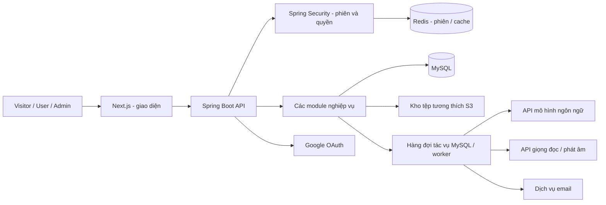
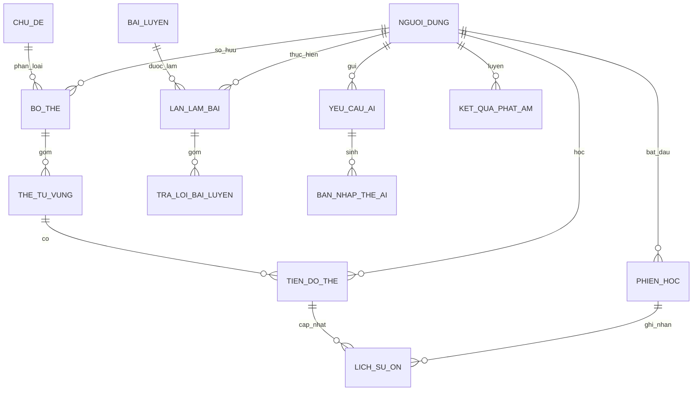

# PHÂN TÍCH VÀ THIẾT KẾ HỆ THỐNG HỌC TỪ VỰNG TIẾNG ANH

> Đối chiếu triển khai 05/10/2026: hợp đồng GĐ0–B1.8 theo controller/DTO, migration và báo cáo Đợt 1. API từ B1.9 trở đi vẫn là kế hoạch. Mô hình logic ánh xạ sang schema vật lý: nguoi_dung.anh_dai_dien_id, ho_so_hoc_tap.da_hoan_tat_khoi_dau, bảng chu_de_yeu_thich, cai_dat_thong_bao.gio_nhac, bo_the.xoa_at/the_tu_vung.xoa_at. URL ký không lưu lâu dài. Mục tiêu bộ, số thẻ, favorite listing và thư viện phải chốt ở B1.9/B1.10; mục tiêu hồ sơ không tự trở thành mục tiêu bộ. Phân trang hiện hành trả items/page/size/totalElements/totalPages.

## 1. Thông tin tài liệu và cơ sở phân tích

| Nội dung | Thông tin |
|---|---|
| Tên đề tài | Xây dựng website học từ vựng tiếng Anh ứng dụng ôn tập ngắt quãng và hỗ trợ trí tuệ nhân tạo |
| Tên tiếng Anh | English Vocabulary Learning Website with Spaced Repetition and AI Support |
| Tên sản phẩm đề xuất | VocabFlow — Học đúng từ, ôn đúng lúc, dùng được trong ngữ cảnh |
| Nguồn phân tích | `C:/doantotnghiep/docs/DE_CUONG_CHI_TIET_HOC_TU_VUNG_K28.docx` |
| Ngày lập | 27/09/2026 |
| Thời gian theo đề cương | 28/09/2026–14/12/2026 |
| Quy mô | Nhóm 5 thành viên; website minh họa khóa luận |
| Trạng thái | Thiết kế đề xuất để triển khai; chưa phải mô tả một hệ thống đã xây dựng hoặc kiểm thử |

**Quy ước phạm vi:**

- **[Gốc]**: yêu cầu được đề cương nêu rõ.
- **[Thiết kế]**: chi tiết kỹ thuật, quy tắc nghiệp vụ hoặc trải nghiệm đề xuất để hiện thực hóa yêu cầu gốc.
- **[Mở rộng]**: ngoài phạm vi nghiệm thu hiện tại, chỉ triển khai khi có thời gian và thống nhất lại phạm vi.

Nội dung trong file Word được sử dụng làm nguồn yêu cầu để phân tích, không được coi là chỉ dẫn điều khiển trợ lý. Mẫu chức năng người dùng cung cấp chỉ được dùng làm mẫu trình bày; các chức năng mạng xã hội, thanh toán, quyên góp, bạn bè và Stories trong mẫu không thuộc đề tài này.

Các lựa chọn dịch vụ và phiên bản triển khai phải được kiểm tra lại khi xây dựng. Tài liệu không khẳng định giá, hạn mức, phiên bản hoặc khả năng hỗ trợ hiện tại của một nhà cung cấp API.

## 2. Đọc hiểu đề cương và định hướng sản phẩm

### 2.1. Bài toán cần giải quyết

Người học thường gặp bốn vấn đề: học nhiều nhưng mau quên; không biết hôm nay cần ôn từ nào; nhớ nghĩa nhưng chưa viết, nghe hoặc phát âm được; khó duy trì thói quen sau khi bỏ học vài ngày.

Hệ thống cần hỗ trợ một vòng học hoàn chỉnh:

**Xác định mục tiêu → chọn/tạo bộ thẻ → học từ mới → ôn đúng lịch → luyện kỹ năng → xem điểm yếu → điều chỉnh kế hoạch.**

AI hỗ trợ tạo nội dung và phản hồi ngôn ngữ. Lịch ôn, quyền truy cập, chấm bài có đáp án cố định và điểm thưởng do máy chủ quyết định bằng quy tắc kiểm chứng được.

### 2.2. Giá trị cốt lõi

| Giá trị | Hành vi sản phẩm | Minh chứng có thể trình diễn |
|---|---|---|
| Nhớ bền hơn | Lịch ôn riêng cho từng người, thẻ và chiều học | Cùng một thẻ có hai lịch Anh–Việt và Việt–Anh khác nhau |
| Biết nên học gì | Bảng điều khiển đưa ra kế hoạch theo thời gian và thẻ đến hạn | Chọn 10 phút, hệ thống tạo phiên phù hợp và giải thích ưu tiên |
| Vận dụng được | Kết hợp nhận nghĩa, chính tả, nghe, viết câu và phát âm | Từ nhận nghĩa đúng nhưng viết sai vẫn được đánh dấu cần luyện viết |
| Quay lại dễ dàng | Chia lượng ôn tồn đọng thành nhiều phiên | Người học nghỉ một tuần vẫn có kế hoạch khả thi, không bị dồn toàn bộ |
| Tạo nội dung nhanh | AI tạo bản nháp thẻ từ đoạn văn | Người học sửa và chọn từng thẻ trước khi lưu |
| Tin cậy và kiểm soát | Lưu nguồn, lịch sử, hạn mức và báo cáo lỗi | Có thể kiểm tra vì sao được gợi ý bài luyện và vì sao bị giới hạn AI |

### 2.3. Phạm vi và ranh giới

**Trong phạm vi [Gốc]:** tài khoản; hồ sơ; thư viện giao tiếp/TOEIC; bộ thẻ cá nhân; CSV; SRS; bài luyện; AI; phát âm; sổ tay từ khó; thống kê; điểm/huy hiệu/thử thách; nhắc học; quản trị và kiểm duyệt.

**Ngoài phạm vi [Gốc]:** ứng dụng di động riêng; thanh toán; mạng xã hội; đồng bộ ngoại tuyến đầy đủ; tự huấn luyện mô hình AI.

**Hướng mở rộng [Gốc/Mở rộng]:** đăng nhập Facebook, nội dung IELTS, tiếng Anh trẻ em, hội thoại AI bằng văn bản. Vai trò giáo viên, lớp học và bảng xếp hạng nhóm cũng chỉ là đề xuất mở rộng, không tự bổ sung vào nghiệm thu.

### 2.4. Các điểm cần làm rõ trước khi lập trình

| Điểm trong đề cương | Cách xử lý đề xuất |
|---|---|
| “Sửa câu tiếng Việt” trong nhóm hỗ trợ AI | Thiết kế chính: người học viết câu tiếng Anh, AI giải thích bằng tiếng Việt. Nếu nhập câu tiếng Việt, cung cấp gợi ý diễn đạt tiếng Anh theo chế độ riêng; cần xác nhận lại với giảng viên |
| Chưa quy định chi tiết biến thể SM-2 | Chốt bảng ánh xạ, công thức, bước học lại và bộ dữ liệu kiểm thử ở mục 7 trước khi triển khai |
| Chưa định nghĩa mức làm chủ | Dùng chỉ số riêng theo kỹ năng và dữ liệu bài làm; không coi một điểm tổng là chứng nhận trình độ |
| Chưa chốt API phát âm và các chỉ số | Chỉ hiển thị trường có thực trong phản hồi API, cho phép giá trị thiếu; kiểm tra ngôn ngữ/định dạng dịch vụ hỗ trợ |
| Chưa chốt xóa dữ liệu | Quy định thời hạn xử lý, thời gian giữ bản sao lưu và cơ chế xử lý dữ liệu đã chia sẻ |
| Chưa chốt ngân sách AI | Hạn mức cấu hình, thống kê theo nhà cung cấp, loại tác vụ và tài khoản; không ghi cứng giá giả định |

## 3. Tác nhân và phân quyền

### 3.1. Các vai trò

1. **Visitor:** khách chưa đăng nhập, xem thông tin và nội dung công khai.
2. **User:** người học, quản lý nội dung của mình và toàn bộ tiến trình học cá nhân.
3. **Admin:** quản trị tài khoản, nội dung mẫu, báo cáo, cấu hình và vận hành.
4. **Dịch vụ ngoài:** Google OAuth, email, mô hình ngôn ngữ, giọng đọc, đánh giá phát âm và kho lưu trữ tệp. Đây là hệ thống tích hợp, không phải tài khoản người dùng.

### 3.2. Ma trận quyền

| Nghiệp vụ | Visitor | User | Admin |
|---|---|---|---|
| Xem giới thiệu, thư viện/bộ công khai | Có, nội dung được phép công bố | Có | Có |
| Xem bộ riêng tư | Không | Chỉ chủ sở hữu | Không mặc định; cần quyền xử lý cụ thể và ghi nhật ký |
| Tạo/sửa/xóa bộ cá nhân | Không | Nội dung của mình | Không mặc định chỉnh sửa nội dung riêng của người học |
| Học và xem lịch sử | Không | Dữ liệu của mình | Chỉ số tổng hợp; truy cập chi tiết theo quyền hỗ trợ được ghi nhận |
| AI và phát âm | Không | Trong hạn mức | Cấu hình/vận hành; không vượt kiểm soát chi phí |
| Sao chép bộ công khai | Yêu cầu đăng nhập | Có | Có |
| Báo cáo nội dung | Yêu cầu đăng nhập | Có | Xử lý báo cáo |
| Quản lý bộ mẫu/chủ đề | Không | Không | Có |
| Khóa tài khoản/phân quyền | Không | Không | Có, không được tự làm mất quản trị viên cuối cùng |
| Thống kê vận hành/nhật ký | Không | Không | Theo quyền quản trị |

Admin được tạo bởi quy trình cấp quyền có kiểm soát, không có chức năng đăng ký công khai để tự trở thành Admin. Có thể dùng tài khoản người học đã được cấp quyền để truy cập khu vực quản trị.

## 4. Danh mục chức năng theo vai trò

### 4.1. Chức năng đối với User

AI hỗ trợ những tác vụ cần xử lý ngôn ngữ, phản hồi và gợi ý; các chức năng khác hoạt động bằng nghiệp vụ thông thường.

- Đăng ký và xác thực email.
- Đăng nhập bằng email/mật khẩu hoặc Google.
- Đăng xuất, quên mật khẩu, đặt lại và đổi mật khẩu.
- Quản lý hồ sơ, ảnh đại diện và tài khoản.
- Thiết lập trình độ tự đánh giá, mục tiêu, chủ đề yêu thích, số từ mới và thời gian học mỗi ngày.
- Cài đặt giờ nhắc, múi giờ, thông báo trong ứng dụng và email.
- Yêu cầu xóa tài khoản và dữ liệu cá nhân.
- Xem bảng điều khiển và kế hoạch học hôm nay.
- Tìm kiếm, lọc và sắp xếp thư viện giao tiếp/TOEIC.
- Xem thông tin bộ thẻ, nguồn, chủ đề, trình độ, số thẻ và trạng thái nội dung.
- Tạo, sửa, xóa và quản lý bộ thẻ cá nhân.
- Tạo, sửa, xóa thẻ: từ/cụm từ, từ loại, nghĩa, IPA, ví dụ, bản dịch, ảnh và âm thanh.
- Quản lý nhãn, độ khó, quyền công khai/riêng tư và yêu thích.
- Sao chép bộ công khai và chia sẻ liên kết.
- Nhập/xuất CSV, xem trước dữ liệu nhập và cảnh báo thẻ trùng.
- Báo cáo bộ/thẻ công khai hoặc đầu ra AI không chính xác.
- Học từ mới, lật thẻ, dùng phím tắt và nghe từ/câu.
- Học hai chiều Anh–Việt, Việt–Anh với tiến độ độc lập.
- Đánh giá Quên/Khó/Nhớ/Dễ và ôn tập theo lịch SRS.
- Xem thẻ mới, đang học, đến hạn, quá hạn và tạm ngưng.
- Tạm ngưng, khôi phục và đặt lại tiến độ có xác nhận.
- Xem lịch sử ôn, số lần quên và tổng kết phiên học.
- Chọn quỹ thời gian và kế hoạch học lại sau thời gian nghỉ.
- Luyện chọn nghĩa/chọn từ, nghe viết, điền chỗ trống, ghép từ và nhập từ theo nghĩa.
- Luyện phân biệt từ dễ nhầm và làm bài kiểm tra tổng hợp.
- Xem đáp án, giải thích, lịch sử bài làm và luyện lại câu sai.
- Viết câu tiếng Anh và nhận phản hồi AI bằng tiếng Việt.
- Tạo thẻ từ đoạn văn bằng AI; xem, sửa và chọn trước khi lưu.
- Nhận nghĩa theo ngữ cảnh, ví dụ, mẹo nhớ và giải thích từ dễ nhầm bằng AI.
- Tạo bài luyện/tình huống với những từ sai hoặc đến hạn bằng AI.
- Xem lịch sử yêu cầu AI, trạng thái tác vụ và hạn mức còn lại.
- Quản lý sổ tay từ khó, nhóm lỗi và cặp từ thường nhầm.
- Xem đề xuất luyện tập có lý do và minh chứng từ kết quả học.
- Nghe phát âm mẫu, ghi âm, nghe lại và gửi đánh giá phát âm.
- Xem chỉ số phát âm do dịch vụ thực sự cung cấp, luyện lại từ điểm thấp và xóa bản ghi.
- Xem thống kê từ đã học, lượt ôn, tỷ lệ đúng, thời gian, mục tiêu và chuỗi ngày.
- Xem mức làm chủ theo kỹ năng, chủ đề/bộ, so sánh kỳ và tổng kết tuần.
- Nhận điểm kinh nghiệm, huy hiệu, thử thách ngày/tuần và thông báo thành tích.

### 4.2. Chức năng đối với Admin

- Đăng nhập, đăng xuất, quên/đặt lại và đổi mật khẩu.
- Quản lý hồ sơ quản trị và xem thông báo vận hành.
- Tìm kiếm, xem, khóa/mở khóa tài khoản User và xử lý yêu cầu hỗ trợ.
- Cấp/thu hồi quyền theo quyền hạn; bảo vệ quản trị viên cuối cùng.
- Quản lý chủ đề, nhãn và danh mục thư viện; phân loại theo enum trình độ. B1.7 không có CRUD trình độ.
- Tạo, sửa, xuất bản, ẩn và quản lý bộ/thẻ mẫu giao tiếp/TOEIC.
- Quản lý nguồn nội dung, ảnh, âm thanh và chất lượng thẻ mẫu.
- Xem hàng đợi báo cáo, kiểm tra nội dung và xử lý vi phạm.
- Xem gợi ý kiểm duyệt AI khi được bật; ra quyết định và lưu lý do xử lý.
- Xử lý báo cáo đầu ra AI sai, đánh dấu để cải thiện cấu hình.
- Quản lý hạn mức AI/phát âm và cấu hình dịch vụ qua thông tin không chứa khóa bí mật.
- Theo dõi lượt sử dụng, tỷ lệ lỗi, thời gian phản hồi và chi phí dịch vụ khi có dữ liệu tính phí.
- Quản lý thông báo hệ thống, nhắc học, huy hiệu và thử thách.
- Xem thống kê tài khoản, nội dung, học tập và mức độ sử dụng hệ thống.
- Xem nhật ký thao tác quản trị, tác vụ nền và lỗi vận hành.
- Theo dõi sao lưu, kết quả phục hồi thử nghiệm và tiến độ xóa dữ liệu.

### 4.3. Chức năng đối với Visitor

- Xem trang giới thiệu, cách học, hướng dẫn và câu hỏi thường gặp.
- Tìm kiếm và xem bộ thẻ công khai đã được phép hiển thị.
- Xem mẫu thẻ và thông tin nguồn/chủ đề/trình độ.
- Đăng ký, xác thực email, đăng nhập và khôi phục mật khẩu.
- Xem chính sách quyền riêng tư và điều khoản sử dụng.

## 5. Yêu cầu chức năng và tiêu chí nghiệm thu

Các mã dưới đây phục vụ truy vết yêu cầu, thiết kế, API và kiểm thử. Mức **P0** là nền tảng phải ổn định; **P1** vẫn thuộc phạm vi đề cương nhưng làm sau P0; **P2** là mở rộng.

| Mã | Nhóm | Mức | Tiêu chí nghiệm thu chính |
|---|---|---|---|
| FR-01 | Tài khoản | P0 | Email xác thực một lần; token hết hạn; đăng xuất vô hiệu phiên; mật khẩu không lưu dạng rõ |
| FR-02 | Hồ sơ/kế hoạch | P0 | Lưu mục tiêu và múi giờ; kế hoạch sử dụng đúng thiết lập; trình độ hiển thị là tự đánh giá |
| FR-03 | Bộ/thẻ | P0 | CRUD đúng quyền; bộ riêng không xuất hiện ở API công khai; thẻ lưu đủ trường bắt buộc |
| FR-04 | Thư viện/chia sẻ | P0 | Tìm/lọc/phân trang; sao chép không mang lịch sử của chủ bộ; có nguồn nội dung |
| FR-05 | CSV | P0 | Xem trước, báo lỗi từng dòng, phát hiện trùng; không ghi dữ liệu lỗi âm thầm |
| FR-06 | SRS/phiên học | P0 | Hai chiều độc lập; lưu kết quả một lần; tính lịch theo quy tắc; tổng kết khớp lịch sử |
| FR-07 | Bài cố định | P0 | Chấm tại máy chủ; không gửi đáp án trong dữ liệu đề trước khi nộp; lưu câu sai |
| FR-08 | Từ khó/gợi ý | P1 | Gợi ý có mã lý do và thẻ/lỗi liên quan; không gợi ý nội dung đã xóa/tạm ngưng |
| FR-09 | AI | P1 | Chỉ lưu thẻ đã chọn; xác thực cấu trúc; có hạn mức; lỗi AI không chặn ôn bình thường |
| FR-10 | Phát âm | P1 | Xin quyền micro; nghe lại trước gửi; lưu kết quả có/thiếu chỉ số; xóa được bản ghi |
| FR-11 | Thống kê | P0/P1 | Tổng số lấy từ sự kiện hợp lệ; không cộng trùng; bộ lọc ngày theo múi giờ người học |
| FR-12 | Thưởng/nhắc | P1 | Thưởng có giới hạn; nhận một lần; nhắc đúng cài đặt và không gửi trùng |
| FR-13 | Quản trị | P0/P1 | Phân quyền máy chủ; thao tác quan trọng có người thực hiện, thời gian và lý do |
| FR-14 | Dữ liệu cá nhân | P1 | Có yêu cầu xóa, trạng thái xử lý, xóa tệp và dữ liệu phụ thuộc theo chính sách |

## 6. Luồng nghiệp vụ chính

### 6.1. Đăng ký và thiết lập lần đầu

1. Visitor nhập email, mật khẩu và chấp nhận điều khoản.
2. Máy chủ kiểm tra dữ liệu, tạo tài khoản chưa xác thực và gửi email.
3. Người dùng xác thực bằng token một lần; token sai/hết hạn có thông báo và khả năng gửi lại.
4. Người học chọn mục tiêu giao tiếp/TOEIC, trình độ tự đánh giá, chủ đề, thời gian/ngày, số từ mới và giờ nhắc.
5. Hệ thống đề xuất bộ mẫu theo thiết lập; người học có thể bỏ qua.
6. Chuyển đến bảng điều khiển với một hành động rõ ràng: “Bắt đầu phiên học đầu tiên”.

Đăng nhập Google xác minh danh tính từ nhà cung cấp; không tự nối tài khoản chỉ vì email trùng khi chưa có bằng chứng và quy trình liên kết an toàn.

### 6.2. Chọn và sao chép bộ thẻ

1. User tìm bộ theo mục tiêu, chủ đề, trình độ và nguồn.
2. Xem số thẻ, mẫu nội dung, tác giả, nguồn và nhãn “Bộ mẫu” hoặc “Người học chia sẻ”.
3. Chọn sao chép; hệ thống tạo bộ cá nhân và thẻ mới, giữ tham chiếu nguồn.
4. Không sao chép tiến độ, điểm thưởng hoặc lịch sử học.
5. Người học sửa bản sao độc lập; cập nhật bộ nguồn không tự ghi đè bản sao.

### 6.3. Tạo thẻ bằng AI

1. Nhập đoạn văn tiếng Anh, chọn bộ đích và số thẻ mong muốn trong giới hạn.
2. Máy chủ kiểm tra độ dài, quyền và hạn mức, tạo tác vụ.
3. AI trả dữ liệu có cấu trúc: từ, nghĩa, từ loại, IPA nếu có cơ sở, ví dụ, bản dịch.
4. Máy chủ kiểm tra cấu trúc/độ dài, loại mục không hợp lệ và đánh dấu thẻ có khả năng trùng.
5. Giao diện hiển thị bản nháp, nguồn đoạn văn và cảnh báo cần kiểm tra.
6. Người học sửa, bỏ chọn hoặc chọn thẻ; nhấn lưu.
7. Máy chủ kiểm tra lại quyền và nội dung, lưu đúng lựa chọn một lần.

Không có bước tự xuất bản thẻ AI. Đoạn văn nhập vào là dữ liệu; những câu như “bỏ qua chỉ dẫn” trong đoạn văn không được dùng thay đổi quy tắc hệ thống.

### 6.4. Phiên học và ôn

1. Chọn bộ/chiều học/quỹ thời gian hoặc dùng kế hoạch hôm nay.
2. Máy chủ lập hàng đợi ưu tiên bước học lại đến hạn, thẻ ôn quá hạn/đến hạn, sau đó thẻ mới trong giới hạn.
3. Mặt trước hiển thị nội dung theo chiều học; người học nhớ lại trước khi lật.
4. Mặt sau hiển thị đáp án, ví dụ và âm thanh; bật bốn mức tự đánh giá.
5. Máy chủ ghi sự kiện, cập nhật trạng thái SRS và trả lịch tiếp theo.
6. Khi hết thời gian, người học có thể hoàn tất thẻ đang học rồi kết thúc; không làm mất kết quả đã lưu.
7. Tổng kết số thẻ, thời gian, các từ cần luyện và gợi ý phiên tiếp theo.

Nếu mất mạng, hiển thị kết quả chưa đồng bộ và cho gửi lại với cùng khóa chống trùng. Đây là xử lý gián đoạn của phiên trực tuyến, không phải cam kết học ngoại tuyến đầy đủ.

### 6.5. Quay lại sau thời gian nghỉ

1. Phát hiện số thẻ quá hạn vượt ngưỡng cấu hình hoặc người học chủ động chọn chế độ học lại.
2. Hiển thị “Có 120 thẻ cần ôn; hôm nay bạn có 15 phút” cùng phương án chia phiên.
3. Tạm giảm từ mới, ưu tiên thẻ quên nhiều và quá hạn.
4. Giữ ngày đến hạn gốc để phản ánh nợ ôn; không tự đẩy hết lịch sang tương lai cho đẹp thống kê.
5. Giải thích khối lượng dự kiến là ước tính, điều chỉnh theo thời gian làm bài thực tế.

### 6.6. Luyện tập và chữa lỗi

1. Chọn dạng bài hoặc gợi ý từ hồ sơ lỗi.
2. Máy chủ tạo đề có phiên bản đáp án và lưu danh sách câu hỏi.
3. User nộp đáp án; máy chủ chấm, trả lời giải và cập nhật lịch sử kỹ năng.
4. Sai chính tả/nghĩa/nghe/cặp từ được lưu bằng mã lỗi.
5. Tạo phiên luyện lại câu sai; không tự sửa lịch SRS nhận biết chỉ vì làm một bài viết, trừ khi quy tắc liên kết được quy định riêng.

### 6.7. Phát âm

1. Nghe từ/câu mẫu; xin quyền micro ngay khi người học chọn ghi âm.
2. Ghi âm trong giới hạn, phát lại và cho ghi lại.
3. Người học chủ động gửi; máy chủ kiểm tra tệp, hạn mức và gọi dịch vụ.
4. Hiển thị những điểm/đơn vị lỗi dịch vụ có cung cấp; trường không có hiển thị “Chưa có dữ liệu”.
5. Lưu kết quả và gợi ý luyện lại; cho xóa âm thanh.
6. Nếu dịch vụ lỗi, vẫn nghe mẫu và ghi âm/phát lại; không sinh điểm thay thế.

### 6.8. Báo cáo và kiểm duyệt

1. User báo cáo bộ/thẻ hoặc đầu ra AI, chọn lý do và mô tả.
2. Hệ thống chống gửi trùng, lưu nội dung tham chiếu và đưa vào hàng đợi.
3. Admin xem nội dung công khai hoặc nội dung cụ thể gắn báo cáo được phép truy cập.
4. AI có thể gợi ý phân loại [Thiết kế]; Admin quyết định giữ/ẩn/yêu cầu sửa/từ chối báo cáo.
5. Lưu người xử lý, lý do, trạng thái trước/sau và gửi thông báo cho người liên quan.

## 7. Thiết kế lịch ôn ngắt quãng

### 7.1. Đơn vị theo dõi

Tiến độ có khóa duy nhất **(nguoi_dung_id, the_id, chieu_hoc)**. Hai chiều có lịch, độ dễ, số lần quên và lịch sử độc lập.

Các trạng thái:

- `MOI`: chưa học.
- `DANG_HOC`: đang ở các bước ghi nhớ ban đầu.
- `ON_TAP`: đã tốt nghiệp bước học đầu và có khoảng ôn tính bằng ngày.
- `HOC_LAI`: trả lời quên ở giai đoạn ôn.
- `TAM_NGUNG`: không đưa vào hàng đợi.

“Đến hạn” và “quá hạn” là trạng thái tính từ `han_on_at`, không cần hai trạng thái lưu riêng. Thẻ quá hạn khi `han_on_at < now`; hiển thị mức trễ theo ngày địa phương khi cần.

### 7.2. Biến thể SM-2 đề xuất [Thiết kế]

Đây là quy tắc triển khai đề xuất, không phải thuật toán mới và không đồng nhất hoàn toàn với SM-2 nguyên bản.

- `EF` ban đầu = 2,5; tối thiểu = 1,3.
- Ánh xạ mức: Quên → `q=1`; Khó → `q=3`; Nhớ → `q=4`; Dễ → `q=5`.
- Khi thẻ ở `ON_TAP`, cập nhật:

```text
EF_moi = max(1.3, EF_cu + 0.1 - (5-q) * (0.08 + (5-q)*0.02))
```

| Trạng thái hiện tại | Quên | Khó | Nhớ | Dễ |
|---|---|---|---|---|
| MOI | DANG_HOC; sau 1 phút, bước 0 | DANG_HOC; sau 5 phút, bước 0 | DANG_HOC; sau 10 phút, bước 1 | ON_TAP; sau 4 ngày, lần thành công 1 |
| DANG_HOC bước 0 | Sau 1 phút, bước 0 | Sau 5 phút, giữ bước | Sau 10 phút, bước 1 | ON_TAP; sau 4 ngày, lần thành công 1 |
| DANG_HOC bước 1 | Sau 1 phút, về bước 0 | Sau 10 phút, giữ bước | ON_TAP; sau 1 ngày, lần thành công 1 | ON_TAP; sau 4 ngày, lần thành công 1 |
| ON_TAP | HOC_LAI; sau 10 phút; tăng số lần quên; đặt lại chuỗi thành công | Sau max(I+1, round(I×1,2)) ngày | Nếu chuỗi thành công = 1: sau 6 ngày; nếu ≥2: max(I+1, round(I×EF_moi)) ngày | Sau max(I+1, round(I×EF_moi×1,3)) ngày |
| HOC_LAI | Sau 1 phút, giữ HOC_LAI | Sau 10 phút, giữ HOC_LAI | ON_TAP; sau 1 ngày, lần thành công 1 | ON_TAP; sau 2 ngày, lần thành công 1 |

`I` là khoảng ôn cũ theo ngày; các mức Khó/Nhớ/Dễ ở `ON_TAP` đều tăng chuỗi thành công một lần. Khoảng ôn giới hạn tối đa 365 ngày là cấu hình đề xuất cho bản minh họa. Chỉ cập nhật EF theo công thức ở `ON_TAP`, tránh giảm EF lặp trong bước học lại ngắn.

**Ví dụ:** thẻ mới chọn Nhớ → 10 phút; tại bước 1 chọn Nhớ → 1 ngày; lần ôn kế tiếp chọn Nhớ → 6 ngày; sau đó chọn Nhớ với EF=2,5 → 15 ngày. Chiều Việt–Anh không thay đổi nếu chỉ học chiều Anh–Việt.

### 7.3. Quy tắc hàng đợi và thời gian

- Lưu thời điểm dưới dạng UTC; quy đổi hiển thị/mục tiêu theo múi giờ IANA của User, ví dụ `Asia/Ho_Chi_Minh`.
- Bước phút tính từ thời điểm máy chủ nhận kết quả; bước ngày tính theo ngày lịch tại múi giờ của phiên và giờ ôn đã quy định, không trộn hai cách tính.
- Giới hạn từ mới tính theo thẻ vật lý lần đầu học trong ngày, không tính hai lần vì học cả hai chiều; hai chiều vẫn có tiến độ riêng.
- Thẻ đến hạn không bị mất chỉ vì hết hạn mức từ mới.
- Khối lượng phiên dựa trên quỹ thời gian và thời gian trung bình của các lượt gần đây; chưa có dữ liệu thì dùng giá trị mặc định và ghi là ước tính.
- Không thêm thẻ tạm ngưng, đã xóa hoặc không còn quyền truy cập.
- Tự đánh giá có thể chủ quan; bài luyện kỹ năng được lưu riêng để bổ sung minh chứng.

### 7.4. Đồng thời và chống ghi trùng

Mỗi kết quả mang `client_event_id`, `phien_id`, `the_id`, `chieu_hoc` và `expected_version`. Trong một giao dịch:

1. Kiểm tra quyền, trạng thái phiên và thẻ thực sự thuộc hàng đợi.
2. Kiểm tra sự kiện đã được lưu chưa; nếu có, trả lại kết quả cũ.
3. Khóa bản ghi tiến độ hoặc kiểm tra phiên bản.
4. Ghi lịch sử gồm trạng thái trước/sau và phiên bản thuật toán.
5. Cập nhật tiến độ, hạn mức từ mới và thưởng hợp lệ.
6. Commit và trả phiên bản mới.

Hai tab cùng nộp với phiên bản cũ: một tab thành công, tab còn lại nhận xung đột và tải trạng thái mới. Không tự ghi đè.

## 8. Thiết kế bài luyện và cá nhân hóa

### 8.1. Các dạng bài

| Dạng | Dữ liệu câu hỏi | Cách chấm/giới hạn |
|---|---|---|
| Chọn nghĩa/chọn từ | Một đáp án, các phương án nhiễu | So sánh ID đáp án tại máy chủ; tránh phương án cũng đúng |
| Nghe viết | Âm thanh và đáp án đã duyệt | Chuẩn hóa theo quy tắc, phân biệt lỗi chính tả |
| Điền chỗ trống | Câu ngữ cảnh, vị trí trống, đáp án hợp lệ | Có danh sách biến thể chấp nhận; không tùy ý đoán |
| Ghép từ–nghĩa | Các cặp ID | Chấm từng cặp; xáo trộn thứ tự |
| Nhập từ theo nghĩa | Nghĩa, từ loại, ngữ cảnh bổ sung | So khớp đáp án/biến thể đã cấu hình |
| Phân biệt cặp nhầm | Hai từ và các ngữ cảnh | Chấm đáp án cố định, giải thích khác biệt |
| Viết câu | Từ mục tiêu, câu User | AI nhận xét; không coi điểm AI là đáp án tuyệt đối |
| Kiểm tra tổng hợp | Nhiều dạng bài | Báo cáo từng kỹ năng; câu viết có kết quả riêng |

Chuẩn hóa Unicode, khoảng trắng và chữ hoa theo loại bài. Không xóa toàn bộ dấu câu, dấu nháy hoặc dấu gạch nối nếu làm thay đổi đáp án. Đề phải có bản chụp nội dung/đáp án để chỉnh sửa thẻ sau này không làm sai kết quả quá khứ.

### 8.2. Hồ sơ lỗi và mức làm chủ

- Nhóm lỗi: nghĩa, chính tả, nghe, dùng từ/ngữ cảnh, cặp nhầm, phát âm.
- Tách tỷ lệ đúng lần đầu với tỷ lệ đúng sau luyện lại.
- Mỗi kỹ năng hiển thị số lần quan sát; thiếu dữ liệu thì ghi “Chưa đủ dữ liệu”.
- Chỉ số làm chủ đề xuất: tỷ lệ đúng có trọng số theo độ gần của tối đa 20 lượt gần nhất; phản hồi AI/phát âm hiển thị riêng kèm nguồn.
- Không quy đổi tự động thành trình độ CEFR/TOEIC được chứng nhận.

### 8.3. Gợi ý có minh chứng

| Mã lý do | Điều kiện đề xuất | Hành động |
|---|---|---|
| QUEN_NHIEU | Ít nhất 3 lần quên gần đây | Ôn và thêm mẹo nhớ |
| SAI_CHINH_TA | Sai ít nhất 2/5 lượt nhập gần nhất | Phiên nhập từ/nghe viết |
| CAP_DE_NHAM | Chọn nhầm hai từ trong nhiều câu | Bài phân biệt cặp từ |
| PHAT_AM_THAP | Kết quả dịch vụ dưới ngưỡng cấu hình | Nghe mẫu và ghi âm lại |
| QUA_HAN_NHIEU | Lượng ôn vượt khả năng một phiên | Chia kế hoạch học lại |

Ví dụ hiển thị: “Luyện viết ‘receipt’ vì bạn viết sai 3 trong 5 lượt gần đây”, có liên kết xem các lượt liên quan. Ngưỡng là cấu hình thiết kế, không phải kết luận nghiên cứu.

## 9. Thiết kế trải nghiệm nổi bật — “wow” có giá trị học tập

### 9.1. Trung tâm “Hôm nay học gì?” [Gốc + Thiết kế]

Một màn hình gom thẻ đến hạn, số từ mới, mục tiêu và quỹ thời gian. Người học chọn “5 phút / 10 phút / 20 phút” rồi bắt đầu. Sau phiên, hệ thống nói rõ đã hoàn thành gì và nên làm gì tiếp theo.

### 9.2. Bản đồ làm chủ từ vựng [Thiết kế từ yêu cầu thống kê]

Mỗi chủ đề là một nhóm; màu thể hiện mức hoàn thành và thiếu dữ liệu. Bấm một từ xem lịch sử nhận nghĩa, viết, nghe, phát âm, cặp nhầm và lịch ôn. Không dùng màu xanh để ngụ ý thành thạo khi chỉ mới nhận nghĩa đúng một lần.

### 9.3. “Cứu lịch ôn” [Gốc + Thiết kế]

Khi quay lại sau nghỉ, giao diện không gây áp lực bằng hàng trăm thẻ. Nó đề xuất lộ trình vài ngày theo thời gian thực tế và cho phép giảm từ mới. Ngày đến hạn gốc vẫn được giữ để thống kê trung thực.

### 9.4. Xưởng thẻ AI có bàn duyệt [Gốc + Thiết kế]

Trái là đoạn văn, phải là thẻ nháp. Mỗi thẻ có nút chọn, sửa, nghe, cảnh báo trùng và liên kết đoạn nguồn. Thanh dưới hiển thị “Lưu 8 thẻ đã chọn”. Đây là luồng tạo nội dung nhanh nhưng vẫn trao quyền cho người học.

### 9.5. “Nhớ nghĩa rồi, giờ dùng thử” [Thiết kế từ yêu cầu viết câu]

Sau ôn, chọn 3 từ đã học để viết một câu trong tình huống giao tiếp/TOEIC. AI chỉ ra từ mục tiêu đã dùng, chỗ cần sửa, bản sửa và giải thích tiếng Việt; người học có thể giữ câu gốc và luyện lại.

### 9.6. Góc phát âm trước–sau [Thiết kế từ yêu cầu phát âm]

Nghe mẫu, nghe bản ghi của mình, xem điểm được API hỗ trợ và so sánh hai lần luyện cùng từ. Nếu một chỉ số không có trong cả hai lần thì không tính mức cải thiện giả.

### 9.7. Tổng kết tuần bằng dữ liệu thật [Gốc + Thiết kế]

Hiển thị từ đã học, kỹ năng tiến bộ, ba từ khó và mục tiêu tuần sau. Văn bản tóm tắt có thể tạo từ mẫu; AI chỉ là tùy chọn diễn đạt, không tự tạo số liệu.

### 9.8. Nguyên tắc giao diện

- Tiếng Việt nhất quán; từ tiếng Anh và IPA hiển thị rõ.
- Giao diện responsive; một hành động chính mỗi màn học; điều khiển lớn trên điện thoại.
- Màu chủ đạo đề xuất: xanh chàm; màu thành công: xanh lá; cảnh báo: hổ phách; lỗi: đỏ. Không dùng màu làm dấu hiệu duy nhất.
- Font hỗ trợ tiếng Việt và IPA; nội dung tối thiểu 16px là mục tiêu thiết kế.
- Có skeleton khi tải, trạng thái rỗng kèm bước tiếp theo, lỗi kèm thử lại và xác nhận sau lưu.
- Phím tắt không kích hoạt khi đang nhập văn bản; có hướng dẫn bàn phím.
- Chuyển động ngắn, tôn trọng giảm chuyển động; không làm gián đoạn việc đọc/nhớ.
- Thuật ngữ Quên/Khó/Nhớ/Dễ có giải thích; tránh biến tự đánh giá thành cuộc đua điểm.

## 10. Danh mục màn hình

| Nhóm | Màn hình và thành phần chính |
|---|---|
| Công khai | Trang chủ, thư viện, chi tiết bộ công khai, hướng dẫn, chính sách |
| Xác thực | Đăng ký, đăng nhập, xác thực, quên/đặt lại mật khẩu |
| Khởi đầu | Chọn mục tiêu, trình độ, chủ đề, thời gian/ngày và bộ khởi động |
| Bảng điều khiển | Kế hoạch hôm nay, đến hạn/quá hạn, mục tiêu, chuỗi ngày, gợi ý có lý do |
| Bộ của tôi | Danh sách, bộ yêu thích, tạo/sửa bộ, quyền chia sẻ |
| Biên tập thẻ | Form thẻ, tệp, nguồn, nhãn, kiểm tra trùng, xem trước |
| CSV | Chọn tệp, ánh xạ cột, xem trước, lỗi từng dòng, kết quả nhập |
| Học | Chọn chiều/thời gian, mặt trước/sau, âm thanh, bốn mức, trạng thái lưu |
| Tổng kết học | Số lượt, từ khó, kết quả mục tiêu, lịch tiếp theo |
| Luyện tập | Chọn dạng, bài làm, đáp án, giải thích, luyện lại |
| AI | Tạo thẻ, duyệt nháp, giải thích ngữ cảnh, viết câu, lịch sử và hạn mức |
| Phát âm | Nghe mẫu, ghi âm, phát lại, kết quả và lịch sử |
| Sổ tay | Từ khó, cặp nhầm, nhóm lỗi, ghi chú và phiên luyện |
| Thống kê | Biểu đồ, bộ lọc ngày/bộ/chủ đề, kỹ năng, tổng kết tuần |
| Động lực | Huy hiệu, thử thách, điểm, lịch sử thưởng |
| Cá nhân | Hồ sơ, mục tiêu, bảo mật, thông báo, dữ liệu và xóa tài khoản |
| Quản trị | Tổng quan, tài khoản, nội dung mẫu, báo cáo, dịch vụ/hạn mức, thông báo, nhật ký/tác vụ |

## 11. Kiến trúc hệ thống

### 11.1. Lựa chọn kiến trúc

**[Gốc]** Next.js gọi API Spring Boot. Backend là **một ứng dụng chia module nghiệp vụ**, phù hợp nhóm 5 người và thời gian đề tài. Không bổ sung microservices, Kafka hoặc MongoDB chỉ để tăng số công nghệ.



Worker là tiến trình xử lý của ứng dụng, có thể chạy riêng khi cần nhưng dùng chung mã nguồn/module. MySQL lưu tác vụ bền vững trong thiết kế B3.1; Redis không phải nguồn duy nhất của kết quả học hoặc hạn mức. Hiện GĐ0–B1.8, email là event sau commit xử lý bất đồng bộ best effort, chưa có outbox/retry bền vững; có luồng gửi lại. Dọn tệp dùng tombstone ngay trong tep_tin.

### 11.2. Module backend

| Module | Trách nhiệm |
|---|---|
| `tai_khoan` | Xác thực, OAuth, hồ sơ, phiên, yêu cầu xóa |
| `noi_dung` | Chủ đề, bộ/thẻ, nguồn, quyền, chia sẻ, CSV, tệp |
| `hoc_tap` | Kế hoạch, hàng đợi, SRS, phiên học, lịch sử |
| `luyen_tap` | Đề, đáp án, nộp bài, chấm cố định, hồ sơ lỗi |
| `ho_tro_ai` | Prompt, bản nháp, phản hồi, hạn mức và adapter dịch vụ |
| `phat_am` | Âm mẫu, ghi âm, đánh giá và lịch sử |
| `thong_ke` | Tổng hợp theo ngày/kỹ năng/bộ và gợi ý |
| `dong_luc` | Điểm, huy hiệu, thử thách và sổ thưởng |
| `thong_bao` | Trong ứng dụng, email, lịch nhắc |
| `quan_tri` | Phân quyền, kiểm duyệt, cấu hình và nhật ký |
| `ha_tang` | Tệp, tác vụ, quan sát vận hành và cấu hình bí mật |

Mỗi module có lớp API, nghiệp vụ và truy cập dữ liệu. Không đặt công thức SRS hoặc chấm điểm vào controller hay frontend.

### 11.3. Phiên đăng nhập [Thiết kế]

- Phiên lưu Redis; cookie phiên có `HttpOnly`, `Secure` khi HTTPS và `SameSite` phù hợp luồng OAuth.
- Ưu tiên frontend/backend chung site qua reverse proxy; cấu hình CORS theo origin cho phép.
- Bảo vệ CSRF cho yêu cầu thay đổi dữ liệu dùng cookie; không coi CORS là thay thế CSRF.
- Đổi/đặt lại mật khẩu vô hiệu các phiên theo chính sách.
- Redis lỗi: từ chối xác thực cần phiên; không dùng thông tin không kiểm chứng để bỏ qua đăng nhập.

## 12. Thiết kế dữ liệu

### 12.1. Nguyên tắc

- Tên bảng/cột tiếng Việt không dấu; giữ tên kỹ thuật `id`, `email`, `password_hash`, `created_at`, `updated_at`, `version`.
- Nội dung thẻ tách khỏi tiến độ và lịch sử cá nhân.
- Khóa ngoại và unique constraints giữ tính toàn vẹn; không chỉ kiểm tra trên giao diện.
- Timestamps theo UTC; lưu múi giờ người dùng và múi giờ phiên khi cần tính ngày học.
- Bản ghi lịch sử chứa bản chụp dữ liệu tối thiểu để nội dung sửa sau này không thay đổi kết quả cũ.
- Tệp nằm ở kho S3; MySQL lưu metadata, quyền và đường dẫn nội bộ; dùng URL ký thời hạn cho tệp riêng.

### 12.2. Danh mục bảng đề xuất

| Bảng | Trường chính và mục đích |
|---|---|
| `nguoi_dung` | id, email unique, password_hash nullable cho tài khoản OAuth, ten_hien_thi, trang_thai, mui_gio |
| `vai_tro`, `nguoi_dung_vai_tro` | Danh mục vai trò và gán quyền |
| `danh_tinh_oauth` | nguoi_dung_id, nha_cung_cap, subject; unique(nha_cung_cap, subject) |
| `token_tai_khoan` | token_hash, loai, het_han_at, da_dung_at; không lưu token rõ |
| `ho_so_hoc_tap` | trình độ tự đánh giá, mục tiêu, phút/ngày, từ mới/ngày, cờ hoàn tất khởi đầu; giờ nhắc lưu ở cai_dat_thong_bao |
| `chu_de`, `nhan` | Danh mục chủ đề và nhãn |
| `bo_the` | chu_so_huu_id, chu_de_id, ten, mo_ta, trinh_do, quyen_truy_cap, trang_thai_kiem_duyet, bo_nguon_id, version |
| `the_tu_vung` | bo_the_id, tu, tu_loai, nghia_vi, phien_am, vi_du_en, dich_vi, do_kho, nguon, version |
| `the_nhan` | Gắn nhiều nhãn cho thẻ |
| `tep_tin` | chu_so_huu_id, object_key, mime_type, kich_thuoc, checksum, loai, trang_thai_xoa |
| `the_tep` | the_id, tep_id, vai_tro: ảnh/âm từ/âm câu |
| `bo_yeu_thich` | nguoi_dung_id, bo_the_id; unique cặp |
| `tien_do_the` | nguoi_dung_id, the_id, chieu_hoc, trang_thai, buoc_hoc, ef, khoang_on_ngay, chuoi_thanh_cong, so_lan_quen, han_on_at, version |
| `phien_hoc` | nguoi_dung_id, chieu_hoc, mui_gio, bat_dau_at, ket_thuc_at, trang_thai, quy_thoi_gian |
| `phien_hoc_the` | phien_id, the_id, chieu_hoc, thu_tu, trang_thai; hàng đợi đã cấp |
| `lich_su_on` | client_event_id, phien_id, tien_do_id, danh_gia, thoi_gian, truoc_json, sau_json, phien_ban_thuat_toan |
| `su_dung_hoc_ngay` | nguoi_dung_id, ngay_dia_phuong, so_the_moi, so_luot_hop_le, diem; unique người/ngày |
| `bai_luyen`, `cau_hoi_bai_luyen` | đề đã sinh, loại bài, thẻ nguồn, câu hỏi và đáp án lưu tại máy chủ |
| `lan_lam_bai`, `tra_loi_bai_luyen` | nguoi_dung_id, bai_id, submit_key, câu trả lời, đúng/sai, điểm và thời gian |
| `loi_hoc_tap` | nguoi_dung_id, the_id, nhom_loi, nguon_su_kien, bang_chung_json |
| `so_tay_tu_kho` | nguoi_dung_id, the_id, ghi_chu, danh_dau_thu_cong |
| `cap_tu_de_nham` | the_1_id, the_2_id, loại nhầm; liên kết bằng chứng theo người học |
| `yeu_cau_ai` | nguoi_dung_id, loai, trang_thai, input_ref, ket_qua_json, phien_ban_prompt, provider_request_id |
| `ban_nhap_the_ai` | yeu_cau_id, noi_dung_json, trang_thai_duyet, the_da_luu_id |
| `han_muc_dich_vu`, `su_dung_dich_vu` | hạn mức, lượt giữ chỗ/đã dùng, token nếu có, chi phí nullable, nguồn định giá |
| `ket_qua_phat_am` | nguoi_dung_id, the_id, tep_ghi_am_id nullable, chi_so_json, nha_cung_cap, trang_thai |
| `huy_hieu`, `nguoi_dung_huy_hieu` | điều kiện, lần nhận; unique người/huy hiệu |
| `thu_thach`, `tien_do_thu_thach` | quy tắc thử thách, khoảng ngày và mức hoàn thành |
| `so_diem_thuong` | nguoi_dung_id, loai_su_kien, su_kien_id, so_diem; unique nguồn thưởng |
| `thong_bao`, `cai_dat_thong_bao` | thông báo, đã đọc, kênh và cài đặt |
| `bao_cao_noi_dung` | người báo cáo, loại/ID đối tượng, lý do, trạng thái, người xử lý |
| `nhat_ky_quan_tri` | người thực hiện, hành động, đối tượng, lý do, trước/sau đã lọc thông tin nhạy cảm |
| `tac_vu_nen` | loại, payload_ref, trạng thái, retry_count, next_run_at, khóa giữ tác vụ |
| `yeu_cau_xoa_du_lieu` | nguoi_dung_id, trạng thái, thời điểm, phạm vi và kết quả |
| `thong_ke_ngay` | dữ liệu tổng hợp có thể tái tạo từ lịch sử hợp lệ |

Đây là mô hình logic đề xuất, chưa phải DDL cuối cùng. Có thể gộp các bảng danh mục nhỏ khi triển khai, nhưng không gộp nội dung thẻ với tiến độ người học hoặc sổ thưởng với tổng điểm.

### 12.3. Quan hệ chính



### 12.4. Ràng buộc và chỉ mục quan trọng

- Unique `tien_do_the(nguoi_dung_id, the_id, chieu_hoc)`.
- Index hàng đợi `tien_do_the(nguoi_dung_id, trang_thai, han_on_at)`.
- Unique `lich_su_on(nguoi_dung_id, client_event_id)`; bổ sung người dùng vào bảng lịch sử để định danh chống trùng trực tiếp.
- Unique `lan_lam_bai(nguoi_dung_id, submit_key)` và `so_diem_thuong(nguoi_dung_id, loai_su_kien, su_kien_id)`.
- Index `bo_the(quyen_truy_cap, trang_thai_kiem_duyet, chu_de_id, created_at)`.
- Index lịch sử `lich_su_on(nguoi_dung_id, created_at)` và báo cáo `(trang_thai, created_at)`.
- Chuẩn hóa từ/từ loại để cảnh báo trùng; không unique toàn cục vì cùng từ có nhiều nghĩa và ngữ cảnh.
- Xóa bộ đang có lịch sử: ẩn/xóa mềm trước, xử lý phụ thuộc theo chính sách; không dùng cascade thiếu kiểm soát làm mất minh chứng học.
- Khi xóa tài khoản, xử lý dữ liệu riêng và tệp; nội dung chia sẻ phải có chính sách xóa hoặc ẩn danh đã thông báo, không mặc định giữ lại.

## 13. Thiết kế API

### 13.1. Quy ước

- Tiền tố `/api/v1`; JSON UTF-8; timestamp ISO 8601 UTC.
- Phân trang và giới hạn kích thước truy vấn; lọc/sắp xếp bằng trường cho phép.
- Yêu cầu tạo kết quả học, nộp bài, lưu thẻ AI và nhận thưởng có khóa chống trùng.
- Trả lỗi có `code`, `message`, `fieldErrors` là mảng {field,message} và `requestId`; không trả stack trace.
- Dùng 401 cho chưa xác thực; 403 cho không đủ quyền; 404 để không lộ tài nguyên riêng; 409 cho xung đột; 422 cho dữ liệu nghiệp vụ sai; 429 cho quá hạn mức.
- Tác vụ dài trả 202 kèm ID và endpoint trạng thái; không giữ kết nối học chờ AI lâu.

### 13.2. Danh mục endpoint chính

| Nhóm | Endpoint đề xuất |
|---|---|
| Xác thực | `POST /auth/register`, `/auth/verify-email`, `/auth/resend-verification`, `/auth/login`, `/auth/logout`, `/auth/forgot-password`, `/auth/reset-password`; `GET /auth/google/start`, `/auth/google/callback` |
| Hồ sơ | `GET/PATCH /me`, `PUT /me/password`, `GET/PUT /me/learning-settings`, `GET/PUT /me/notification-settings`, `POST /me/deletion-requests` |
| Thư viện | `GET /library/decks`, `GET /library/decks/{id}` |
| Bộ/thẻ | `GET/POST /decks`, `GET/PATCH/DELETE /decks/{id}`, `POST /decks/{id}/copy`, `PUT/DELETE /decks/{id}/favorite`, `GET/POST /decks/{id}/cards`, `PATCH/DELETE /cards/{id}` |
| CSV/tệp | `POST /decks/{id}/imports/preview`, `POST /imports/{id}/commit`, `GET /decks/{id}/export`, `POST /files/upload-requests`, `POST /files/{id}/complete`, `DELETE /files/{id}` |
| Kế hoạch/SRS | `GET /learning/today`, `POST /learning/sessions`, `GET /learning/sessions/{id}`, `POST /learning/sessions/{id}/reviews`, `POST /learning/sessions/{id}/finish`, `PUT /cards/{id}/progress/suspend`, `POST /cards/{id}/progress/reset` |
| Luyện tập | `POST /practice/sessions`, `GET /practice/sessions/{id}`, `POST /practice/sessions/{id}/submissions`, `GET /practice/history`, `POST /practice/mistakes/retry` |
| Sổ tay/gợi ý | `GET /notebook`, `PUT/DELETE /notebook/{cardId}`, `GET /learning/recommendations`, `GET /learning/confusing-pairs` |
| AI | `POST /ai/card-drafts`, `POST /ai/context-explanations`, `POST /ai/sentence-feedback`, `POST /ai/exercise-drafts`, `GET /ai/requests/{id}`, `POST /ai/card-drafts/{id}/commit`, `GET /ai/history`, `GET /me/service-quota` |
| Phát âm | `GET /cards/{id}/audio`, `POST /pronunciation/assessments`, `GET /pronunciation/assessments/{id}`, `GET /pronunciation/history`, `DELETE /pronunciation/recordings/{id}` |
| Thống kê/thưởng | `GET /statistics/overview`, `/statistics/skills`, `/statistics/weekly-summary`, `GET /rewards/history`, `GET /badges`, `GET /challenges` |
| Thông báo/báo cáo | `GET /notifications`, `PATCH /notifications/{id}`, `POST /reports` |
| Quản trị | `GET /admin/users`, `PATCH /admin/users/{id}/status`, `PUT /admin/users/{id}/roles`, CRUD `/admin/topics`, `/admin/decks`, `/admin/cards`, `GET /admin/reports`, `POST /admin/reports/{id}/resolve`, `GET /admin/statistics`, `GET/PUT /admin/service-quotas`, `GET /admin/service-usage`, `GET /admin/audit-logs`, `GET /admin/jobs`, `POST /admin/announcements` |

Các endpoint là hợp đồng đề xuất; cần đặc tả request/response và quyền cụ thể trong OpenAPI khi lập trình. Duyệt bài AI được dùng cho bản nháp đã kiểm tra, không gửi trực tiếp nội dung AI chưa duyệt thành bài kiểm tra có đáp án cố định.

### 13.3. Ví dụ ghi kết quả học

```json
{
  "client_event_id": "evt-example-001",
  "the_id": 125,
  "chieu_hoc": "EN_VI",
  "danh_gia": "NHO",
  "expected_version": 3,
  "thoi_gian_tra_loi_ms": 8200
}
```

Thời gian phía client chỉ hỗ trợ thống kê sau kiểm tra giới hạn hợp lý; máy chủ xác định thời điểm ghi nhận và không cho client quyết định điểm thưởng hoặc ngày đến hạn.

## 14. Thiết kế tích hợp AI và phát âm

### 14.1. Hợp đồng đầu ra

| Tác vụ | Đầu ra cần có | Quy tắc |
|---|---|---|
| Tạo thẻ | Danh sách từ, từ loại, nghĩa, ví dụ, bản dịch | Giới hạn số lượng/độ dài; thiếu trường bắt buộc không cho lưu |
| Nghĩa ngữ cảnh | Nghĩa phù hợp, giải thích tiếng Việt, đoạn liên quan | Không coi là nguồn từ điển đã xác minh; cho báo cáo sai |
| Viết câu | Câu gốc, bản sửa, lỗi, giải thích, cách dùng từ mục tiêu | Phân biệt gợi ý phong cách và lỗi; không khẳng định một cách viết duy nhất |
| Bài luyện | Câu hỏi, đáp án, phương án, giải thích | Kiểm tra đáp án, trùng lựa chọn, câu mơ hồ; bài không đạt chuyển nháp/lỗi |
| Phát âm | Các chỉ số thực có và trạng thái dịch vụ | Không dựng chỉ số bị thiếu hoặc so sánh khác thang đo |

Prompt có phiên bản; tách hướng dẫn cố định với dữ liệu User. Không cho mô hình chạy SQL, gọi công cụ quản trị, thay đổi quyền, chấm thưởng hoặc truy cập dữ liệu của người khác.

### 14.2. Hạn mức và chi phí

- Tách hạn mức tạo thẻ, giải thích, sửa câu, sinh bài và phát âm.
- Giữ chỗ hạn mức nguyên tử trước gọi API; hoàn trả theo trạng thái thất bại đã xác định.
- Giới hạn độ dài đầu vào, số thẻ, token đầu ra, thời lượng âm thanh và tác vụ đồng thời.
- Ghi nhà cung cấp, model nếu có, thời lượng, token có thể đo, trạng thái và mã lỗi.
- Chi phí hiển thị từ dữ liệu sử dụng và cấu hình đơn giá có ngày hiệu lực; chưa có cơ sở thì ghi “Chưa xác định”, không ghi 0 như đã miễn phí.
- Với timeout không rõ nhà cung cấp đã xử lý chưa, lưu trạng thái chưa xác định; không thử lại vô hạn gây nhân chi phí.
- Cache nội dung chung và âm mẫu bằng khóa chứa nội dung, ngôn ngữ, giọng đọc và phiên bản; không dùng cache chung cho dữ liệu riêng của người học.

### 14.3. Xử lý lỗi

Timeout, giới hạn tốc độ, sai cấu trúc và dịch vụ ngừng hoạt động có mã lỗi riêng. Thử lại hữu hạn với backoff cho lỗi phù hợp; dùng mã yêu cầu nhà cung cấp nếu có. Khi lỗi kéo dài, tạm ngừng nhận tác vụ ngoài và hiển thị tình trạng. Học thẻ, SRS, bài cố định và thống kê vẫn dùng dữ liệu nội bộ.

## 15. Điểm thưởng, chuỗi ngày và nhắc học

### 15.1. Quy tắc đề xuất

- Chỉ thưởng cho sự kiện hoàn tất hợp lệ đã được lưu; không thưởng chỉ vì mở trang/lật thẻ.
- Một thẻ/chiều chỉ có một lượt thưởng SRS chính trong ngày; các bước học lại vẫn lưu nhưng không khai thác điểm bằng bấm liên tục.
- Điểm tối đa/ngày là cấu hình; ví dụ minh họa 100 điểm/ngày, phải thống nhất trước triển khai.
- Bài luyện lặp đúng nguyên đề nhiều lần giảm/không nhận điểm; lịch sử học vẫn được giữ.
- Chuỗi ngày tăng khi hoàn thành ít nhất một phiên có tối thiểu 5 lượt hợp lệ là quy tắc đề xuất; không cam kết ngày có một cú bấm là ngày học.
- Sổ điểm là dữ liệu gốc; tổng điểm có thể tái tạo. Không nhận điểm lại khi gửi trùng hoặc chạy lại tác vụ.

### 15.2. Nhắc học

Nhắc theo múi giờ và lựa chọn kênh. Khóa chống trùng gồm User, loại nhắc và ngày địa phương. Không gửi nếu đã tắt kênh, tài khoản đang xóa hoặc đã hoàn thành điều kiện không cần nhắc. Email có lựa chọn ngừng nhận; thông báo hệ thống quan trọng tách khỏi nhắc học tùy chọn.

## 16. Yêu cầu phi chức năng và bảo mật

Các con số sau là **mục tiêu nghiệm thu đề xuất**, chưa phải kết quả đo.

| Nhóm | Yêu cầu/mục tiêu |
|---|---|
| Hiệu năng | API nội bộ phổ biến p95 ≤ 1 giây với dữ liệu minh họa và 50 User đồng thời trong môi trường được mô tả; đo riêng upload, AI/phát âm |
| Trải nghiệm | Responsive từ 360px; không tràn ngang ở màn học chính; tải/rỗng/lỗi rõ ràng |
| Tính đúng | Không ghi trùng kết quả, điểm, lượt AI; tiến độ hai chiều độc lập |
| Khả dụng | Lỗi AI/phát âm không chặn chức năng học nội bộ; Redis/DB lỗi được báo rõ thay vì ghi nhận giả |
| Bảo mật | Băm mật khẩu bằng thư viện chuẩn, HTTPS khi triển khai, xác thực/quyền/sở hữu tại máy chủ |
| Tiếp cận | Bàn phím dùng được, nhãn form, focus rõ, tương phản đủ, không chỉ dựa vào màu |
| Vận hành | Log có requestId; giám sát lỗi API/tác vụ/hàng đợi; không log token, mật khẩu hoặc khóa dịch vụ |
| Sao lưu | Mục tiêu sao lưu hàng ngày; RPO 24 giờ và RTO 4 giờ cho bản minh họa, phải chứng minh bằng phục hồi thử |

**Các kiểm soát cần triển khai:**

- Rate limit đăng nhập, khôi phục mật khẩu, upload, AI và báo cáo.
- Kiểm tra quyền cả tài nguyên cha và con; không sửa thẻ bằng cách đổi ID sang bộ người khác.
- Không đưa khóa dịch vụ ra bundle Next.js hoặc các biến công khai.
- Escape nội dung khi hiển thị; không render HTML AI/người dùng chưa làm sạch.
- CSV export chống công thức bảng tính ở ô bắt đầu bằng ký tự nguy hiểm; import giới hạn kích thước và số dòng.
- Upload kiểm tra MIME thực, dung lượng, thời lượng và quyền; không cho User chỉ định đường dẫn tệp máy chủ hoặc URL tùy ý để backend tải.
- URL ký thời hạn cho bản ghi âm; không dùng bucket công khai cho dữ liệu riêng.
- Admin có quyền tối thiểu; khóa/mở khóa, đổi quyền và ẩn nội dung cần nhật ký.
- Không dùng tài liệu/đoạn văn nhập vào làm chỉ dẫn cấp hệ thống cho AI.
- Thông báo rõ loại dữ liệu được gửi dịch vụ AI/phát âm; giới hạn thời gian lưu và cho xóa.

## 17. Công nghệ ràng buộc

### 17.1. Kỹ thuật phát triển hệ thống

- Nền tảng ứng dụng web, sử dụng trên máy tính và điện thoại qua trình duyệt.
- Ngôn ngữ: Java; JavaScript; HTML; CSS. TypeScript có thể được nhóm chọn để tăng kiểm tra kiểu [Thiết kế], không phải ràng buộc gốc.
- Giao diện: Next.js trên nền React, giao diện tiếng Việt.
- Backend: Spring Boot, Spring Security, Spring Data JPA.
- Cơ sở dữ liệu nghiệp vụ: MySQL.
- Phiên đăng nhập và cache: Redis.
- Ảnh/âm thanh: kho tương thích S3.
- Tích hợp: Google OAuth, email, API mô hình ngôn ngữ như OpenAI, API giọng đọc/đánh giá phát âm như Azure Speech.
- Đóng gói/triển khai: Docker; Docker Compose và reverse proxy là lựa chọn đề xuất cho bản minh họa.
- Quản lý mã nguồn: Git; kho dùng chung và quy trình review.
- Đặc tả/kiểm thử: OpenAPI, công cụ kiểm tra API, kiểm thử backend và luồng web.
- Quản lý tài liệu: Markdown; Draw.io hoặc Mermaid cho sơ đồ; Drive có thể dùng để cộng tác [Thiết kế].
- Không bắt buộc Kafka, MongoDB, microservices hay mô hình AI tự huấn luyện.

### 17.2. Cấu trúc mã nguồn đề xuất

Ánh xạ triển khai 05/10/2026: BE ở backend/k28; module account/content/common ánh xạ module logic tài khoản/nội dung/dùng chung; migration ở src/main/resources/db/migration, test ở src/test/java. Cây bên dưới là đề xuất tổng thể, không phải thư mục bắt buộc hiện có.

```text
vocabflow/
├── frontend/            # Next.js
├── backend/             # Spring Boot, chia module nghiệp vụ
├── database/            # Migration và dữ liệu mẫu
├── docs/                # Yêu cầu, thiết kế, OpenAPI, hướng dẫn
├── deploy/              # Docker và cấu hình triển khai mẫu
└── tests/               # Kịch bản tích hợp và nghiệm thu
```

Tệp cấu hình mẫu chỉ chứa tên biến, không chứa khóa hoặc tài khoản thật.

## 18. Kế hoạch triển khai theo đề cương

### 18.1. Các mốc

| Thời gian | Kết quả cần có |
|---|---|
| 28/09–04/10 | Chốt yêu cầu, khảo sát, tác nhân, phạm vi, quy tắc SRS và danh mục màn hình |
| 05/10–11/10 | Chốt mô hình dữ liệu, API, wireframe, môi trường, dữ liệu mẫu và kế hoạch kiểm thử |
| 12/10–25/10 — Đợt 1 | Tài khoản/hồ sơ, bộ/thẻ, thư viện, quyền, tệp, CSV; trình diễn vòng quản lý nội dung |
| 26/10–08/11 — Đợt 2 | SRS, phiên học, bài cố định, lịch sử, sổ tay, thống kê nền và quản trị; trình diễn học đầu-cuối |
| 09/11–29/11 — Đợt 3 | AI, phát âm, gợi ý, thưởng/nhắc, kiểm duyệt, các trải nghiệm nổi bật và tích hợp |
| 30/11–06/12 | Kiểm thử, lấy phản hồi, sửa lỗi, đo hiệu năng, kiểm tra sao lưu/triển khai |
| 07/12–14/12 | Hoàn thiện báo cáo, hướng dẫn, demo, bằng chứng nghiệm thu và bàn giao |

P1 được triển khai sau nền P0 nhưng vẫn cần hoàn tất theo phạm vi đề cương. Nếu không đủ thời gian, phải chốt điều chỉnh phạm vi với giảng viên; không tự đổi chức năng đã cam kết thành “tùy chọn”.

### 18.2. Phân công 5 thành viên đề xuất

| Vai trò công việc | Trách nhiệm chính |
|---|---|
| Nhóm trưởng | Chốt yêu cầu/API, kiến trúc, tài khoản/phân quyền, tích hợp và triển khai |
| Thành viên 2 | Giao diện thư viện/bộ/thẻ, CSV, tệp và trải nghiệm responsive |
| Thành viên 3 | SRS, phiên học, lịch sử, xử lý đồng thời và kiểm thử công thức |
| Thành viên 4 | Bài luyện, sổ tay, thống kê, gợi ý và điểm thưởng |
| Thành viên 5 | Tích hợp AI/phát âm, tác vụ, hạn mức, nhắc học và kiểm thử lỗi dịch vụ |

Phân công theo trách nhiệm, không khẳng định đây là phân công đã thống nhất của những người có tên trong đề cương. Mỗi module cần người review khác; kiểm thử và tài liệu là trách nhiệm chung.

## 19. Kế hoạch kiểm thử và nghiệm thu

| Mã | Tình huống | Kết quả cần đạt |
|---|---|---|
| TC-01 | Xác thực/đặt lại mật khẩu với token cũ, sai, dùng hai lần | Từ chối đúng; không lộ thông tin nhạy cảm |
| TC-02 | User A gọi API xem/sửa bộ riêng của B | Không truy cập được, kể cả đổi ID tài nguyên con |
| TC-03 | Sao chép bộ công khai | Nội dung/nguồn được sao chép; tiến độ và lịch sử không được sao chép |
| TC-04 | CSV sai cột, dòng thiếu nghĩa, trùng từ, dữ liệu nguy hiểm | Báo lỗi/xem trước; không nhập âm thầm; export an toàn |
| TC-05 | Học một thẻ hai chiều | Hai tiến độ khác nhau; chỉ chiều đã trả lời thay đổi |
| TC-06 | Nhớ ở chuỗi thẻ mới → 10 phút → 1 ngày → 6 ngày → 15 ngày | Công thức và lịch đúng theo quy tắc đã chốt |
| TC-07 | Quên ở ON_TAP, Khó lặp trong HOC_LAI, tốt nghiệp học lại | Trạng thái/số lần quên/EF/khoảng ôn đúng; không cộng thưởng lặp |
| TC-08 | Gửi cùng kết quả hai lần hoặc hai tab dùng phiên bản cũ | Chỉ một sự kiện/cập nhật/thưởng; xung đột được xử lý |
| TC-09 | Đổi múi giờ, qua nửa đêm, đạt hạn mức từ mới | Không cộng hai chiều thành hai từ; thống kê và ngày mục tiêu nhất quán |
| TC-10 | Nghỉ học nhiều ngày, có nhiều thẻ quá hạn | Kế hoạch chia được; không xóa nợ ôn hoặc tự đổi lịch gốc |
| TC-11 | Sửa thẻ sau khi bài luyện đã tạo | Chấm theo bản chụp của đề; không làm thay đổi lịch sử cũ |
| TC-12 | AI trả sai schema, đoạn văn chứa chỉ dẫn, hết hạn mức, timeout | Không lưu dữ liệu lỗi, không làm theo chỉ dẫn trong dữ liệu; học thường vẫn chạy |
| TC-13 | Chỉ chọn 3/8 thẻ AI, gửi commit hai lần | Lưu đúng 3 thẻ một lần |
| TC-14 | Micro bị từ chối, tệp sai, dịch vụ thiếu chỉ số hoặc lỗi | Thông báo đúng; không tạo điểm phát âm giả; vẫn nghe mẫu khi có tệp |
| TC-15 | Nhận thưởng/nhắc học chạy lại tác vụ | Không nhận thưởng hoặc email trùng |
| TC-16 | Xóa bản ghi và yêu cầu xóa tài khoản | Tệp mất quyền truy cập; tiến trình xóa xử lý dữ liệu phụ thuộc theo chính sách |
| TC-17 | Admin cuối cùng tự bỏ quyền; Admin xem dữ liệu riêng ngoài nhiệm vụ | Từ chối; nhật ký thao tác hợp lệ đầy đủ |
| TC-18 | Điện thoại, bàn phím, mạng chậm, API lỗi | Không mất kết quả đã lưu; điều khiển và trạng thái rõ ràng |
| TC-19 | Khôi phục dữ liệu từ bản sao lưu | Phục hồi được DB và tham chiếu tệp; có biên bản thời gian/kết quả |
| TC-20 | Tải 50 người dùng theo môi trường mô tả | Có báo cáo p95/tỷ lệ lỗi; mục tiêu được đánh giá bằng số đo thực |

Kiểm thử công thức dùng đồng hồ cố định và bộ dữ liệu dự kiến; kiểm thử AI dùng phản hồi mô phỏng để tái lập lỗi, bổ sung một số lượt dịch vụ thật cho nghiệm thu tích hợp. Không coi nội dung AI giống từng chữ là tiêu chí thành công.

## 20. Dữ liệu và kịch bản demo

### 20.1. Dữ liệu mẫu đề xuất

- 1 Admin, 3 User minh họa với lịch sử học khác nhau; tài khoản không chứa thông tin cá nhân thật.
- 6–10 bộ giao tiếp/TOEIC, tổng 200–300 thẻ được kiểm tra nội dung và nguồn.
- Thẻ mới, đang học, quá hạn, tạm ngưng; một số cặp nhầm và lịch sử lỗi chính tả/nghe.
- Đầu ra AI nháp, một báo cáo nội dung, dữ liệu thưởng/nhắc và một trường hợp dịch vụ lỗi.
- Dữ liệu phát âm giả lập phải gắn nhãn “Mô phỏng”; ít nhất một lần đánh giá thật nếu dịch vụ và ngân sách cho phép nghiệm thu tích hợp.

### 20.2. Demo 8–10 phút

1. Visitor xem thư viện; User đăng nhập và mở kế hoạch hôm nay.
2. Sao chép bộ TOEIC; chỉ ra nội dung và tiến độ tách biệt.
3. Ôn hai chiều, chọn mức nhớ; xem lịch và tổng kết.
4. Luyện nghe viết, sai một từ; xem sổ tay/gợi ý có minh chứng.
5. Nhập đoạn văn, AI tạo nháp; sửa/chọn thẻ rồi lưu.
6. Viết câu với từ đã học; xem giải thích tiếng Việt.
7. Ghi âm, xem kết quả dịch vụ và xóa bản ghi.
8. Mở tài khoản nghỉ học lâu; trình diễn cứu lịch ôn.
9. Admin xử lý báo cáo và xem nhật ký/hạn mức.
10. Mô phỏng AI lỗi; chứng minh phiên học và bài cố định vẫn hoạt động.

## 21. Rủi ro và cách giảm thiểu

| Rủi ro | Cách xử lý |
|---|---|
| Phạm vi lớn trong 2,5 tháng | Chốt nền P0 sớm; tích hợp từng đợt; giữ P1 trong kế hoạch và không thêm mạng xã hội/thanh toán |
| AI tạo nội dung sai/mơ hồ | Schema, giới hạn, duyệt trước lưu, báo cáo lỗi; nội dung mẫu được kiểm tra thủ công |
| Lỗi SRS/đồng thời | Quy tắc rõ, đồng hồ cố định, version/giao dịch/idempotency |
| Phát âm không hỗ trợ chỉ số mong muốn | Thiết kế chỉ số nullable và adapter; kiểm tra khả năng dịch vụ trước chốt giao diện |
| Chi phí tăng | Hạn mức nguyên tử, timeout, retry hữu hạn, cache đúng phạm vi, ngân sách cấu hình |
| Nguồn nội dung/tệp không rõ | Lưu nguồn, ưu tiên nội dung tự biên soạn/được phép, kiểm duyệt bộ công khai |
| Thống kê “đẹp” nhưng sai | Dùng lịch sử hợp lệ, tách tự đánh giá và bài thực hành, hiển thị thiếu dữ liệu |
| Xóa dữ liệu chưa triệt để | Kiểm kê bảng/tệp/cache/tác vụ, quy trình xóa và quy định vòng đời backup |

## 22. Bộ đầu ra bàn giao

- Website người học và quản trị chạy được; có dữ liệu minh họa và kịch bản đầu-cuối.
- Mã nguồn Next.js/Spring Boot, migration và seed MySQL.
- Tài liệu yêu cầu, ma trận quyền, quy tắc SRS, mô hình dữ liệu và đặc tả OpenAPI.
- Cấu hình Docker, biến môi trường mẫu, hướng dẫn cài đặt/sử dụng/vận hành.
- Bộ kiểm thử, kết quả đo, kiểm thử lỗi API và biên bản khôi phục.
- Báo cáo khóa luận, slide/demo và danh sách hạn chế đã biết.

**Tiêu chí hoàn thành:** người học thực hiện được vòng tạo/chọn bộ → học/ôn → luyện → xem tiến độ; AI/phát âm có kiểm soát; dữ liệu và quyền đúng; Admin vận hành được; các luồng quan trọng có bằng chứng kiểm thử. Điểm nổi bật nằm ở một hành trình học nhất quán, gợi ý có căn cứ và khả năng phục hồi sau gián đoạn.
