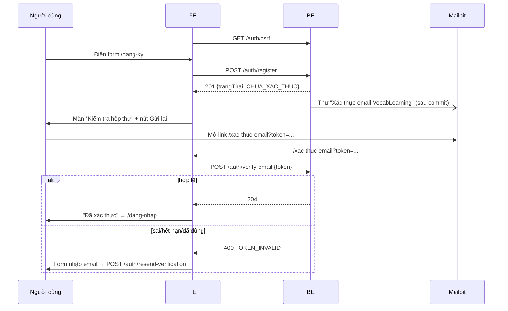

# Báo cáo bàn giao BE → FE — DOT1 Tài khoản & nội dung

| Mục | Giá trị |
|---|---|
| Giai đoạn | Đợt 1 — Tài khoản & nội dung (12/10 – 25/10/2026) |
| Ngày bàn giao | 29/09/2026 (bản 1 — bàn giao sớm B1.1; cập nhật tiếp theo từng bước) |
| Trạng thái BE | 🟡 B1.1 xong · 8 test `FR01RegisterTest` xanh · B1.2–B1.12 chưa làm |
| FE làm tương ứng | F1.1 (`roadmap/ROADMAP_FE.md` §Đợt 1); F1.2 trở đi dùng MSW theo mục 9 |
| Báo cáo trước | [GĐ0](GD0_BAO_CAO_FE.md) — hợp đồng chung (lỗi, CSRF, phân trang, `api-client.js`) xem ở đó |

> **Đọc nhanh:**
> - Dùng được thật ngay: `POST /auth/register`, `/auth/verify-email`, `/auth/resend-verification`. Thư xác thực xem ở Mailpit http://localhost:8025.
> - **Tên trường JSON = tên field entity** (tiếng Việt không dấu): `tenHienThi`, `trangThai`, `muiGio`, `vaiTro`, `daHoanTatKhoiDau`. FE dùng nguyên tên, không đổi sang tiếng Anh.
> - Đăng nhập, `/me` chưa có (B1.2) → mock bằng MSW theo mục 9.

---

## 1. BE đã giao gì (đối chiếu 2 roadmap)

| BE bước | Kết quả | FE bước / UI | FE cần làm |
|---|---|---|---|
| B1.1 Đăng ký & xác thực email | ✅ `POST /auth/register`, `/auth/verify-email`, `/auth/resend-verification`; token một lần, hết hạn 24 giờ, chỉ lưu SHA-256; mật khẩu BCrypt | F1.1 UI06 `/dang-ky`, UI07 `/xac-thuc-email` | Form đăng ký; trang xác thực tự gọi API từ `?token=`; nút gửi lại thư; khóa nút khi 429 |
| B1.2 Đăng nhập/đăng xuất/phiên | ⏳ chưa làm | F1.2 UI08 `/dang-nhap` | Mock theo mục 9 |
| B1.3 – B1.12 | ⏳ chưa làm | F1.3 – F1.12 | Mock theo mockup `mockups/dot1/` |

**Chưa có** (dùng MSW): `POST /auth/login`, `/auth/logout`, `GET /me` (B1.2), mật khẩu (B1.3), Google (B1.4), hồ sơ/thiết lập (B1.5), tệp (B1.6), nội dung (B1.7–B1.12). Lịch: Đợt 1, 12/10–25/10.

## 2. Chạy BE

Không đổi so với GĐ0: `docker compose --profile app up -d --build` trong `backend/k28`.

| Mới | Giá trị |
|---|---|
| Link trong thư xác thực | `${APP_FRONTEND_URL}/xac-thuc-email?token=<token>` (mặc định `http://localhost:3000`) → FE phải có route `/xac-thuc-email` đọc `token` |
| Mailpit | http://localhost:8025 — mọi thư BE gửi nằm ở đây, không ra ngoài |

## 3. Thay đổi hợp đồng chung

| Thay đổi | Chi tiết |
|---|---|
| **Tên trường JSON** | = tên field entity, camelCase tiếng Việt không dấu (`tenHienThi`, `trangThai`, `muiGio`, `emailXacThucAt`, `vaiTro`, `daHoanTatKhoiDau`). Trường không có trong entity: tên gần nhất (`password`, `token`, `acceptTerms`). Áp dụng cho mọi API từ Đợt 1 |
| Mã lỗi mới | `TOKEN_INVALID` (400) — token xác thực sai, hết hạn hoặc đã dùng |
| Enum `trangThai` người dùng | `CHUA_XAC_THUC`, `HOAT_DONG`, `BI_KHOA`, `DANG_XOA` |
| Enum `vaiTro` | `USER`, `ADMIN` |
| Hạn mức mới (429 `RATE_LIMITED`) | Đăng ký: 5 lần/giờ/IP. Gửi lại thư: 3 lần/15 phút theo IP **và** 3 lần/15 phút theo email |

## 4. Luồng chính



## 5. API chi tiết (đã kiểm chứng trên BE thật)

Mọi request ghi (POST) cần cookie `XSRF-TOKEN` + header `X-XSRF-TOKEN` (GĐ0 §3). Thiếu → 403 `FORBIDDEN`.

### 5.1 `POST /api/v1/auth/register` — đăng ký

| Quyền | FE bước | UI | Trang |
|---|---|---|---|
| G | F1.1 | UI06 | `/dang-ky` |

**Gửi**

| Trường | Kiểu | Bắt buộc | Giới hạn (khớp BE) | Ví dụ |
|---|---|---|---|---|
| `tenHienThi` | string | ✔ | không rỗng, ≤ 100 ký tự | `"Minh Anh"` |
| `email` | string | ✔ | email hợp lệ, ≤ 255; BE tự trim + chữ thường | `"minhanh@vocab.local"` |
| `password` | string | ✔ | 8–72 ký tự, có ít nhất 1 chữ cái và 1 chữ số | `"matkhau123"` |
| `muiGio` | string | – | IANA, ≤ 50; bỏ trống → `Asia/Ho_Chi_Minh` | `Intl.DateTimeFormat().resolvedOptions().timeZone` |
| `acceptTerms` | boolean | ✔ | phải `true` | `true` |

**Nhận** (thật)

```http
HTTP/1.1 201
```
```json
{"id":"6","email":"minhanh.1790618975@vocab.local","tenHienThi":"Minh Anh","trangThai":"CHUA_XAC_THUC","muiGio":"Asia/Ho_Chi_Minh","emailXacThucAt":null,"vaiTro":["USER"],"daHoanTatKhoiDau":false}
```

Chưa tạo phiên: đăng ký xong **không** đăng nhập; phải xác thực email rồi đăng nhập (B1.2).

**Lỗi** (thật)

| HTTP | `code` | Khi nào | FE xử lý |
|---|---|---|---|
| 400 | `VALIDATION_FAILED` + `fieldErrors` | Sai giới hạn trường | `applyServerErrors` → lỗi dưới ô (`field` = tên input) |
| 400 | `VALIDATION_FAILED`, `fieldErrors: []`, message `"Múi giờ không hợp lệ"` | `muiGio` không phải IANA | Hiện lỗi chung của form (hoặc không gửi `muiGio`) |
| 409 | `CONFLICT` "Email đã được sử dụng" | Email đã có (không phân biệt hoa/thường) | `setError('email', …)` + link `/dang-nhap` |
| 429 | `RATE_LIMITED` | > 5 lần/giờ cùng IP | Khóa nút, toast |
| 403 | `FORBIDDEN` | Thiếu CSRF | `api-client` tự lấy token và thử lại 1 lần |

```json
{"code":"VALIDATION_FAILED","message":"Dữ liệu không hợp lệ","fieldErrors":[{"field":"password","message":"Mật khẩu 8–72 ký tự, có chữ cái và chữ số"},{"field":"email","message":"Email không hợp lệ"},{"field":"acceptTerms","message":"Bạn cần đồng ý với điều khoản sử dụng"},{"field":"tenHienThi","message":"Vui lòng nhập tên hiển thị"}],"requestId":"cbf0c5d5-fa82-45a8-ad78-67fa0dbb90e4"}
```
```json
{"code":"CONFLICT","message":"Email đã được sử dụng","fieldErrors":[],"requestId":"73d7fa4a-115f-4477-b9d0-8c36aebdd8e5"}
```

**Tác dụng phụ:** tạo `ho_so_hoc_tap` + `cai_dat_thong_bao` mặc định; gửi thư tiêu đề **"Xác thực email VocabLearning"** chứa link `http://localhost:3000/xac-thuc-email?token=…` (hiệu lực 24 giờ). Thư gửi bất đồng bộ sau commit, thường tới Mailpit trong 1–2 giây.

### 5.2 `POST /api/v1/auth/verify-email` — xác thực email

| Quyền | FE bước | UI | Trang |
|---|---|---|---|
| G | F1.1 | UI07 | `/xac-thuc-email?token=` |

**Gửi**

| Trường | Kiểu | Bắt buộc | Giới hạn | Ví dụ |
|---|---|---|---|---|
| `token` | string | ✔ | không rỗng, ≤ 100 | lấy nguyên từ query `token` |

**Nhận** (thật)

```http
HTTP/1.1 204
```

`trangThai` chuyển `CHUA_XAC_THUC` → `HOAT_DONG`, ghi `emailXacThucAt`. Token bị đánh dấu đã dùng.

**Lỗi** (thật)

| HTTP | `code` | Khi nào | FE xử lý |
|---|---|---|---|
| 400 | `TOKEN_INVALID` | Token sai, hết hạn, **đã dùng** (gọi lần 2), hoặc đã bị thay bằng token mới do gửi lại | Hiện "Liên kết không hợp lệ hoặc đã hết hạn" + form gửi lại thư |
| 400 | `VALIDATION_FAILED` (`field: token`) | Thiếu token | Như trên |

```json
{"code":"TOKEN_INVALID","message":"Liên kết xác thực không hợp lệ hoặc đã hết hạn","fieldErrors":[],"requestId":"2feb89a0-2dd1-4406-bb1d-04fa42bb9a6f"}
```

> React Strict Mode gọi effect 2 lần ở dev → lần 2 nhận `TOKEN_INVALID`. Dùng `useMutation` + cờ `useRef` để chỉ gọi 1 lần.

### 5.3 `POST /api/v1/auth/resend-verification` — gửi lại thư xác thực

| Quyền | FE bước | UI | Trang |
|---|---|---|---|
| G | F1.1 | UI06 (sau đăng ký), UI07 | `/dang-ky`, `/xac-thuc-email` |

**Gửi**

| Trường | Kiểu | Bắt buộc | Giới hạn | Ví dụ |
|---|---|---|---|---|
| `email` | string | ✔ | email hợp lệ, ≤ 255 | `"minhanh@vocab.local"` |

**Nhận** (thật): luôn `204`, kể cả email không tồn tại hoặc đã xác thực (không lộ tài khoản).

```http
HTTP/1.1 204
```

**Lỗi** (thật)

| HTTP | `code` | Khi nào | FE xử lý |
|---|---|---|---|
| 400 | `VALIDATION_FAILED` | Email sai định dạng | Lỗi dưới ô email |
| 429 | `RATE_LIMITED` | > 3 lần/15 phút cùng IP hoặc cùng email | `VL.countdown`/khóa nút ~60 giây, toast message |

**Tác dụng phụ:** chỉ khi tài khoản tồn tại và `CHUA_XAC_THUC`: vô hiệu token cũ, gửi thư mới. Link trong thư cũ sẽ trả `TOKEN_INVALID`.

## 6. Mã FE mẫu

**Zod** (giới hạn = BE):

```js
import { z } from 'zod';

export const registerSchema = z.object({
  tenHienThi: z.string().trim().min(1, 'Vui lòng nhập tên hiển thị').max(100, 'Tên hiển thị tối đa 100 ký tự'),
  email: z.string().trim().email('Email không hợp lệ').max(255),
  password: z.string().regex(/^(?=.*[A-Za-z])(?=.*\d).{8,72}$/, 'Mật khẩu 8–72 ký tự, có chữ cái và chữ số'),
  acceptTerms: z.literal(true, { errorMap: () => ({ message: 'Bạn cần đồng ý với điều khoản sử dụng' }) }),
});

export const resendSchema = z.object({ email: z.string().trim().email('Email không hợp lệ').max(255) });
```

**Hook**:

```js
import { useMutation } from '@tanstack/react-query';
import { api } from '@/lib/api-client';

const tz = () => Intl.DateTimeFormat().resolvedOptions().timeZone;

export const useRegister = () =>
  useMutation({ mutationFn: (v) => api('/auth/register', { method: 'POST', body: { ...v, muiGio: tz() } }) });

export const useVerifyEmail = () =>
  useMutation({ mutationFn: (token) => api('/auth/verify-email', { method: 'POST', body: { token } }) });

export const useResendVerification = () =>
  useMutation({ mutationFn: (email) => api('/auth/resend-verification', { method: 'POST', body: { email } }) });
```

**Xử lý lỗi đăng ký**:

```js
onError: (e) => {
  if (applyServerErrors(e, setError)) return;
  if (e.code === 'CONFLICT') return setError('email', { message: e.message });
  if (e.code === 'RATE_LIMITED') return lockSubmit(60);
  setError('root', { message: e.message });
}
```

**MSW** (dữ liệu thật mục 5):

```js
import { http, HttpResponse } from 'msw';
const API = 'http://localhost:8080/api/v1';
const err = (status, code, message, fieldErrors = []) =>
  HttpResponse.json({ code, message, fieldErrors, requestId: 'mock' }, { status });

export const authHandlers = [
  http.post(`${API}/auth/register`, async ({ request }) => {
    const b = await request.json();
    if (b.email?.trim().toLowerCase() === 'an@vocab.local') return err(409, 'CONFLICT', 'Email đã được sử dụng');
    return HttpResponse.json({
      id: '6', email: b.email.trim().toLowerCase(), tenHienThi: b.tenHienThi.trim(), trangThai: 'CHUA_XAC_THUC',
      muiGio: b.muiGio ?? 'Asia/Ho_Chi_Minh', emailXacThucAt: null, vaiTro: ['USER'], daHoanTatKhoiDau: false,
    }, { status: 201 });
  }),
  http.post(`${API}/auth/verify-email`, async ({ request }) => {
    const { token } = await request.json();
    return token === 'mock-ok' ? new HttpResponse(null, { status: 204 })
      : err(400, 'TOKEN_INVALID', 'Liên kết xác thực không hợp lệ hoặc đã hết hạn');
  }),
  http.post(`${API}/auth/resend-verification`, () => new HttpResponse(null, { status: 204 })),
];
```

## 7. Dữ liệu mẫu / tài khoản demo

| Việc | Cách làm |
|---|---|
| Tài khoản seed | Như GĐ0 §7 (`admin@`, `an@`, `binh@`, `chi@vocab.local`) — đăng nhập được từ B1.2 |
| Tạo tài khoản test mới | Đăng ký với email bất kỳ `*@vocab.local` → mở http://localhost:8025 → bấm link trong thư |
| Email trùng để thử 409 | `an@vocab.local` |
| Bị 429 khi dev | Chờ hết cửa sổ (1 giờ / 15 phút) hoặc nhờ BE xóa khóa Redis `rl:*` |

## 8. Checklist FE hoàn thành F1.1

- [ ] `/dang-ky`: 4 trường + checkbox điều khoản; Zod khớp mục 6; gửi `muiGio` từ trình duyệt
- [ ] Lỗi server hiện dưới đúng ô theo `fieldErrors[].field` (`tenHienThi`, `email`, `password`, `acceptTerms`)
- [ ] 409 → lỗi dưới ô email + link đăng nhập; 429 → khóa nút có đếm ngược
- [ ] Đăng ký xong → màn "Kiểm tra hộp thư" hiện email vừa nhập + nút "Gửi lại thư"
- [ ] `/xac-thuc-email?token=` tự gọi xác thực **đúng 1 lần**; 204 → thông báo thành công + nút `/dang-nhap`
- [ ] `TOKEN_INVALID` → thông báo + form email gửi lại thư; gửi lại luôn hiện cùng một thông báo thành công
- [ ] Không có `token` trên URL → hiện form gửi lại thư
- [ ] Kiểm thử thật: đăng ký → mở link trong Mailpit → xác thực OK; mở lại link lần 2 → `TOKEN_INVALID`

## 9. Sắp có ở Đợt 1 — hợp đồng dự kiến

| BE bước | Dự kiến có | API | FE bước | UI |
|---|---|---|---|---|
| B1.2 | Đợt 1 (12–25/10) | `POST /auth/login`, `POST /auth/logout`, `GET /me` | F1.2 | UI08 `/dang-nhap`, menu người dùng |
| B1.3 | Đợt 1 | `POST /auth/forgot-password`, `/auth/reset-password`, `PUT /me/password` | F1.3 | UI09, UI10, UI42 |
| B1.4 | Đợt 1 | `GET /auth/google/start`, `/auth/google/callback` | F1.4 | Nút Google UI06/UI08 |
| B1.5 | Đợt 1 | `PATCH /me`, `GET/PUT /me/learning-settings`, `GET/PUT /me/notification-settings` | F1.5 | UI11, UI40, UI41, UI43 |
| B1.6 – B1.12 | Đợt 1 | tệp, chủ đề, bộ thẻ, thẻ, thư viện, sao chép, CSV (TK §13.2) | F1.6 – F1.12 | xem `mockups/dot1/` |

**B1.2 — dự kiến** (TK §13.2, ROADMAP_BE B1.2):

```json
// POST /auth/login (dự kiến)
{ "email": "an@vocab.local", "password": "********" }
// 200 → cùng dạng response đăng ký (mục 5.1) + Set-Cookie SESSION (HttpOnly); session id đổi khi đăng nhập
// 401 INVALID_CREDENTIALS · 403 EMAIL_NOT_VERIFIED · 403 ACCOUNT_LOCKED · 429 RATE_LIMITED (nhiều lần sai)

// POST /auth/logout (dự kiến) → 204, xóa phiên; cookie cũ gọi /me → 401

// GET /me (dự kiến)
{ "id": "2", "email": "an@vocab.local", "tenHienThi": "Nguyễn An", "trangThai": "HOAT_DONG", "muiGio": "Asia/Ho_Chi_Minh",
  "emailXacThucAt": "2026-09-28T00:00:00Z", "vaiTro": ["USER"], "daHoanTatKhoiDau": true }
```

Sau đăng nhập, `daHoanTatKhoiDau = false` → chuyển `/bat-dau` (UI11).

## 10. Lưu ý / giới hạn / chưa kiểm chứng

| Mục | Chi tiết |
|---|---|
| `api-client` retry 403 | Từ B1.2 sẽ có 403 nghiệp vụ (`EMAIL_NOT_VERIFIED`, `ACCOUNT_LOCKED`). Sửa `api-client.js` (GĐ0 §6): chỉ lấy lại CSRF và thử lại khi `code === 'FORBIDDEN'` |
| Hạn mức theo IP | Gửi lại thư đếm chung theo IP (3/15 phút) cho mọi email → nhiều người cùng mạng/NAT có thể bị 429 sớm. Dev trên localhost cũng chung 1 IP |
| `muiGio` sai | Trả 400 không có `fieldErrors` (lỗi chung form), khác các trường khác |
| Mockup | `mockups/dot1/dang-ky.html`, `xac-thuc-email.html` đã đổi sang tên trường mới (`tenHienThi`, `muiGio`…). Mockup dùng API giả `shared/demo.js`, trả thêm `demoToken` chỉ để demo — **BE thật không trả trường này** |
| Chưa kiểm chứng | Token hết hạn 24 giờ: kiểm bằng test tự động (`tc01_expiredTokenRejected`), không chờ thật. Hạn mức đăng ký 5/giờ: kiểm bằng code, không bấm thật 6 lần |
| Mockups còn tên cũ | Phần thiết lập học tập/thông báo trong mockup (`goal`, `minutesPerDay`, `inApp`…) sẽ đổi theo entity khi xong B1.5 |

## 11. Báo lỗi cho BE

Gửi đường dẫn API + body + `requestId`; BE tra: `docker compose logs api | grep <requestId>`.
