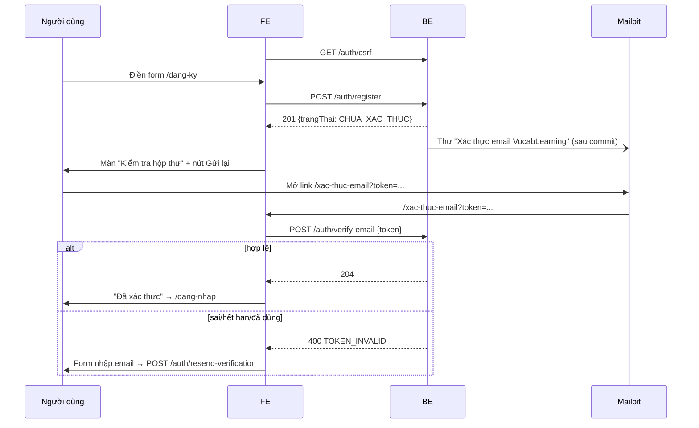

# Báo cáo bàn giao BE → FE — DOT1 Tài khoản & nội dung

| Mục | Giá trị |
|---|---|
| Giai đoạn | Đợt 1 — Tài khoản & nội dung (12/10 – 25/10/2026) |
| Ngày bàn giao | 01/10/2026 (bản 5 — B1.1 → B1.5; cập nhật tiếp theo từng bước) |
| Trạng thái BE | 🟡 B1.1 → B1.5 xong · 66 test xanh (`FR01RegisterTest` 8, `FR01LoginTest` 9, `FR01PasswordTest` 8, `FR01GoogleLoginTest` 9, `FR02SettingsTest` 7) · B1.6–B1.12 chưa làm |
| FE làm tương ứng | F1.1 → F1.5 (`roadmap/ROADMAP_FE.md` §Đợt 1); F1.6 trở đi dùng MSW theo mục 9 |
| Báo cáo trước | [GĐ0](GD0_BAO_CAO_FE.md) — hợp đồng chung (lỗi, CSRF, phân trang, `api-client.js`) xem ở đó |

> **Đọc nhanh:**
> - Dùng được thật ngay: `POST /auth/register`, `/auth/verify-email`, `/auth/resend-verification`. Thư xác thực xem ở Mailpit http://localhost:8025.
> - **Tên trường JSON = tên field entity** (tiếng Việt không dấu): `tenHienThi`, `trangThai`, `muiGio`, `vaiTro`, `daHoanTatKhoiDau`. FE dùng nguyên tên, không đổi sang tiếng Anh.
> - Đăng nhập thật đã có: `POST /auth/login`, `POST /auth/logout`, `GET /me` (cookie `SESSION`). Tài khoản seed: `an@vocab.local` / `Vocab@12345`.
> - **Sửa `api-client.js` trước khi nối đăng nhập:** chỉ thử lại 403 khi `code === 'FORBIDDEN'` (mục 3).
> - Hồ sơ & thiết lập thật đã có (B1.5): `PATCH /me`, thiết lập học (lưu lần đầu = hoàn tất `/bat-dau`), thông báo; PUT phải gửi `version` (409 khi cũ) — mục 5.11–5.13.
> - Google thật đã có (B1.4): nút Google **điều hướng toàn trang** tới `/api/v1/auth/google/start?next=…`; lỗi quay về `/dang-nhap?loi=<MÃ>` (mục 5.10).
> - Mật khẩu thật đã có (B1.3): quên mật khẩu, đặt lại từ thư (Mailpit), đổi mật khẩu ở `/ca-nhan/bao-mat`. Đặt lại → đăng xuất **mọi** phiên; đổi → giữ phiên hiện tại, đăng xuất phiên khác.

---

## 1. BE đã giao gì (đối chiếu 2 roadmap)

| BE bước | Kết quả | FE bước / UI | FE cần làm |
|---|---|---|---|
| B1.1 Đăng ký & xác thực email | ✅ `POST /auth/register`, `/auth/verify-email`, `/auth/resend-verification`; token một lần, hết hạn 24 giờ, chỉ lưu SHA-256; mật khẩu BCrypt | F1.1 UI06 `/dang-ky`, UI07 `/xac-thuc-email` | Form đăng ký; trang xác thực tự gọi API từ `?token=`; nút gửi lại thư; khóa nút khi 429 |
| B1.2 Đăng nhập/đăng xuất/phiên | ✅ `POST /auth/login`, `POST /auth/logout`, `GET /me`; phiên Redis, đổi session id khi đăng nhập, logout xóa phiên; lỗi riêng chưa xác thực/bị khóa; 429 khi sai nhiều | F1.2 UI08 `/dang-nhap`, menu người dùng | Form đăng nhập; `useMe()` làm nguồn người dùng; route guard; nút đăng xuất; điều hướng theo `daHoanTatKhoiDau` |
| B1.3 Quên / đặt lại / đổi mật khẩu | ✅ `POST /auth/forgot-password`, `POST /auth/reset-password`, `PUT /me/password`; link một lần, hết hạn 30 phút; đặt lại hủy mọi phiên, đổi giữ phiên hiện tại | F1.3 UI09 `/quen-mat-khau`, UI10 `/dat-lai-mat-khau`, UI42 `/ca-nhan/bao-mat` | Form email → màn "Kiểm tra hộp thư" (luôn giống nhau); trang đặt lại đọc `?token=`; form đổi mật khẩu có ô nhập lại |
| B1.4 Đăng nhập Google | ✅ `GET /auth/google/start` → Google → `/auth/google/callback`; tạo tài khoản mới đã xác thực, không tự liên kết email trùng (liên kết sau khi đăng nhập mật khẩu) | F1.4 UI06, UI08 | Nút "Tiếp tục với Google" điều hướng toàn trang; `/dang-nhap` đọc `?loi=` |
| B1.5 Hồ sơ & thiết lập | ✅ `PATCH /me`, `GET/PUT /me/learning-settings`, `GET/PUT /me/notification-settings`; khóa phiên bản (`version` → 409); lưu thiết lập học lần đầu = hoàn tất khởi đầu | F1.5 UI11 `/bat-dau`, UI40 `/ca-nhan`, UI41 `/ca-nhan/hoc-tap`, UI43 `/ca-nhan/thong-bao` | Form theo mục 5.11–5.13; gửi kèm `version`; 409 → tải lại |
| B1.6 – B1.12 | ⏳ chưa làm | F1.6 – F1.12 | Mock theo mockup `mockups/dot1/` |

**Chưa có** (dùng MSW): tệp & ảnh đại diện (B1.6), nội dung (B1.7–B1.12). Lịch: Đợt 1, 12/10–25/10.

## 2. Chạy BE

Không đổi so với GĐ0: `docker compose --profile app up -d --build` trong `backend/k28`.

| Mới | Giá trị |
|---|---|
| Link trong thư xác thực | `${APP_FRONTEND_URL}/xac-thuc-email?token=<token>` (mặc định `http://localhost:3000`) → FE phải có route `/xac-thuc-email` đọc `token` |
| Link trong thư đặt lại mật khẩu | `${APP_FRONTEND_URL}/dat-lai-mat-khau?token=<token>` (hiệu lực 30 phút, dùng 1 lần) → FE phải có route `/dat-lai-mat-khau` đọc `token` |
| Mailpit | http://localhost:8025 — mọi thư BE gửi nằm ở đây, không ra ngoài |

## 3. Thay đổi hợp đồng chung

| Thay đổi | Chi tiết |
|---|---|
| **Tên trường JSON** | = tên field entity, camelCase tiếng Việt không dấu (`tenHienThi`, `trangThai`, `muiGio`, `emailXacThucAt`, `vaiTro`, `daHoanTatKhoiDau`). Trường không có trong entity: tên gần nhất (`password`, `token`, `acceptTerms`). Áp dụng cho mọi API từ Đợt 1 |
| Mã lỗi mới | `TOKEN_INVALID` (400) — token xác thực sai, hết hạn hoặc đã dùng |
| Enum `trangThai` người dùng | `CHUA_XAC_THUC`, `HOAT_DONG`, `BI_KHOA`, `DANG_XOA` |
| Enum `vaiTro` | `USER`, `ADMIN` |
| Hạn mức mới (429 `RATE_LIMITED`) | Đăng ký: 5 lần/giờ/IP. Gửi lại thư: 3 lần/15 phút theo IP **và** 3 lần/15 phút theo email. Đăng nhập: 5 lần/15 phút theo email (lần 6 bị 429 kể cả khi đúng mật khẩu; đăng nhập đúng trước đó thì bộ đếm về 0) |
| Mã lỗi mới (B1.2) | `INVALID_CREDENTIALS` 401 · `EMAIL_NOT_VERIFIED` 403 · `ACCOUNT_LOCKED` 403 |
| **`api-client.js` (GĐ0 §6) phải sửa** | Hiện đang thử lại **mọi** 403 của request ghi. Từ B1.2 có 403 nghiệp vụ → chỉ thử lại khi `code === 'FORBIDDEN'` (code mẫu ở mục 6) |
| Hạn mức mới (B1.3) | Quên mật khẩu: 3 lần/15 phút theo IP **và** theo email. Đổi mật khẩu: 5 lần/15 phút theo người dùng (đổi thành công thì bộ đếm về 0) |
| Lỗi nghiệp vụ có `fieldErrors` (từ B1.3) | Một số lỗi không phải lỗi định dạng vẫn kèm 1 phần tử `fieldErrors` để FE hiện dưới ô (ví dụ sai mật khẩu hiện tại → `currentPassword`). `applyServerErrors` xử lý được, không cần code riêng |
| Cookie phiên | `SESSION` (HttpOnly, SameSite=Lax) chỉ được tạo khi **đăng nhập thành công**; request khách bị 401 không tạo phiên. Logout trả `SESSION=; Max-Age=0` |
| Hết phiên | Không hoạt động 7 ngày thì phiên hết hạn. Cookie là cookie phiên trình duyệt (không có `Max-Age`) |

## 4. Luồng chính



**Đăng nhập / đăng xuất (B1.2):**

```mermaid
sequenceDiagram
  participant FE
  participant BE
  participant R as Redis
  FE->>BE: GET /auth/csrf
  FE->>BE: POST /auth/login {email, password}
  alt đúng + HOAT_DONG
    BE->>R: tạo phiên (session id mới)
    BE-->>FE: 200 user + Set-Cookie SESSION
    FE->>BE: GET /auth/csrf (lấy token mới cho phiên)
    FE->>BE: GET /me (useMe)
    FE->>FE: daHoanTatKhoiDau ? next ?? /bo-the : /bat-dau
  else sai
    BE-->>FE: 401 INVALID_CREDENTIALS / 403 EMAIL_NOT_VERIFIED / 403 ACCOUNT_LOCKED / 429
  end
  FE->>BE: POST /auth/logout
  BE->>R: xóa phiên
  BE-->>FE: 204 + SESSION=; Max-Age=0
  FE->>BE: GET /me (cookie cũ)
  BE-->>FE: 401 UNAUTHENTICATED
```

## 5. API chi tiết (đã kiểm chứng trên BE thật)

Mọi request ghi (POST) cần cookie `XSRF-TOKEN` + header `X-XSRF-TOKEN` (GĐ0 §3). Thiếu → 403 `FORBIDDEN`.

### 5.1 `POST /api/v1/auth/register` — đăng ký

| Quyền | FE bước | UI | Trang |
|---|---|---|---|
| G | F1.1 | UI06 | `/dang-ky` |

**Gửi**

| Trường | Kiểu | Bắt buộc | Giới hạn (khớp BE) | Ví dụ |
|---|---|---|---|---|
| `tenHienThi` | string | ✔ | không rỗng, ≤ 100 ký tự | `"Minh Anh"` |
| `email` | string | ✔ | email hợp lệ, ≤ 255; BE tự trim + chữ thường | `"minhanh@vocab.local"` |
| `password` | string | ✔ | 8–72 ký tự, có ít nhất 1 chữ cái và 1 chữ số | `"matkhau123"` |
| `muiGio` | string | – | IANA, ≤ 50; bỏ trống → `Asia/Ho_Chi_Minh` | `Intl.DateTimeFormat().resolvedOptions().timeZone` |
| `acceptTerms` | boolean | ✔ | phải `true` | `true` |

**Nhận** (thật)

```http
HTTP/1.1 201
```
```json
{"id":"6","email":"minhanh.1790618975@vocab.local","tenHienThi":"Minh Anh","trangThai":"CHUA_XAC_THUC","muiGio":"Asia/Ho_Chi_Minh","emailXacThucAt":null,"vaiTro":["USER"],"daHoanTatKhoiDau":false}
```

Chưa tạo phiên: đăng ký xong **không** đăng nhập; phải xác thực email rồi đăng nhập (B1.2).

**Lỗi** (thật)

| HTTP | `code` | Khi nào | FE xử lý |
|---|---|---|---|
| 400 | `VALIDATION_FAILED` + `fieldErrors` | Sai giới hạn trường | `applyServerErrors` → lỗi dưới ô (`field` = tên input) |
| 400 | `VALIDATION_FAILED`, `fieldErrors: []`, message `"Múi giờ không hợp lệ"` | `muiGio` không phải IANA | Hiện lỗi chung của form (hoặc không gửi `muiGio`) |
| 409 | `CONFLICT` "Email đã được sử dụng" | Email đã có (không phân biệt hoa/thường) | `setError('email', …)` + link `/dang-nhap` |
| 429 | `RATE_LIMITED` | > 5 lần/giờ cùng IP | Khóa nút, toast |
| 403 | `FORBIDDEN` | Thiếu CSRF | `api-client` tự lấy token và thử lại 1 lần |

```json
{"code":"VALIDATION_FAILED","message":"Dữ liệu không hợp lệ","fieldErrors":[{"field":"password","message":"Mật khẩu 8–72 ký tự, có chữ cái và chữ số"},{"field":"email","message":"Email không hợp lệ"},{"field":"acceptTerms","message":"Bạn cần đồng ý với điều khoản sử dụng"},{"field":"tenHienThi","message":"Vui lòng nhập tên hiển thị"}],"requestId":"cbf0c5d5-fa82-45a8-ad78-67fa0dbb90e4"}
```
```json
{"code":"CONFLICT","message":"Email đã được sử dụng","fieldErrors":[],"requestId":"73d7fa4a-115f-4477-b9d0-8c36aebdd8e5"}
```

**Tác dụng phụ:** tạo `ho_so_hoc_tap` + `cai_dat_thong_bao` mặc định; gửi thư tiêu đề **"Xác thực email VocabLearning"** chứa link `http://localhost:3000/xac-thuc-email?token=…` (hiệu lực 24 giờ). Thư gửi bất đồng bộ sau commit, thường tới Mailpit trong 1–2 giây.

### 5.2 `POST /api/v1/auth/verify-email` — xác thực email

| Quyền | FE bước | UI | Trang |
|---|---|---|---|
| G | F1.1 | UI07 | `/xac-thuc-email?token=` |

**Gửi**

| Trường | Kiểu | Bắt buộc | Giới hạn | Ví dụ |
|---|---|---|---|---|
| `token` | string | ✔ | không rỗng, ≤ 100 | lấy nguyên từ query `token` |

**Nhận** (thật)

```http
HTTP/1.1 204
```

`trangThai` chuyển `CHUA_XAC_THUC` → `HOAT_DONG`, ghi `emailXacThucAt`. Token bị đánh dấu đã dùng.

**Lỗi** (thật)

| HTTP | `code` | Khi nào | FE xử lý |
|---|---|---|---|
| 400 | `TOKEN_INVALID` | Token sai, hết hạn, **đã dùng** (gọi lần 2), hoặc đã bị thay bằng token mới do gửi lại | Hiện "Liên kết không hợp lệ hoặc đã hết hạn" + form gửi lại thư |
| 400 | `VALIDATION_FAILED` (`field: token`) | Thiếu token | Như trên |

```json
{"code":"TOKEN_INVALID","message":"Liên kết xác thực không hợp lệ hoặc đã hết hạn","fieldErrors":[],"requestId":"2feb89a0-2dd1-4406-bb1d-04fa42bb9a6f"}
```

> React Strict Mode gọi effect 2 lần ở dev → lần 2 nhận `TOKEN_INVALID`. Dùng `useMutation` + cờ `useRef` để chỉ gọi 1 lần.

### 5.3 `POST /api/v1/auth/resend-verification` — gửi lại thư xác thực

| Quyền | FE bước | UI | Trang |
|---|---|---|---|
| G | F1.1 | UI06 (sau đăng ký), UI07 | `/dang-ky`, `/xac-thuc-email` |

**Gửi**

| Trường | Kiểu | Bắt buộc | Giới hạn | Ví dụ |
|---|---|---|---|---|
| `email` | string | ✔ | email hợp lệ, ≤ 255 | `"minhanh@vocab.local"` |

**Nhận** (thật): luôn `204`, kể cả email không tồn tại hoặc đã xác thực (không lộ tài khoản).

```http
HTTP/1.1 204
```

**Lỗi** (thật)

| HTTP | `code` | Khi nào | FE xử lý |
|---|---|---|---|
| 400 | `VALIDATION_FAILED` | Email sai định dạng | Lỗi dưới ô email |
| 429 | `RATE_LIMITED` | > 3 lần/15 phút cùng IP hoặc cùng email | `VL.countdown`/khóa nút ~60 giây, toast message |

**Tác dụng phụ:** chỉ khi tài khoản tồn tại và `CHUA_XAC_THUC`: vô hiệu token cũ, gửi thư mới. Link trong thư cũ sẽ trả `TOKEN_INVALID`.

### 5.4 `POST /api/v1/auth/login` — đăng nhập

| Quyền | FE bước | UI | Trang |
|---|---|---|---|
| G | F1.2 | UI08 | `/dang-nhap?next=` |

**Gửi**

| Trường | Kiểu | Bắt buộc | Giới hạn (khớp BE) | Ví dụ |
|---|---|---|---|---|
| `email` | string | ✔ | email hợp lệ, ≤ 255; BE tự trim + chữ thường | `"an@vocab.local"` |
| `password` | string | ✔ | không rỗng, ≤ 72 | `"Vocab@12345"` |

Trường lạ (ví dụ `remember` của mockup) bị bỏ qua.

**Nhận** (thật)

```http
HTTP/1.1 200
Set-Cookie: SESSION=<id>; Path=/; HttpOnly; SameSite=Lax
```
```json
{"id":"2","email":"an@vocab.local","tenHienThi":"Nguyễn Văn An","trangThai":"HOAT_DONG","muiGio":"Asia/Ho_Chi_Minh","emailXacThucAt":"2026-09-27T14:47:04.939Z","vaiTro":["USER"],"daHoanTatKhoiDau":true}
```

**Lỗi** (thật)

| HTTP | `code` | Khi nào | FE xử lý |
|---|---|---|---|
| 400 | `VALIDATION_FAILED` + `fieldErrors` (`email`, `password`) | Thiếu/sai định dạng | Lỗi dưới ô |
| 401 | `INVALID_CREDENTIALS` "Sai email hoặc mật khẩu" | Sai mật khẩu **hoặc** email không tồn tại (cùng thông điệp) | Notice đầu form; **không** chuyển trang, không gọi `/dang-nhap?next` |
| 403 | `EMAIL_NOT_VERIFIED` "Tài khoản chưa xác thực email" | Mật khẩu đúng nhưng `CHUA_XAC_THUC` | Notice cảnh báo + nút "Gửi lại thư xác thực" → `/xac-thuc-email?email=` |
| 403 | `ACCOUNT_LOCKED` "Tài khoản đã bị khóa. Liên hệ với quản trị viên để được hỗ trợ" | `BI_KHOA` hoặc `DANG_XOA` | Notice lỗi |
| 429 | `RATE_LIMITED` | > 5 lần/15 phút cùng email | Khóa nút, đếm ngược |

```json
{"code":"INVALID_CREDENTIALS","message":"Sai email hoặc mật khẩu","fieldErrors":[],"requestId":"941e54c9-09c4-4360-839b-670aac768583"}
```
```json
{"code":"EMAIL_NOT_VERIFIED","message":"Tài khoản chưa xác thực email","fieldErrors":[],"requestId":"668119c0-0a4b-45d5-8d70-8e949f969159"}
```

**Tác dụng phụ:** đổi session id (chống session fixation), ghi `dang_nhap_cuoi_at`. Sau đăng nhập gọi lại `GET /auth/csrf` (ROADMAP_FE F1.2) rồi `invalidateQueries(['me'])`.

### 5.5 `GET /api/v1/me` — người dùng hiện tại

| Quyền | FE bước | UI | Trang |
|---|---|---|---|
| L | F1.2 | Header, menu người dùng, route guard | mọi trang cần đăng nhập |

**Nhận** (thật): cùng dạng 5.4.

```http
HTTP/1.1 200
```
```json
{"id":"6","email":"minhanh.1790618975@vocab.local","tenHienThi":"Minh Anh","trangThai":"HOAT_DONG","muiGio":"Asia/Ho_Chi_Minh","emailXacThucAt":"2026-09-28T18:09:40.227Z","vaiTro":["USER"],"daHoanTatKhoiDau":false}
```

**Lỗi** (thật)

| HTTP | `code` | Khi nào | FE xử lý |
|---|---|---|---|
| 401 | `UNAUTHENTICATED` | Chưa đăng nhập, phiên hết hạn hoặc đã đăng xuất | `useMe()` trả `null` (không redirect ở trang khách); trang cần đăng nhập → `/dang-nhap?next=` |

```json
{"code":"UNAUTHENTICATED","message":"Bạn cần đăng nhập để tiếp tục","fieldErrors":[],"requestId":"726dfa70-c2da-49ef-b3b2-78da860aa4b4"}
```

### 5.6 `POST /api/v1/auth/logout` — đăng xuất

| Quyền | FE bước | UI | Trang |
|---|---|---|---|
| G/L | F1.2 | Menu người dùng | mọi trang |

**Nhận** (thật)

```http
HTTP/1.1 204
Set-Cookie: SESSION=; Max-Age=0; Expires=Thu, 1 Jan 1970 00:00:00 GMT; Path=/; HttpOnly; SameSite=Lax
```

Gọi khi chưa đăng nhập vẫn 204. Cần CSRF như mọi POST. Sau logout: `queryClient.clear()` rồi chuyển `/dang-nhap?loggedOut=1`. Cookie cũ gọi `/me` → 401 (đã kiểm thật).

### 5.7 `POST /api/v1/auth/forgot-password` — quên mật khẩu

| Quyền | FE bước | UI | Trang |
|---|---|---|---|
| G | F1.3 | UI09 | `/quen-mat-khau` |

**Gửi**

| Trường | Kiểu | Bắt buộc | Giới hạn | Ví dụ |
|---|---|---|---|---|
| `email` | string | ✔ | email hợp lệ, ≤ 255; BE tự trim + chữ thường | `"an@vocab.local"` |

**Nhận** (thật): luôn `200` body rỗng, kể cả email không tồn tại hoặc tài khoản bị khóa (không lộ tài khoản).

```http
HTTP/1.1 200
```

**Lỗi** (thật)

| HTTP | `code` | Khi nào | FE xử lý |
|---|---|---|---|
| 400 | `VALIDATION_FAILED` + `fieldErrors` `email` "Email không hợp lệ" | Sai định dạng | Lỗi dưới ô email |
| 429 | `RATE_LIMITED` | > 3 lần/15 phút cùng IP hoặc cùng email | Khóa nút, đếm ngược |

```json
{"code":"VALIDATION_FAILED","message":"Dữ liệu không hợp lệ","fieldErrors":[{"field":"email","message":"Email không hợp lệ"}],"requestId":"5b724f9c-a26d-4dbc-b77f-03fe66617df0"}
```

**Tác dụng phụ:** chỉ khi tài khoản `HOAT_DONG` hoặc `CHUA_XAC_THUC`: vô hiệu link đặt lại cũ, gửi thư mới (tiêu đề "Đặt lại mật khẩu VocabLearning"). FE luôn hiện cùng một màn "Kiểm tra hộp thư".

### 5.8 `POST /api/v1/auth/reset-password` — đặt lại mật khẩu

| Quyền | FE bước | UI | Trang |
|---|---|---|---|
| G | F1.3 | UI10 | `/dat-lai-mat-khau?token=` |

**Gửi**

| Trường | Kiểu | Bắt buộc | Giới hạn | Ví dụ |
|---|---|---|---|---|
| `token` | string | ✔ | lấy từ `?token=` (43 ký tự), ≤ 100 | `"q3Zk…"` |
| `password` | string | ✔ | 8–72 ký tự, có chữ cái và chữ số | `"matkhaumoi1"` |

Ô "Nhập lại mật khẩu" chỉ kiểm ở FE, không gửi.

**Nhận** (thật)

```http
HTTP/1.1 204
```

**Lỗi** (thật)

| HTTP | `code` | Khi nào | FE xử lý |
|---|---|---|---|
| 400 | `VALIDATION_FAILED` + `fieldErrors` `password` | Mật khẩu yếu. Link **chưa** bị dùng, sửa rồi gửi lại được | Lỗi dưới ô mật khẩu |
| 400 | `TOKEN_INVALID` "Liên kết đặt lại mật khẩu không hợp lệ hoặc đã hết hạn" | Token sai, hết hạn, đã dùng, là token xác thực email, hoặc tài khoản bị khóa | Màn "Liên kết không dùng được" + nút `/quen-mat-khau`, hiện `requestId` |

```json
{"code":"TOKEN_INVALID","message":"Liên kết đặt lại mật khẩu không hợp lệ hoặc đã hết hạn","fieldErrors":[],"requestId":"12432091-14cd-47eb-8ad8-e20729a86c4b"}
```

**Tác dụng phụ:** đổi mật khẩu; **đăng xuất mọi phiên** của tài khoản; xóa bộ đếm 429 đăng nhập; tài khoản `CHUA_XAC_THUC` được xác thực luôn (đã chứng minh sở hữu email). Sau 204 FE đặt cache `['me']` = `null` và mời đăng nhập lại.

### 5.9 `PUT /api/v1/me/password` — đổi mật khẩu

| Quyền | FE bước | UI | Trang |
|---|---|---|---|
| L | F1.3 | UI42 | `/ca-nhan/bao-mat` |

**Gửi**

| Trường | Kiểu | Bắt buộc | Giới hạn | Ví dụ |
|---|---|---|---|---|
| `currentPassword` | string | ✔ | ≤ 72 | `"Vocab@12345"` |
| `newPassword` | string | ✔ | 8–72 ký tự, có chữ cái và chữ số, khác mật khẩu hiện tại | `"matkhau456"` |

**Nhận** (thật)

```http
HTTP/1.1 204
```

**Lỗi** (thật)

| HTTP | `code` | Khi nào | FE xử lý |
|---|---|---|---|
| 400 | `VALIDATION_FAILED` + `fieldErrors` `newPassword` "Mật khẩu 8–72 ký tự, có chữ cái và chữ số" | Mật khẩu mới yếu | Lỗi dưới ô |
| 400 | `VALIDATION_FAILED` + `fieldErrors` `currentPassword` "Mật khẩu hiện tại không đúng" | Sai mật khẩu hiện tại | Lỗi dưới ô mật khẩu hiện tại |
| 400 | `VALIDATION_FAILED` + `fieldErrors` `newPassword` "Mật khẩu mới phải khác mật khẩu hiện tại" | Trùng mật khẩu cũ | Lỗi dưới ô mật khẩu mới |
| 401 | `UNAUTHENTICATED` | Chưa đăng nhập hoặc phiên đã bị hủy | `/dang-nhap?next=/ca-nhan/bao-mat` |
| 429 | `RATE_LIMITED` | > 5 lần/15 phút | Khóa nút, đếm ngược |

```json
{"code":"VALIDATION_FAILED","message":"Mật khẩu hiện tại không đúng","fieldErrors":[{"field":"currentPassword","message":"Mật khẩu hiện tại không đúng"}],"requestId":"1439d887-8fa9-4ed1-892b-d54054f21902"}
```

**Tác dụng phụ:** phiên hiện tại **vẫn đăng nhập**; các phiên khác bị đăng xuất (đã kiểm thật: phiên A `/me` 200, phiên B `/me` 401). Thành công → reset form + toast "Đã đổi mật khẩu".

### 5.10 `GET /api/v1/auth/google/start` — đăng nhập bằng Google

| Quyền | FE bước | UI | Trang |
|---|---|---|---|
| G | F1.4 | UI06, UI08 | Nút "Tiếp tục với Google" trên `/dang-ky` và `/dang-nhap` |

**Không phải API JSON.** FE **điều hướng toàn trang**, không dùng `fetch`/`api-client` (Google không cho nhúng, cookie phiên phải do trình duyệt nhận qua chuyển hướng):

```js
window.location.href = `/api/v1/auth/google/start?next=${encodeURIComponent(next ?? '/bo-the')}`;
```

| Tham số | Kiểu | Bắt buộc | Giới hạn |
|---|---|---|---|
| `next` | string | không | bắt đầu `/`, không `//`, không `\`, ≤ 200 ký tự; sai thì BE bỏ qua (về `/bo-the`) |

**Luồng** (thật):

| Bước | URL | Kết quả |
|---|---|---|
| 1 | `GET /api/v1/auth/google/start?next=/bo-the` | `302 Location: /api/v1/auth/oauth2/google` |
| 2 | `GET /api/v1/auth/oauth2/google` | `302` tới `accounts.google.com` (`scope=openid profile email`, `redirect_uri=http://localhost:8080/api/v1/auth/google/callback`) |
| 3 | Người dùng chọn tài khoản Google | Google gọi `GET /api/v1/auth/google/callback?code=…&state=…` |
| 4a | Thành công | Đặt cookie `SESSION` → `302 {frontend}/bat-dau` nếu `daHoanTatKhoiDau = false`, ngược lại `next` hoặc `/bo-the` |
| 4b | Lỗi | `302 {frontend}/dang-nhap?loi=<MÃ>` — không tạo phiên |

Sau 4a, FE ở trang đích gọi `GET /me` như bình thường (mục 5.5) và lấy lại CSRF.

**Quy tắc tài khoản** (TK §6.1):

| Trường hợp | Kết quả |
|---|---|
| Google mới, email chưa có trong hệ thống | Tạo tài khoản `HOAT_DONG`, `emailXacThucAt` = lúc đăng nhập, **không có mật khẩu**, `tenHienThi` = tên Google, `muiGio = Asia/Ho_Chi_Minh` → vào `/bat-dau` |
| Đã từng đăng nhập bằng Google này | Vào thẳng tài khoản cũ |
| Email Google **trùng** tài khoản mật khẩu có sẵn | **Không tự liên kết** → `?loi=OAUTH_LINK_REQUIRED`. BE giữ hồ sơ Google trong phiên 10 phút; người dùng đăng nhập bằng mật khẩu (`POST /auth/login`, cùng trình duyệt) → BE tự liên kết. Lần sau bấm Google vào thẳng |

**Giá trị `?loi=` trên `/dang-nhap` và thông điệp FE nên hiện** (`.notice`, đặt trên form):

| `loi` | Khi nào | Thông điệp | Hành động kèm |
|---|---|---|---|
| `OAUTH_LINK_REQUIRED` | Email Google đã có tài khoản đăng ký bằng mật khẩu | "Email này đã có tài khoản. Đăng nhập bằng mật khẩu để liên kết Google, lần sau bạn có thể dùng Google." | Focus ô mật khẩu. Nếu đăng nhập tiếp bị `EMAIL_NOT_VERIFIED` → hiện thêm "Hãy xác thực email trước, rồi đăng nhập để liên kết Google" + nút gửi lại thư |
| `EMAIL_NOT_VERIFIED` | Google báo email chưa xác minh | "Email Google này chưa được xác minh. Hãy dùng tài khoản Google khác hoặc đăng ký bằng email." | Link `/dang-ky` |
| `ACCOUNT_LOCKED` | Tài khoản bị khóa hoặc đang xóa | "Tài khoản đã bị khóa. Liên hệ quản trị viên để được hỗ trợ." | — |
| `GOOGLE_THAT_BAI` | Bấm Hủy trên Google, hết hạn, `state` sai | "Không đăng nhập được bằng Google. Vui lòng thử lại." | Nút Google bấm lại được |
| giá trị khác | — | Dùng thông điệp của `GOOGLE_THAT_BAI` | — |

Sau khi hiện, xóa `loi` khỏi URL (`router.replace('/dang-nhap')`) để tải lại trang không hiện lại.

### 5.11 `PATCH /api/v1/me` — sửa hồ sơ

| Quyền | FE bước | UI | Trang |
|---|---|---|---|
| L | F1.5 | UI40 | `/ca-nhan` |

**Gửi** — chỉ trường có gửi mới đổi; bỏ trường hoặc `null` = giữ nguyên.

| Trường | Kiểu | Bắt buộc | Giới hạn | Ví dụ |
|---|---|---|---|---|
| `tenHienThi` | string | không | 1–100 ký tự sau khi cắt khoảng trắng | `"Nguyễn Minh Anh"` |
| `muiGio` | string | không | ID IANA trong danh sách của Java (`Asia/Ho_Chi_Minh`, `Asia/Tokyo`, `UTC`); **không** nhận `+07:00` | `"Asia/Tokyo"` |

**Nhận** (thật) — `UserResponse` như `GET /me`:

```json
{"id":"14","email":"b15-631@test.local","tenHienThi":"Minh Anh mới","trangThai":"HOAT_DONG","muiGio":"Asia/Tokyo","emailXacThucAt":"2026-10-01T04:06:33.031Z","vaiTro":["USER"],"daHoanTatKhoiDau":true}
```

**Lỗi** (thật)

| HTTP | `code` | Khi nào | FE xử lý |
|---|---|---|---|
| 400 | `VALIDATION_FAILED` + `fieldErrors` `tenHienThi` "Tên hiển thị 1–100 ký tự" | Rỗng/toàn khoảng trắng hoặc > 100 | Lỗi dưới ô |
| 400 | `VALIDATION_FAILED` + `fieldErrors` `muiGio` "Múi giờ không hợp lệ" | Không phải ID IANA | Lỗi dưới ô (FE nên dùng select, mặc định `Intl.DateTimeFormat().resolvedOptions().timeZone`) |
| 401 | `UNAUTHENTICATED` | Chưa đăng nhập | `/dang-nhap?next=/ca-nhan` |

Thành công → `queryClient.setQueryData(['me'], data)` + toast "Đã lưu hồ sơ". Ảnh đại diện làm ở B1.6.

### 5.12 `GET/PUT /api/v1/me/learning-settings` — thiết lập học

| Quyền | FE bước | UI | Trang |
|---|---|---|---|
| L | F1.5 | UI11, UI41 | `/bat-dau`, `/ca-nhan/hoc-tap` |

**GET → 200** (thật, tài khoản mới):

```json
{"trinhDo":null,"mucTieu":null,"phutMoiNgay":10,"tuMoiMoiNgay":10,"daHoanTatKhoiDau":false,"version":0}
```

**PUT — gửi** (thay toàn bộ, mọi trường bắt buộc):

| Trường | Kiểu | Giới hạn | Nhãn FE |
|---|---|---|---|
| `trinhDo` | enum | `MOI_BAT_DAU`, `CO_BAN`, `TRUNG_CAP`, `NANG_CAO` | "Trình độ tự đánh giá" (FR-02: chỉ là tự đánh giá, không phải điểm) |
| `mucTieu` | enum | `GIAO_TIEP`, `TOEIC` | "Mục tiêu" |
| `phutMoiNgay` | int | 1–240 | "Phút học mỗi ngày" |
| `tuMoiMoiNgay` | int | 0–100 | "Từ mới mỗi ngày" |
| `version` | number | = `version` của lần GET gần nhất | ẩn |

**PUT → 200** (thật): `{"trinhDo":"CO_BAN","mucTieu":"TOEIC","phutMoiNgay":15,"tuMoiMoiNgay":20,"daHoanTatKhoiDau":true,"version":1}`

**Tác dụng phụ:** lần lưu đầu đặt `daHoanTatKhoiDau = true` → đây là nút "Hoàn tất" của `/bat-dau`. Sau 200 FE cập nhật `['me']` (`daHoanTatKhoiDau: true`) rồi chuyển `/bo-the`.

**Lỗi** (thật)

| HTTP | `code` | Khi nào | FE xử lý |
|---|---|---|---|
| 400 | `VALIDATION_FAILED` + `fieldErrors` `phutMoiNgay` "Thời gian học từ 1 đến 240 phút mỗi ngày", `tuMoiMoiNgay` "Số từ mới từ 0 đến 100 mỗi ngày", `trinhDo` "Chọn trình độ tự đánh giá", `mucTieu` "Chọn mục tiêu học" | Thiếu/sai giới hạn | Lỗi dưới ô |
| 400 | `VALIDATION_FAILED` không có `fieldErrors` | Enum sai chính tả (`"ABC"`) | Lỗi chung; dùng select để không gặp |
| 409 | `VERSION_CONFLICT` "Thiết lập đã được thay đổi ở nơi khác, vui lòng tải lại" | `version` cũ (đã lưu ở tab khác) | Notice + nút "Tải lại" (refetch GET) |
| 401 | `UNAUTHENTICATED` | | `/dang-nhap?next=` |

**Chưa có:** chủ đề yêu thích (mockup gửi `topicIds`) — cần bảng `chu_de` ở B1.7. FE giữ ô chọn chủ đề trên UI11 nhưng **không gửi** `topicIds`, hoặc ẩn đến B1.7.

### 5.13 `GET/PUT /api/v1/me/notification-settings` — thông báo & giờ nhắc

| Quyền | FE bước | UI | Trang |
|---|---|---|---|
| L | F1.5 | UI43 | `/ca-nhan/thong-bao` |

**GET → 200** (thật, mặc định): `{"nhanTrongUngDung":true,"nhanEmail":true,"nhacHoc":true,"gioNhac":null,"version":0}`

**PUT — gửi:**

| Trường | Kiểu | Bắt buộc | Giới hạn |
|---|---|---|---|
| `nhanTrongUngDung` | boolean | ✔ | |
| `nhanEmail` | boolean | ✔ | |
| `nhacHoc` | boolean | ✔ | |
| `gioNhac` | string `"HH:mm"` | khi `nhacHoc = true` | giờ địa phương theo `muiGio`; được `null` khi tắt nhắc học |
| `version` | number | ✔ | = `version` của lần GET gần nhất |

**PUT → 200** (thật): `{"nhanTrongUngDung":true,"nhanEmail":false,"nhacHoc":true,"gioNhac":"20:30","version":1}`

**Lỗi** (thật)

| HTTP | `code` | Khi nào | FE xử lý |
|---|---|---|---|
| 400 | `VALIDATION_FAILED` + `fieldErrors` `gioNhac` "Chọn giờ nhắc học" | Bật nhắc học mà không có giờ | Lỗi dưới ô giờ (FE nên mặc định `20:00` khi bật) |
| 409 | `VERSION_CONFLICT` | `version` cũ | Như 5.12 |
| 401 | `UNAUTHENTICATED` | | `/dang-nhap?next=` |

Lưu ý: mặc định `nhacHoc = true` nhưng `gioNhac = null` → FE hiện công tắc bật và ô giờ trống; khi lưu phải có giờ. Gửi nhắc thật làm ở module thông báo (Đợt 3).

## 6. Mã FE mẫu

**Zod** (giới hạn = BE):

```js
import { z } from 'zod';

export const registerSchema = z.object({
  tenHienThi: z.string().trim().min(1, 'Vui lòng nhập tên hiển thị').max(100, 'Tên hiển thị tối đa 100 ký tự'),
  email: z.string().trim().email('Email không hợp lệ').max(255),
  password: z.string().regex(/^(?=.*[A-Za-z])(?=.*\d).{8,72}$/, 'Mật khẩu 8–72 ký tự, có chữ cái và chữ số'),
  acceptTerms: z.literal(true, { errorMap: () => ({ message: 'Bạn cần đồng ý với điều khoản sử dụng' }) }),
});

export const resendSchema = z.object({ email: z.string().trim().email('Email không hợp lệ').max(255) });
```

**Hook**:

```js
import { useMutation } from '@tanstack/react-query';
import { api } from '@/lib/api-client';

const tz = () => Intl.DateTimeFormat().resolvedOptions().timeZone;

export const useRegister = () =>
  useMutation({ mutationFn: (v) => api('/auth/register', { method: 'POST', body: { ...v, muiGio: tz() } }) });

export const useVerifyEmail = () =>
  useMutation({ mutationFn: (token) => api('/auth/verify-email', { method: 'POST', body: { token } }) });

export const useResendVerification = () =>
  useMutation({ mutationFn: (email) => api('/auth/resend-verification', { method: 'POST', body: { email } }) });
```

**Xử lý lỗi đăng ký**:

```js
onError: (e) => {
  if (applyServerErrors(e, setError)) return;
  if (e.code === 'CONFLICT') return setError('email', { message: e.message });
  if (e.code === 'RATE_LIMITED') return lockSubmit(60);
  setError('root', { message: e.message });
}
```

**MSW** (dữ liệu thật mục 5):

```js
import { http, HttpResponse } from 'msw';
const API = 'http://localhost:8080/api/v1';
const err = (status, code, message, fieldErrors = []) =>
  HttpResponse.json({ code, message, fieldErrors, requestId: 'mock' }, { status });

export const authHandlers = [
  http.post(`${API}/auth/register`, async ({ request }) => {
    const b = await request.json();
    if (b.email?.trim().toLowerCase() === 'an@vocab.local') return err(409, 'CONFLICT', 'Email đã được sử dụng');
    return HttpResponse.json({
      id: '6', email: b.email.trim().toLowerCase(), tenHienThi: b.tenHienThi.trim(), trangThai: 'CHUA_XAC_THUC',
      muiGio: b.muiGio ?? 'Asia/Ho_Chi_Minh', emailXacThucAt: null, vaiTro: ['USER'], daHoanTatKhoiDau: false,
    }, { status: 201 });
  }),
  http.post(`${API}/auth/verify-email`, async ({ request }) => {
    const { token } = await request.json();
    return token === 'mock-ok' ? new HttpResponse(null, { status: 204 })
      : err(400, 'TOKEN_INVALID', 'Liên kết xác thực không hợp lệ hoặc đã hết hạn');
  }),
  http.post(`${API}/auth/resend-verification`, () => new HttpResponse(null, { status: 204 })),
];
```

**Đăng nhập / phiên (B1.2)**

Sửa `api-client.js` (GĐ0 §6), chỉ thử lại khi lỗi CSRF:

```js
if (res.status === 403 && data?.code === 'FORBIDDEN' && WRITE.has(method) && !retried) {
  document.cookie = 'XSRF-TOKEN=; Max-Age=0; path=/';
  return api(path, { method, body, headers, retried: true });
}
```

```js
export const loginSchema = z.object({
  email: z.string().trim().min(1, 'Vui lòng nhập email').email('Email không hợp lệ').max(255),
  password: z.string().min(1, 'Vui lòng nhập mật khẩu').max(72, 'Mật khẩu tối đa 72 ký tự'),
});

export const useMe = () =>
  useQuery({
    queryKey: ['me'],
    queryFn: () => api('/me').catch((e) => (e instanceof ApiError && e.status === 401 ? null : Promise.reject(e))),
    staleTime: 60_000,
  });

export const useLogin = () => {
  const qc = useQueryClient();
  return useMutation({
    mutationFn: (v) => api('/auth/login', { method: 'POST', body: v }),
    onSuccess: async (user) => {
      document.cookie = 'XSRF-TOKEN=; Max-Age=0; path=/';
      await ensureCsrf();
      qc.setQueryData(['me'], user);
    },
  });
};

export const useLogout = () => {
  const qc = useQueryClient();
  return useMutation({
    mutationFn: () => api('/auth/logout', { method: 'POST' }),
    onSettled: () => { qc.clear(); window.location.href = '/dang-nhap?loggedOut=1'; },
  });
};

export const afterLogin = (user, next) => (user.daHoanTatKhoiDau ? next ?? '/bo-the' : '/bat-dau');
```

Xử lý lỗi form đăng nhập:

```js
onError: (e) => {
  if (applyServerErrors(e, setError)) return;
  if (e.code === 'EMAIL_NOT_VERIFIED') return setNotice({ kind: 'warning', text: e.message, resendFor: getValues('email') });
  if (e.code === 'RATE_LIMITED') return lockSubmit(60);
  setNotice({ kind: 'danger', text: e.message, requestId: e.requestId });
}
```

MSW:

```js
let loggedIn = null;
const an = { id: '2', email: 'an@vocab.local', tenHienThi: 'Nguyễn Văn An', trangThai: 'HOAT_DONG', muiGio: 'Asia/Ho_Chi_Minh',
  emailXacThucAt: '2026-09-27T14:47:04.939Z', vaiTro: ['USER'], daHoanTatKhoiDau: true };

export const sessionHandlers = [
  http.post(`${API}/auth/login`, async ({ request }) => {
    const b = await request.json();
    if (b.email?.trim().toLowerCase() !== an.email || b.password !== 'Vocab@12345')
      return err(401, 'INVALID_CREDENTIALS', 'Sai email hoặc mật khẩu');
    loggedIn = an;
    return HttpResponse.json(an);
  }),
  http.get(`${API}/me`, () => (loggedIn ? HttpResponse.json(loggedIn) : err(401, 'UNAUTHENTICATED', 'Bạn cần đăng nhập để tiếp tục'))),
  http.post(`${API}/auth/logout`, () => { loggedIn = null; return new HttpResponse(null, { status: 204 }); }),
];
```

**Mật khẩu (B1.3)**

```js
const password = z.string().regex(/^(?=.*[A-Za-z])(?=.*\d).{8,72}$/, 'Mật khẩu 8–72 ký tự, có chữ cái và chữ số');

export const forgotSchema = z.object({ email: z.string().trim().min(1, 'Vui lòng nhập email').email('Email không hợp lệ').max(255) });

export const resetSchema = z.object({ password, confirm: z.string() })
  .refine((v) => v.password === v.confirm, { path: ['confirm'], message: 'Hai mật khẩu chưa khớp' });

export const changePasswordSchema = z.object({
  currentPassword: z.string().min(1, 'Vui lòng nhập mật khẩu hiện tại').max(72, 'Mật khẩu tối đa 72 ký tự'),
  newPassword: password,
  confirm: z.string(),
}).refine((v) => v.newPassword === v.confirm, { path: ['confirm'], message: 'Hai mật khẩu chưa khớp' });

export const useForgotPassword = () =>
  useMutation({ mutationFn: (email) => api('/auth/forgot-password', { method: 'POST', body: { email } }) });

export const useResetPassword = () => {
  const qc = useQueryClient();
  return useMutation({
    mutationFn: ({ token, password }) => api('/auth/reset-password', { method: 'POST', body: { token, password } }),
    onSuccess: () => qc.setQueryData(['me'], null),
  });
};

export const useChangePassword = () =>
  useMutation({
    mutationFn: ({ currentPassword, newPassword }) => api('/me/password', { method: 'PUT', body: { currentPassword, newPassword } }),
  });
```

Trang đặt lại: `TOKEN_INVALID` → màn "Liên kết không dùng được"; lỗi khác → `applyServerErrors`. Không gửi `confirm` lên BE.

MSW:

```js
export const passwordHandlers = [
  http.post(`${API}/auth/forgot-password`, () => new HttpResponse(null, { status: 200 })),
  http.post(`${API}/auth/reset-password`, async ({ request }) => {
    const { token } = await request.json();
    return token === 'mock-ok' ? new HttpResponse(null, { status: 204 })
      : err(400, 'TOKEN_INVALID', 'Liên kết đặt lại mật khẩu không hợp lệ hoặc đã hết hạn');
  }),
  http.put(`${API}/me/password`, async ({ request }) => {
    const b = await request.json();
    if (b.currentPassword !== 'Vocab@12345')
      return err(400, 'VALIDATION_FAILED', 'Mật khẩu hiện tại không đúng', [{ field: 'currentPassword', message: 'Mật khẩu hiện tại không đúng' }]);
    return new HttpResponse(null, { status: 204 });
  }),
];
```

## 7. Dữ liệu mẫu / tài khoản demo

| Việc | Cách làm |
|---|---|
| Tài khoản seed (profile `dev`) | `admin@vocab.local` (ADMIN, USER), `an@vocab.local`, `binh@vocab.local`, `chi@vocab.local` — mật khẩu chung `Vocab@12345` (README). `an@` có `daHoanTatKhoiDau = true` |
| Thử 403 `EMAIL_NOT_VERIFIED` | Đăng ký tài khoản mới, **không** bấm link trong Mailpit, rồi đăng nhập |
| Thử 403 `ACCOUNT_LOCKED` | Chưa có API khóa (phần quản trị); nhờ BE đổi `trang_thai = 'BI_KHOA'` trong DB dev |
| Tạo tài khoản test mới | Đăng ký với email bất kỳ `*@vocab.local` → mở http://localhost:8025 → bấm link trong thư |
| Email trùng để thử 409 | `an@vocab.local` |
| Thử quên / đặt lại mật khẩu | `/quen-mat-khau` nhập email → http://localhost:8025, thư "Đặt lại mật khẩu VocabLearning" → bấm link. Nên dùng tài khoản tự đăng ký, tránh đổi mật khẩu seed dùng chung |
| Thử "đăng xuất phiên khác" | Đăng nhập cùng tài khoản ở 2 trình duyệt (hoặc 1 cửa sổ ẩn danh), đổi mật khẩu ở cửa sổ 1 → cửa sổ 2 tải lại bị đưa về `/dang-nhap` |
| Bị 429 khi dev | Chờ hết cửa sổ (1 giờ / 15 phút) hoặc nhờ BE xóa khóa Redis `rl:*` |

## 8. Checklist FE hoàn thành F1.1 → F1.5

- [ ] `/dang-ky`: 4 trường + checkbox điều khoản; Zod khớp mục 6; gửi `muiGio` từ trình duyệt
- [ ] Lỗi server hiện dưới đúng ô theo `fieldErrors[].field` (`tenHienThi`, `email`, `password`, `acceptTerms`)
- [ ] 409 → lỗi dưới ô email + link đăng nhập; 429 → khóa nút có đếm ngược
- [ ] Đăng ký xong → màn "Kiểm tra hộp thư" hiện email vừa nhập + nút "Gửi lại thư"
- [ ] `/xac-thuc-email?token=` tự gọi xác thực **đúng 1 lần**; 204 → thông báo thành công + nút `/dang-nhap`
- [ ] `TOKEN_INVALID` → thông báo + form email gửi lại thư; gửi lại luôn hiện cùng một thông báo thành công
- [ ] Không có `token` trên URL → hiện form gửi lại thư
- [ ] Kiểm thử thật: đăng ký → mở link trong Mailpit → xác thực OK; mở lại link lần 2 → `TOKEN_INVALID`
- [ ] F1.2 `api-client.js` chỉ thử lại 403 khi `code === 'FORBIDDEN'`
- [ ] F1.2 `/dang-nhap`: Zod khớp mục 6; 401 → notice chung (không chỉ ra sai email hay mật khẩu); 403 `EMAIL_NOT_VERIFIED` → notice + nút gửi lại thư; 403 `ACCOUNT_LOCKED` → notice lỗi; 429 → khóa nút đếm ngược
- [ ] F1.2 Đăng nhập xong: lấy lại CSRF, đặt cache `['me']`, chuyển `/bat-dau` nếu `daHoanTatKhoiDau = false`, ngược lại `next` hoặc `/bo-the`
- [ ] F1.2 `useMe()` là nguồn duy nhất cho header/menu; route guard trang cần đăng nhập → `/dang-nhap?next=`
- [ ] F1.2 Đăng xuất: `POST /auth/logout` → xóa cache → `/dang-nhap?loggedOut=1`; bấm Back không xem lại được dữ liệu cũ
- [ ] F1.2 Kiểm thử thật: đăng nhập `an@vocab.local` → header có tên; đăng xuất → mở `/ca-nhan` bị đẩy về `/dang-nhap`
- [ ] F1.3 `/quen-mat-khau`: 200 → màn "Kiểm tra hộp thư" giống hệt cho mọi email; 400 → lỗi dưới ô; 429 → khóa nút đếm ngược
- [ ] F1.3 `/dat-lai-mat-khau?token=`: không có `token` → màn lỗi + link `/quen-mat-khau`; ô nhập lại kiểm ở FE; 400 `password` → lỗi dưới ô; `TOKEN_INVALID` → màn lỗi có `requestId`; 204 → màn thành công + nút `/dang-nhap`
- [ ] F1.3 `/ca-nhan/bao-mat`: 3 ô (hiện tại, mới, nhập lại) + gợi ý 8–72/chữ/số; `fieldErrors` `currentPassword`/`newPassword` hiện đúng ô; 204 → reset form + toast "Đã đổi mật khẩu"; 429 → khóa nút
- [ ] F1.4 Nút "Tiếp tục với Google" trên `/dang-ky` và `/dang-nhap`: `window.location.href = '/api/v1/auth/google/start?next=…'` (không `fetch`); khóa nút sau khi bấm
- [ ] F1.4 `/dang-nhap?loi=`: hiện đúng thông điệp 4 mã ở mục 5.10, mã lạ dùng thông điệp chung; xóa `loi` khỏi URL sau khi hiện
- [ ] F1.4 `OAUTH_LINK_REQUIRED` → đăng nhập mật khẩu ngay trên trang đó → lần sau bấm Google vào thẳng
- [ ] F1.4 Kiểm thử thật: Gmail mới → `/bat-dau`, `/me` có email Gmail; bấm Hủy trên Google → `?loi=GOOGLE_THAT_BAI`
- [ ] F1.5 `/bat-dau`: GET thiết lập học → form mục tiêu, trình độ, phút/ngày, từ mới/ngày; "Hoàn tất" = PUT kèm `version` → cập nhật `['me']` → `/bo-the`
- [ ] F1.5 `/ca-nhan`: sửa `tenHienThi`, chọn `muiGio` (mặc định múi giờ trình duyệt); 200 → cập nhật `['me']` + toast "Đã lưu hồ sơ"
- [ ] F1.5 `/ca-nhan/hoc-tap` và `/ca-nhan/thong-bao`: luôn gửi `version` vừa đọc; 409 `VERSION_CONFLICT` → notice + "Tải lại"; `fieldErrors` hiện dưới đúng ô
- [ ] F1.5 Bật nhắc học → ô `gioNhac` bắt buộc (`HH:mm`), mặc định `20:00`
- [ ] F1.5 Kiểm thử thật: tài khoản mới → `/bat-dau` → hoàn tất → đăng nhập lại vào thẳng `/bo-the`; mở 2 tab cùng sửa thiết lập học → tab lưu sau bị 409
- [ ] F1.3 Kiểm thử thật: quên → Mailpit → đặt lại → đăng nhập bằng mật khẩu mới; mở lại link lần 2 → màn lỗi; đổi mật khẩu khi đăng nhập ở 2 trình duyệt → trình duyệt kia bị đăng xuất

## 9. Sắp có ở Đợt 1 — hợp đồng dự kiến

| BE bước | Dự kiến có | API | FE bước | UI |
|---|---|---|---|---|
| B1.6 – B1.12 | Đợt 1 | tệp, chủ đề, bộ thẻ, thẻ, thư viện, sao chép, CSV (TK §13.2) | F1.6 – F1.12 | xem `mockups/dot1/` |

## 10. Lưu ý / giới hạn / chưa kiểm chứng

| Mục | Chi tiết |
|---|---|
| `api-client` retry 403 | Đã có 403 nghiệp vụ (`EMAIL_NOT_VERIFIED`, `ACCOUNT_LOCKED`) → bắt buộc sửa như mục 6, nếu không form đăng nhập sẽ gửi 2 lần |
| "Ghi nhớ đăng nhập (7 ngày)" | Mockup có ô này nhưng BE **chưa hỗ trợ**: `remember` bị bỏ qua, cookie `SESSION` luôn là cookie phiên trình duyệt. FE ẩn ô này hoặc để nguyên nhưng không hứa 7 ngày; cần thì báo BE bổ sung |
| Tên seed mockup ≠ BE | Mockup: `an@` tên "Nguyễn An", `chi@` chưa xác thực. BE seed: "Nguyễn Văn An", `chi@` đã xác thực. Dữ liệu thật lấy theo BE |
| Hạn mức theo IP | Gửi lại thư đếm chung theo IP (3/15 phút) cho mọi email → nhiều người cùng mạng/NAT có thể bị 429 sớm. Dev trên localhost cũng chung 1 IP |
| `muiGio` sai | Trả 400 không có `fieldErrors` (lỗi chung form), khác các trường khác |
| Mockup | `mockups/dot1/dang-ky.html`, `xac-thuc-email.html`, `dang-nhap.html`, `quen-mat-khau.html`, `dat-lai-mat-khau.html`, `ca-nhan-bao-mat.html` đã khớp BE (tên trường, thông điệp lỗi, mật khẩu demo `Vocab@12345`) (`tenHienThi`, `muiGio`…). Mockup dùng API giả `shared/demo.js`, trả thêm `demoToken` chỉ để demo — **BE thật không trả trường này** |
| Chưa kiểm chứng | Token hết hạn 24 giờ: kiểm bằng test tự động (`tc01_expiredTokenRejected`), không chờ thật. Hạn mức đăng ký 5/giờ: kiểm bằng code, không bấm thật 6 lần. `ACCOUNT_LOCKED`: kiểm bằng test (`tc01_lockedReturns403`), chưa có API khóa để gọi thật |
| Phiên tạo trước B1.3 | Phiên đăng nhập tạo trước bản BE này chưa có chỉ mục theo người dùng nên không bị hủy khi đặt lại/đổi mật khẩu. Đăng nhập lại một lần là hết |
| Chưa kiểm chứng (B1.3) | Link hết hạn 30 phút: kiểm bằng test (`tc01_invalidExpiredOrWrongTypeTokenRejected`), không chờ thật. Hạn mức đổi mật khẩu 5/15 phút: kiểm bằng code, không bấm thật 6 lần |
| Google chỉ cho tài khoản test (B1.4) | OAuth client ở chế độ *Testing*: chỉ Gmail có trong *Test users* của project Google Cloud đăng nhập được, người khác gặp `access_denied` → `?loi=GOOGLE_THAT_BAI`. Cần thêm Gmail của bạn: báo BE |
| Google cần key thật (B1.4) | BE chạy với `GOOGLE_CLIENT_ID`/`GOOGLE_CLIENT_SECRET` trong `backend/k28/.env` (không commit). Thiếu key → Google báo `invalid_client`; MSW không giả được bước Google |
| Tài khoản Google không có mật khẩu (B1.4) | Tài khoản tạo bằng Google chưa đặt được mật khẩu ở `/ca-nhan/bao-mat` (`PUT /me/password` cần mật khẩu hiện tại); muốn có mật khẩu thì dùng "Quên mật khẩu" |
| Mockups còn tên cũ (B1.5) | Mockup + `shared/demo.js` vẫn dùng `goal`, `level`, `minutesPerDay`, `newCardsPerDay`, `onboardingDone`, `inApp`, `email`, `studyReminder`, `reminderTime`. Tên thật: `mucTieu`, `trinhDo`, `phutMoiNgay`, `tuMoiMoiNgay`, `daHoanTatKhoiDau`, `nhanTrongUngDung`, `nhanEmail`, `nhacHoc`, `gioNhac`. FE dùng tên thật theo mục 5.12–5.13 |
| Chủ đề yêu thích (B1.5) | Chưa lưu được (`topicIds`) — chờ bảng `chu_de` ở B1.7 |
| Chưa kiểm chứng (B1.5) | Hai tab lưu đúng cùng một khoảnh khắc: kiểm bằng `@Version` của Hibernate (trả 409), không bấm thật đồng thời |

## 11. Báo lỗi cho BE

Gửi đường dẫn API + body + `requestId`; BE tra: `docker compose logs api | grep <requestId>`.
