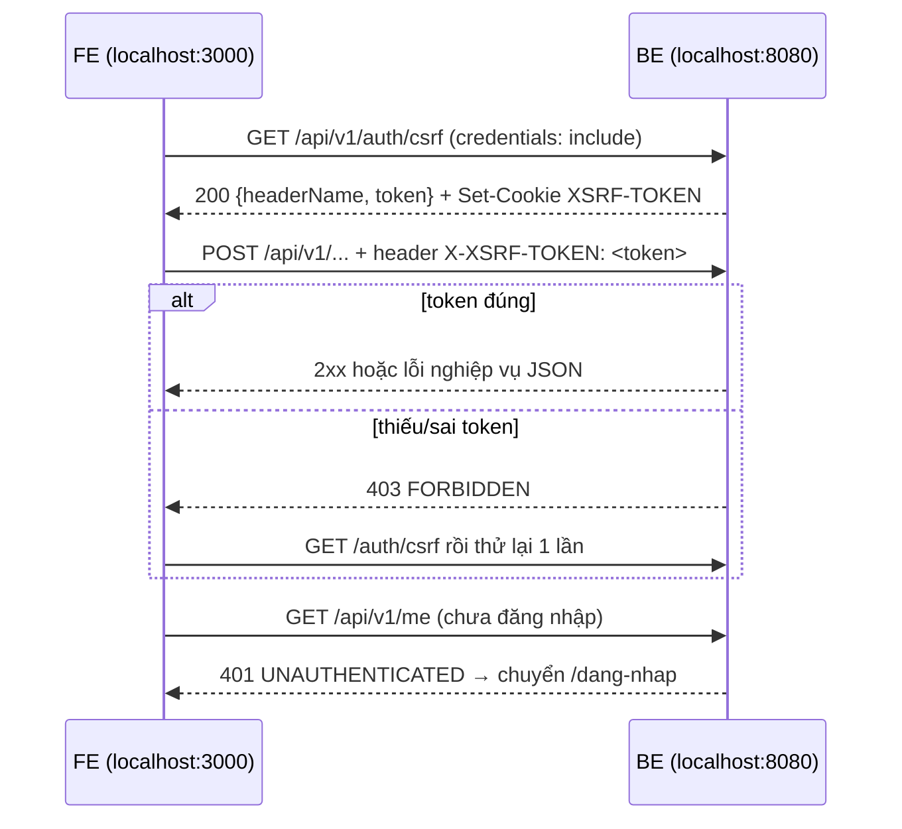
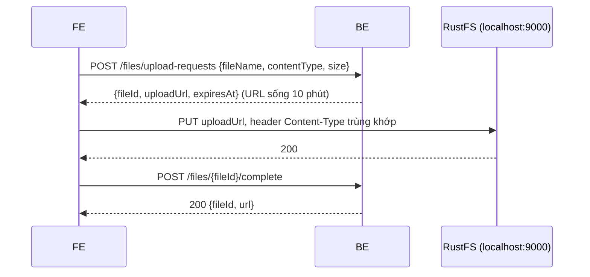

# Báo cáo bàn giao BE → FE — GĐ0 Khởi tạo & nền tảng

| Mục | Giá trị |
|---|---|
| Giai đoạn | GĐ0 — Khởi tạo & nền tảng (28/09 – 11/10/2026) |
| Ngày bàn giao | 28/09/2026 |
| Trạng thái BE | ✅ B0.1–B0.8 · 25 test xanh · chạy được trong Docker |
| FE làm tương ứng | Nền tảng FE: dự án Next.js, `api-client`, xử lý lỗi, MSW (chưa có `roadmap/ROADMAP_FE.md`) |
| Báo cáo trước | Không có. Đây là báo cáo đầu tiên và chứa **hợp đồng chung** (lỗi, CSRF, phân trang, CORS) cho mọi báo cáo sau |

> **Đọc nhanh:**
> - Chạy `docker compose --profile app up -d --build` trong `backend/k28`, rồi mở http://localhost:8080/swagger-ui.html.
> - Dựng `api-client.js` theo mục 6: gửi cookie, gọi `GET /auth/csrf` rồi gửi lại header `X-XSRF-TOKEN`, đọc lỗi dạng `{code, message, fieldErrors, requestId}`.
> - Chưa có đăng nhập hay nghiệp vụ. Mọi màn hình Đợt 1 dùng MSW với hợp đồng dự kiến ở mục 9.

---

## 1. BE đã giao gì (đối chiếu 2 roadmap)

| BE bước | Kết quả | FE bước / UI | FE cần làm |
|---|---|---|---|
| B0.1 Tạo project | ✅ Spring Boot 4.1, Java 21 | — | Không có việc |
| B0.2 Docker Compose | ✅ MySQL, Redis, RustFS (S3), Mailpit, API (`--profile app`) | Nền FE | Chạy BE bằng một lệnh (mục 2) |
| B0.3 Cấu hình & Flyway | ✅ 7 bảng tài khoản, seed 4 tài khoản demo | — | Chưa có API đăng nhập (B1.2) |
| B0.4 Xử lý lỗi | ✅ Định dạng lỗi thống nhất, `X-Request-Id` | Nền FE | Hàm `ApiError` + hiển thị `fieldErrors` dưới ô nhập (mục 3, 6) |
| B0.5 Bảo mật nền | ✅ Cookie `SESSION`, CSRF, CORS, 401/403 JSON, `GET /auth/csrf` | Nền FE | `credentials: 'include'`, gắn `X-XSRF-TOKEN` cho POST/PUT/PATCH/DELETE |
| B0.6 OpenAPI | ✅ Swagger UI chia nhóm theo module, `GET /public/ping` | Nền FE | Dùng ping để hiển thị "BE đang chạy" khi phát triển |
| B0.7 Nền kiểm thử | ✅ Testcontainers | — | Không có việc |
| B0.8 Lưu tệp & email | ✅ Dịch vụ nội bộ: URL ký S3, gửi mail sau commit | — | API tệp mở ở B1.6. Mail xem trong Mailpit |

**Chưa có** (dùng MSW): toàn bộ API nghiệp vụ, gồm đăng ký, đăng nhập, `/me`, tệp, bộ thẻ… Các API này có ở Đợt 1 (12/10–25/10), xem mục 9.

## 2. Chạy BE

```bash
cd backend/k28
docker compose --profile app up -d --build
```

| Dịch vụ | Địa chỉ |
|---|---|
| API | http://localhost:8080 |
| Swagger UI | http://localhost:8080/swagger-ui.html (chọn nhóm góc phải: `all`, `account`, `content`…) |
| OpenAPI JSON | http://localhost:8080/v3/api-docs/all (dùng để sinh type hoặc import vào Postman) |
| Health | http://localhost:8080/actuator/health |
| Mailpit (xem email) | http://localhost:8025 |
| RustFS console | http://localhost:9001 (`s3admin` / `s3admin_dev_pw`) |

Biến môi trường FE cần khớp:

| BE | Mặc định | Ý nghĩa với FE |
|---|---|---|
| `APP_FRONTEND_URL` | `http://localhost:3000` | Origin duy nhất được CORS cho phép. FE chạy cổng khác thì phải đổi biến này |
| `S3_PUBLIC_ENDPOINT` | `http://localhost:9000` | Host của URL ký mà trình duyệt sẽ PUT/GET tệp (từ B1.6) |

Dừng: `docker compose --profile app down`. **Không** dùng `-v`, vì lệnh đó xóa sạch dữ liệu.

## 3. Hợp đồng chung (áp dụng cho mọi API)

**Quy ước**

| Mục | Quy ước |
|---|---|
| Tiền tố | `/api/v1` |
| JSON | camelCase, UTF-8 |
| Thời gian | ISO-8601 UTC, ví dụ `2026-09-28T03:15:58.044Z` |
| ID | Trả về dạng **string** (tránh mất chính xác số lớn trong JS) |
| Phân trang | `?page=0&size=20` (page bắt đầu từ 0). Phản hồi dạng `{items, page, size, totalElements, totalPages}` |
| Xác thực | Cookie `SESSION` (HttpOnly, SameSite=Lax), phiên sống 7 ngày. FE không đọc được cookie này, chỉ cần gửi kèm |
| CSRF | Cookie `XSRF-TOKEN` (FE đọc được) → gửi lại qua header `X-XSRF-TOKEN` cho POST/PUT/PATCH/DELETE |
| Theo dõi lỗi | Header `X-Request-Id` (FE gửi được, BE trả lại). Nếu FE không gửi, BE tự sinh |

**Định dạng lỗi** (mọi lỗi 4xx/5xx)

```json
{
  "code": "VALIDATION_FAILED",
  "message": "Dữ liệu không hợp lệ",
  "fieldErrors": [{ "field": "email", "message": "Email không hợp lệ" }],
  "requestId": "1b00eb5e-98d3-415f-a1b3-6f7e9cae21d2"
}
```

| HTTP | `code` | Khi nào | FE xử lý |
|---|---|---|---|
| 400 | `VALIDATION_FAILED` | Sai dữ liệu hoặc JSON hỏng | Gắn `fieldErrors[].message` vào ô `field`. Nếu không có field thì hiện toast `message` |
| 401 | `UNAUTHENTICATED` | Chưa đăng nhập hoặc phiên hết hạn | Xóa cache user, chuyển `/dang-nhap?next=<trang hiện tại>` |
| 403 | `FORBIDDEN` | Thiếu hoặc sai CSRF, hoặc không đủ quyền | Gọi lại `GET /auth/csrf` rồi thử lại **1 lần**. Nếu vẫn lỗi thì hiện "Không có quyền" |
| 404 | `NOT_FOUND` | Không tồn tại, sai method, hoặc là dữ liệu riêng của người khác | Trang "Không tìm thấy" |
| 409 | `CONFLICT` | Trùng, ví dụ email đã tồn tại | Hiện `message` tại form |
| 409 | `VERSION_CONFLICT` | Dữ liệu đã bị sửa ở nơi khác | Báo "Dữ liệu đã thay đổi", tải lại |
| 422 | `BUSINESS_RULE` | Vi phạm quy tắc nghiệp vụ | Hiện `message` |
| 429 | `RATE_LIMITED` | Gọi quá nhiều | Hiện `message`, khóa nút một lúc |
| 503 | `DEPENDENCY_DOWN` | Lưu trữ, mail hoặc AI tạm lỗi | "Thử lại sau" |
| 500 | `INTERNAL_ERROR` | Lỗi hệ thống | Toast chung, kèm `requestId` để báo BE |

**Giới hạn tần suất đã cấu hình** (dùng từ Đợt 1)

| Hành động | Giới hạn |
|---|---|
| Đăng nhập | 5 lần / 15 phút |
| Đăng ký | 5 lần / 1 giờ |
| Gửi lại email xác thực | 3 lần / 15 phút |
| Quên mật khẩu | 3 lần / 15 phút |

**Phân quyền URL**

| Mẫu URL | Quyền |
|---|---|
| `/api/v1/public/**`, `/api/v1/auth/**`, `/api/v1/library/**` | G (khách) |
| `/api/v1/admin/**` | A (ADMIN) |
| Còn lại dưới `/api/v1/**` | L (đã đăng nhập) |

## 4. Luồng chính



## 5. API chi tiết (đã kiểm chứng trên BE thật)

### 5.1 `GET /api/v1/auth/csrf` — lấy CSRF token

| Quyền | FE bước | UI | Trang |
|---|---|---|---|
| G | Nền FE (`api-client`) | — | Gọi khi app khởi động và sau khi gặp 403 |

**Gửi:** không có body. Cần `credentials: 'include'`.

**Nhận** (thật)

```http
HTTP/1.1 200
Set-Cookie: XSRF-TOKEN=b8d12c7f-0031-4869-bfa5-f23057218374; Path=/
```
```json
{"headerName":"X-XSRF-TOKEN","token":"b8d12c7f-0031-4869-bfa5-f23057218374"}
```

**Lỗi:** không có.

**Tác dụng phụ:** tạo cookie `XSRF-TOKEN`. Token giữ nguyên đến khi đăng nhập hoặc đăng xuất (từ B1.2 sẽ đổi token, FE gọi lại endpoint này).

### 5.2 `GET /api/v1/public/ping` — kiểm tra BE còn sống

| Quyền | FE bước | UI | Trang |
|---|---|---|---|
| G | Nền FE | — | Banner "BE offline" khi phát triển (tùy chọn) |

**Nhận** (thật)

```http
HTTP/1.1 200
X-Request-Id: a28c1593-32fd-44a9-9f24-900cf65bc480
Content-Type: application/json
```
```json
{"status":"UP","serverTime":"2026-09-28T03:15:58.044659700Z"}
```

**Lỗi** (thật)

| HTTP | `code` | Khi nào | FE xử lý |
|---|---|---|---|
| 403 | `FORBIDDEN` | `POST` không kèm `X-XSRF-TOKEN` | Kiểm tra `api-client` đã gắn header chưa |
| 404 | `NOT_FOUND` | `POST` có CSRF (sai method) hoặc sai đường dẫn | — |

```json
{"code":"FORBIDDEN","message":"Bạn không có quyền truy cập","fieldErrors":[],"requestId":"6331b023-53b5-4528-9a5f-5324f1c8c0d4"}
```

### 5.3 API cần đăng nhập — phản hồi 401 (thật)

`GET /api/v1/me` (chưa có controller, xem B1.2) và `GET /api/v1/admin/**` khi chưa đăng nhập:

```http
HTTP/1.1 401
X-Request-Id: fe-test-123
```
```json
{"code":"UNAUTHENTICATED","message":"Bạn cần đăng nhập để tiếp tục","fieldErrors":[],"requestId":"fe-test-123"}
```

Nếu FE gửi `X-Request-Id: fe-test-123` thì BE trả lại đúng giá trị đó trong header và trong `requestId`.

### 5.4 CORS preflight (thật)

```http
OPTIONS /api/v1/auth/csrf  Origin: http://localhost:3000
HTTP/1.1 200
Access-Control-Allow-Origin: http://localhost:3000
Access-Control-Allow-Methods: GET,POST,PUT,PATCH,DELETE,OPTIONS
Access-Control-Allow-Headers: content-type, x-xsrf-token
Access-Control-Expose-Headers: X-Request-Id
Access-Control-Allow-Credentials: true
Access-Control-Max-Age: 3600
```

- Origin khác (ví dụ `http://evil.com`) → **403**.
- Header được phép gửi: `Content-Type`, `X-XSRF-TOKEN`, `Idempotency-Key`, `X-Request-Id`.

### 5.5 `GET /actuator/health`

```json
{"groups":["liveness","readiness"],"status":"UP"}
```

## 6. Mã FE mẫu

**`src/lib/api-client.js`**: mọi báo cáo sau đều dùng file này.

```js
const BASE = process.env.NEXT_PUBLIC_API_URL ?? 'http://localhost:8080/api/v1';
const WRITE = new Set(['POST', 'PUT', 'PATCH', 'DELETE']);

export class ApiError extends Error {
  constructor(status, body) {
    super(body?.message ?? 'Lỗi không xác định');
    this.status = status;
    this.code = body?.code ?? 'INTERNAL_ERROR';
    this.fieldErrors = body?.fieldErrors ?? [];
    this.requestId = body?.requestId;
  }
}

function readCookie(name) {
  return document.cookie.split('; ').find((c) => c.startsWith(name + '='))?.split('=')[1];
}

export async function ensureCsrf() {
  if (readCookie('XSRF-TOKEN')) return;
  await fetch(`${BASE}/auth/csrf`, { credentials: 'include' });
}

export async function api(path, { method = 'GET', body, headers = {}, retried = false } = {}) {
  if (WRITE.has(method)) await ensureCsrf();
  const res = await fetch(`${BASE}${path}`, {
    method,
    credentials: 'include',
    headers: {
      ...(body !== undefined && { 'Content-Type': 'application/json' }),
      ...(WRITE.has(method) && { 'X-XSRF-TOKEN': readCookie('XSRF-TOKEN') }),
      ...headers,
    },
    body: body !== undefined ? JSON.stringify(body) : undefined,
  });
  if (res.status === 204) return null;
  const data = await res.json().catch(() => null);
  if (res.ok) return data;
  if (res.status === 403 && WRITE.has(method) && !retried) {
    document.cookie = 'XSRF-TOKEN=; Max-Age=0; path=/';
    return api(path, { method, body, headers, retried: true });
  }
  throw new ApiError(res.status, data);
}
```

**Hiển thị lỗi form** (dùng với react-hook-form):

```js
export function applyServerErrors(error, setError) {
  if (!(error instanceof ApiError)) return false;
  error.fieldErrors.forEach((f) => setError(f.field, { message: f.message }));
  return error.fieldErrors.length > 0;
}
```

**TanStack Query, xử lý 401 toàn cục:**

```js
export const queryClient = new QueryClient({
  queryCache: new QueryCache({
    onError: (e) => {
      if (e instanceof ApiError && e.status === 401) window.location.href = `/dang-nhap?next=${location.pathname}`;
    },
  }),
  defaultOptions: { queries: { retry: (n, e) => !(e instanceof ApiError && e.status < 500) && n < 2 } },
});
```

**MSW handlers** (dữ liệu thật ở mục 5):

```js
import { http, HttpResponse } from 'msw';
const API = 'http://localhost:8080/api/v1';

export const baseHandlers = [
  http.get(`${API}/auth/csrf`, () =>
    HttpResponse.json(
      { headerName: 'X-XSRF-TOKEN', token: 'mock-csrf' },
      { headers: { 'Set-Cookie': 'XSRF-TOKEN=mock-csrf; Path=/' } },
    )),
  http.get(`${API}/public/ping`, () =>
    HttpResponse.json({ status: 'UP', serverTime: new Date().toISOString() })),
  http.get(`${API}/me`, () =>
    HttpResponse.json(
      { code: 'UNAUTHENTICATED', message: 'Bạn cần đăng nhập để tiếp tục', fieldErrors: [], requestId: 'mock' },
      { status: 401 },
    )),
];
```

## 7. Dữ liệu mẫu / tài khoản demo

Tài khoản có sẵn trong profile `dev`; mật khẩu xem `README.md`. Đăng nhập được từ B1.2.

| Email | Vai trò |
|---|---|
| admin@vocab.local | ADMIN, USER |
| an@vocab.local, binh@vocab.local, chi@vocab.local | USER |

Email do BE gửi (xác thực, quên mật khẩu, từ B1.1) xem tại http://localhost:8025.

## 8. Checklist FE hoàn thành GĐ0

- [ ] `api-client.js` gửi `credentials: 'include'` cho mọi request
- [ ] POST/PUT/PATCH/DELETE tự gắn `X-XSRF-TOKEN`. Gặp 403 thì lấy token mới và thử lại đúng 1 lần
- [ ] `ApiError` có đủ `status`, `code`, `fieldErrors`, `requestId`. Lỗi form hiện đúng dưới ô nhập
- [ ] 401 toàn cục → chuyển `/dang-nhap?next=...`
- [ ] Toast lỗi 5xx có hiện `requestId`
- [ ] MSW bật/tắt bằng biến môi trường. Tắt MSW thì `GET /public/ping` gọi BE thật trả 200
- [ ] Hiển thị thời gian: chuyển ISO UTC sang giờ địa phương của người dùng

## 9. Sắp có ở Đợt 1 — hợp đồng dự kiến

| BE bước | Dự kiến có | API | FE bước | UI |
|---|---|---|---|---|
| B1.1 | Đợt 1 (12–25/10) | `POST /auth/register`, `/auth/verify-email`, `/auth/resend-verification` | Đăng ký, xác thực | `/dang-ky`, `/xac-thuc-email` |
| B1.2 | Đợt 1 (12–25/10) | `POST /auth/login`, `/auth/logout`, `GET /me` | Đăng nhập, header user | `/dang-nhap` |
| B1.3 | Đợt 1 (12–25/10) | `POST /auth/forgot-password`, `/auth/reset-password`, `PUT /me/password` | Quên/đổi mật khẩu | `/quen-mat-khau`, `/dat-lai-mat-khau` |
| B1.4 | Đợt 1 (12–25/10) | `GET /auth/google/start`, `/auth/google/callback` | Nút Google | `/dang-nhap` |
| B1.5 | Đợt 1 (12–25/10) | `PATCH /me`, `GET/PUT /me/learning-settings`, `GET/PUT /me/notification-settings` | Hồ sơ, thiết lập | `/ho-so`, `/cai-dat` |
| B1.6 | Đợt 1 (12–25/10) | `POST /files/upload-requests`, `POST /files/{id}/complete`, `DELETE /files/{id}` | Ảnh đại diện, ảnh thẻ | `/ho-so` |
| B1.7–B1.12 | Đợt 1 (12–25/10) | Chủ đề, bộ thẻ, thẻ, thư viện, sao chép, CSV | Bộ thẻ, thư viện | `/bo-the`, `/thu-vien` |

Hợp đồng **dự kiến** (theo TK §12.2, §13.2), có thể đổi tên trường khi code:

```json
// POST /auth/register  (dự kiến)
{ "email": "an@example.com", "password": "********", "displayName": "An", "timeZone": "Asia/Ho_Chi_Minh" }
// 201 → { "id": "5", "email": "an@example.com", "status": "CHUA_XAC_THUC" }
// 409 CONFLICT khi email trùng · 429 RATE_LIMITED sau 5 lần/giờ

// POST /auth/login  (dự kiến)
{ "email": "an@example.com", "password": "********" }
// 200 → { "id": "5", "email": "...", "displayName": "An", "roles": ["USER"] } + Set-Cookie SESSION

// GET /me  (dự kiến)
{ "id": "5", "email": "...", "displayName": "An", "roles": ["USER"], "timeZone": "Asia/Ho_Chi_Minh", "avatarUrl": null }
```

Luồng tải tệp **dự kiến** (B1.6), dùng `StorageService` đã có:



## 10. Lưu ý / giới hạn / chưa kiểm chứng

| Mục | Chi tiết |
|---|---|
| Chưa có `roadmap/ROADMAP_FE.md` và `mockups/` | Cột "FE bước / UI" ghi theo tên màn hình dự kiến. Cần tạo roadmap FE (`/ui-mockup` cho Đợt 1) |
| Lỗi validation (400 có `fieldErrors`) | Chưa có endpoint nhận body để kiểm chứng trên BE thật. Định dạng đã kiểm chứng bằng test `GlobalExceptionHandlerTest` |
| Tên trường lỗi | TK §13.1 viết `field_errors`/`request_id`, nhưng BE dùng camelCase **`fieldErrors`/`requestId`** theo quy ước JSON camelCase. FE theo BE |
| Sai method | Trả **404** `NOT_FOUND` chứ không phải 405 |
| Upload trực tiếp từ trình duyệt lên RustFS | Cần CORS ở phía bucket. Sẽ cấu hình và kiểm chứng ở B1.6 |
| Ví dụ trong mục 5 | Lấy từ API chạy bằng `spring-boot:run` với profile `dev` trên máy BE, ngày 28/09/2026 |

## 11. Báo lỗi cho BE

Gửi đường dẫn API, body và `requestId` (có trong body lỗi và header `X-Request-Id`). BE tra bằng:

```bash
docker compose logs api | grep <requestId>
```
